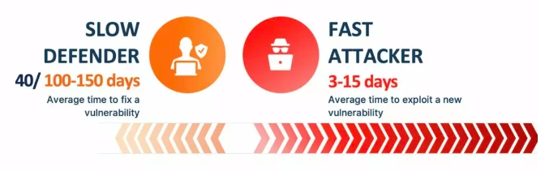
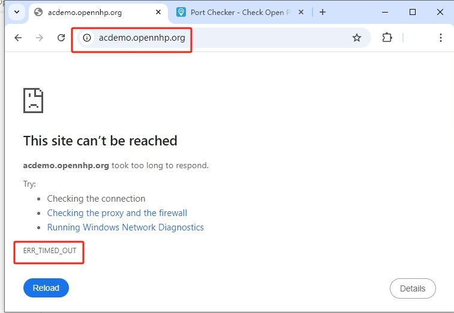
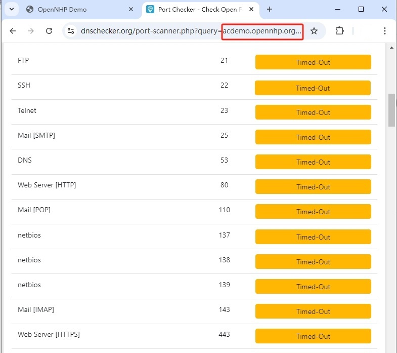
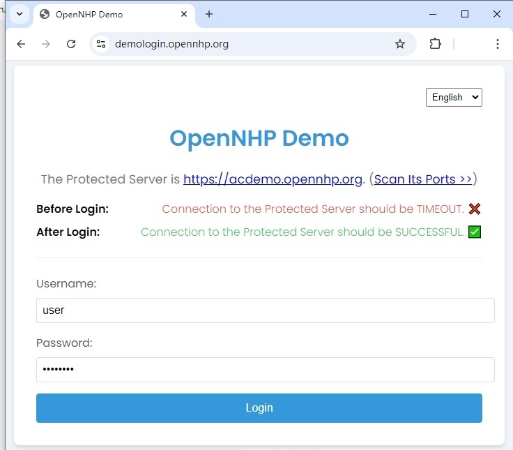
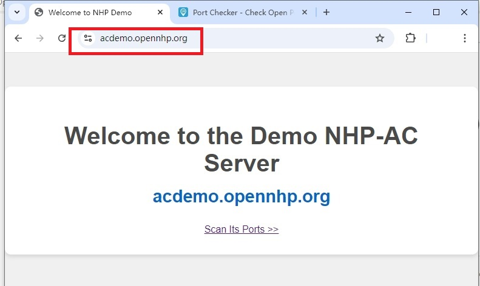
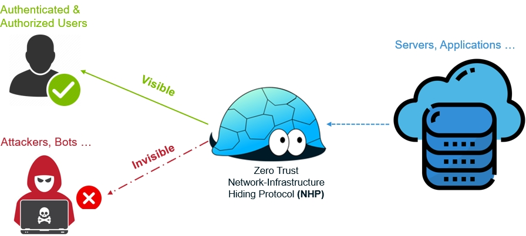
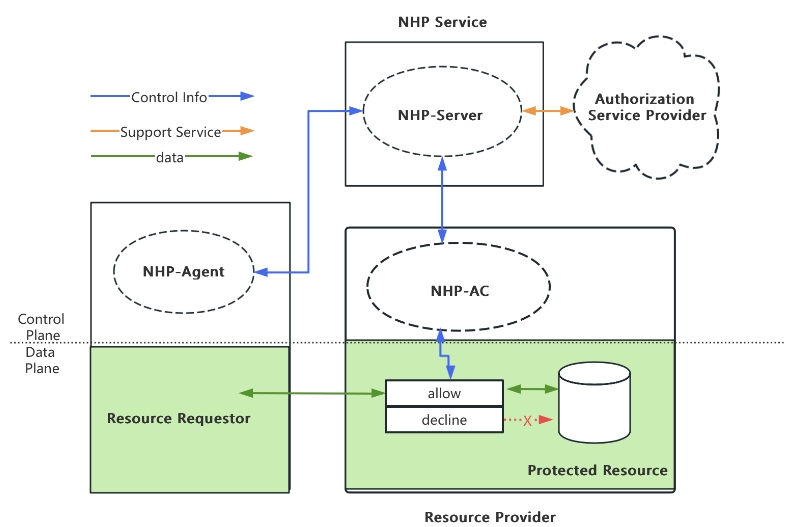

# OpenNHP: Protocolo de Ocultación de Infraestructura de Red Zero Trust
Un protocolo de red de confianza cero impulsado por criptografía en la capa 5 del modelo OSI para ocultar su servidor y sus datos de los atacantes.

---

## Desafío: La IA transforma Internet en un "Bosque Oscuro"

El rápido avance de las tecnologías de **IA**, especialmente los grandes modelos de lenguaje (LLM), está transformando significativamente el panorama de la ciberseguridad. El surgimiento de la **Explotación Autónoma de Vulnerabilidades (AVE)** representa un gran avance en la era de la IA, al automatizar la explotación de vulnerabilidades, como se muestra en [este artículo de investigación](https://arxiv.org/abs/2404.08144). Este desarrollo aumenta significativamente el riesgo para todos los servicios de red expuestos, evocando la [Hipótesis del Bosque Oscuro](https://es.wikipedia.org/wiki/Hip%C3%B3tesis_del_bosque_oscuro) en Internet. Las herramientas impulsadas por IA escanean continuamente el entorno digital, identifican rápidamente las debilidades y las explotan. Como resultado, Internet está evolucionando hacia un **"bosque oscuro"** donde **la visibilidad equivale a vulnerabilidad**.

La investigación de Gartner pronostica un [rápido aumento de los ciberataques impulsados por IA](https://www.gartner.com/en/newsroom/press-releases/2024-08-28-gartner-forecasts-global-information-security-spending-to-grow-15-percent-in-2025). Este cambio de paradigma requiere una reevaluación de las estrategias tradicionales de ciberseguridad, con un enfoque en defensas proactivas, mecanismos de respuesta rápida y la adopción de tecnologías de ocultación de red para proteger la infraestructura crítica.

---

## Demostración rápida: Ver OpenNHP en acción

Antes de profundizar en los detalles de OpenNHP, comencemos con una breve demostración de cómo OpenNHP protege un servidor del acceso no autorizado. Puede verlo en acción accediendo al servidor protegido en https://acdemo.opennhp.org.

### 1) El servidor protegido es "invisible" para los usuarios no autenticados

Por defecto, cualquier intento de conectar con el servidor protegido resultará en un error TIME OUT, ya que todos los puertos están cerrados, haciendo que el servidor parezca *"invisible"* y efectivamente fuera de línea.

El escaneo de puertos del servidor también devolverá un error TIME OUT.

### 2) Después de la autenticación, el servidor protegido se vuelve accesible

OpenNHP admite una variedad de métodos de autenticación, como OAuth, SAML, códigos QR, y más. Para esta demostración, utilizamos un servicio de autenticación básica de nombre de usuario/contraseña en https://demologin.opennhp.org.

Una vez que haga clic en el botón "Login", la autenticación se completará con éxito y será redirigido al servidor protegido. En ese momento, el servidor se vuelve *"visible"* y accesible en su dispositivo.

---

## Visín: Hacer de Internet un lugar confiable

La apertura de los protocolos TCP/IP ha impulsado el crecimiento explosivo de las aplicaciones de Internet, pero también ha expuesto vulnerabilidades, permitiendo que actores malintencionados obtengan acceso no autorizado y exploten cualquier dirección IP expuesta. Aunque el [modelo de red OSI](https://es.wikipedia.org/wiki/Modelo_OSI) define la *capa 5 (capa de sesión)* para la gestión de conexiones, pocas soluciones efectivas se han implementado para abordar este problema.

**NHP**, o el **"Protocolo de Ocultación de la Infraestructura de Red"**, es un protocolo de red ligero y basado en criptografía Zero Trust, diseñado para funcionar en la *capa de sesión OSI*, óptimo para gestionar la visibilidad y las conexiones de la red. El objetivo principal de NHP es ocultar los recursos protegidos de entidades no autorizadas, otorgando acceso solo a los usuarios verificados y autorizados mediante una verificación continua, contribuyendo así a un Internet más confiable.

---

## Solución: OpenNHP restablece el control de la visibilidad de la red

**OpenNHP** es la implementación de código abierto del protocolo NHP. Está impulsado por criptografía y diseñado con principios de seguridad en primer lugar, implementando una verdadera arquitectura de confianza cero en la *capa de sesión OSI*.

OpenNHP se basa en investigaciones anteriores sobre tecnología de ocultación de redes, utilizando un marco criptográfico moderno y una arquitectura que garantiza seguridad y alto rendimiento, superando las limitaciones de tecnologías anteriores.

| Protocolo de Ocultación de Infraestructura de Red | 1ª Generación | 2ª Generación | 3ª Generación |
|:---|:---|:---|:---|
| **Tecnología Clave** | [Port Knocking](https://es.wikipedia.org/wiki/Port_knocking) | [Single Packet Authorization (SPA)](https://cloudsecurityalliance.org/artifacts/software-defined-perimeter-zero-trust-specification-v2) | Protocolo de Ocultación de Infraestructura de Red (NHP) |
| **Autenticación** | Secuencias de puertos | Secretos compartidos | Marco Criptográfico Moderno |
| **Arquitectura** | Sin plano de control | Sin plano de control | Plano de control escalable |
| **Capacidad** | Ocultar puertos | Ocultar puertos | Ocultar puertos, IPs y dominios |
| **Control de Acceso** | Nivel IP | Nivel de Puertos | Nivel de Aplicación |
| **Proyectos de Código Abierto** | [knock](https://github.com/jvinet/knock) *(C)* | [fwknop](https://github.com/mrash/fwknop) *(C++)* | [OpenNHP](https://github.com/OpenNHP/opennhp) *(Go)* |

> Es crucial elegir un lenguaje **seguro para la memoria** como *Go* para el desarrollo de OpenNHP, como se destaca en el [informe técnico del gobierno de los EE.UU.](https://www.whitehouse.gov/wp-content/uploads/2024/02/Final-ONCD-Technical-Report.pdf). Para una comparación detallada entre **SPA y NHP**, consulte la [sección a continuación](#comparison-between-spa-and-nhp).

## Beneficios de Seguridad

Dado que OpenNHP implementa los principios de confianza cero en la *capa de sesión OSI*, ofrece beneficios significativos:

- Reduce la superficie de ataque ocultando la infraestructura
- Evita el reconocimiento no autorizado de la red
- Mitiga la explotación de vulnerabilidades
- Previene ataques de phishing mediante DNS cifrado
- Protege contra ataques DDoS
- Permite el control de acceso granular
- Proporciona seguimiento de conexiones basado en identidad
- Atribución de ataques

## Arquitectura

La arquitectura de OpenNHP se inspira en el [estándar de Arquitectura de Confianza Cero del NIST](https://www.nist.gov/publications/zero-trust-architecture). Sigue un diseño modular con los tres componentes principales: **NHP-Server**, **NHP-AC** y **NHP-Agent**, como se ilustra en el siguiente diagrama.

> Consulte la [documentación de OpenNHP](https://opennhp.org/) para obtener información detallada sobre la arquitectura y el flujo de trabajo.

## Centro: Algoritmos Criptográficos

La criptografía es el centro de OpenNHP, proporcionando seguridad robusta, un excelente rendimiento y escalabilidad mediante el uso de algoritmos criptográficos de vanguardia. A continuación se muestran los principales algoritmos y marcos criptográficos utilizados por OpenNHP:

- **[Criptografía de Curva Elíptica (ECC)](https://es.wikipedia.org/wiki/Criptograf%C3%ADa_de_curva_el%C3%ADptica)**: Utilizada para criptografía asimétrica eficiente.

> En comparación con RSA, ECC ofrece una mayor eficiencia con una encriptación más fuerte en longitudes de clave más cortas, mejorando tanto la transmisión en la red como el rendimiento computacional. La tabla a continuación muestra las diferencias en la fortaleza de la seguridad, las longitudes de clave y la proporción de longitud de clave entre RSA y ECC, junto con sus respectivos períodos de validez.

| Fortaleza de Seguridad (bits) | Longitud de Clave DSA/RSA (bits) | Longitud de Clave ECC (bits) | Relación: ECC vs. DSA/RSA | Validez |
|:----------------------------:|:-------------------------------:|:---------------------------:|:--------------------------:|:-------:|
| 80                           | 1024                            | 160-223                     | 1:6                        | Hasta 2010 |
| 112                          | 2048                            | 224-255                     | 1:9                        | Hasta 2030 |
| 128                          | 3072                            | 256-383                     | 1:12                       | Después de 2031 |
| 192                          | 7680                            | 384-511                     | 1:20                       | |
| 256                          | 15360                           | 512+                        | 1:30                       | |

- **[Marco de Protocolo Noise](https://noiseprotocol.org/)**: Permite el intercambio seguro de claves, el cifrado/descifrado de mensajes y la autenticación mutua.

> El Protocolo Noise se basa en el [acuerdo de clave Diffie-Hellman](https://es.wikipedia.org/wiki/Intercambio_de_claves_Diffie-Hellman) y proporciona soluciones criptográficas modernas como la autenticación mutua y opcional, el ocultamiento de identidad, la confidencialidad directa y el cifrado de ida y vuelta. Probado por su seguridad y rendimiento, ya es utilizado por aplicaciones populares como [WhatsApp](https://www.whatsapp.com/security/WhatsApp-Security-Whitepaper.pdf), [Slack](https://github.com/slackhq/nebula) y [WireGuard](https://www.wireguard.com/).

- **[Criptografía Basada en Identidad (IBC)](https://es.wikipedia.org/wiki/Criptograf%C3%ADa_basada_en_la_identidad)**: Simplifica la distribución de claves a escala.

> Una distribución eficiente de claves es esencial para implementar Zero Trust. OpenNHP admite tanto PKI como IBC. Mientras que PKI se ha utilizado ampliamente durante décadas, depende de Autoridades Certificadoras (CA) centralizadas para la verificación de identidad y la gestión de claves, lo que puede ser costoso y llevar tiempo. En contraste, IBC permite un enfoque descentralizado y autogestionado para la verificación de identidad y la gestión de claves, haciéndolo más rentable para el entorno Zero Trust de OpenNHP, donde miles de millones de dispositivos o servidores pueden necesitar protección e integración en tiempo real.

- **[Criptografía sin Certificados (CL-PKC)](https://es.wikipedia.org/wiki/Criptograf%C3%ADa_sin_certificado)**: Algoritmo IBC recomendado

> CL-PKC es un esquema que mejora la seguridad al evitar la custodia de claves y abordar las limitaciones de la Criptografía Basada en Identidad (IBC). En la mayoría de los sistemas IBC, la clave privada de un usuario es generada por un Centro de Generación de Claves (KGC), lo cual conlleva riesgos significativos. Un KGC comprometido puede llevar a la exposición de todas las claves privadas de los usuarios, requiriendo plena confianza en el KGC. CL-PKC mitiga este problema dividiendo el proceso de generación de claves, de modo que el KGC solo tiene conocimiento de una clave privada parcial. Como resultado, CL-PKC combina las fortalezas de PKI e IBC, ofreciendo una mayor seguridad sin los inconvenientes de la gestión centralizada de claves.

Lectura adicional:

> Consulte la [documentación de OpenNHP](https://opennhp.org/cryptography/) para una explicación detallada de los algoritmos criptográficos utilizados en OpenNHP.

## Características Clave

- Mitiga la explotación de vulnerabilidades mediante la aplicación de reglas "denegar todo" por defecto
- Previene ataques de phishing mediante la resolución DNS cifrada
- Protege contra ataques DDoS ocultando la infraestructura
- Permite la atribución de ataques mediante conexiones basadas en identidad
- Control de acceso predeterminado para todos los recursos protegidos
- Autenticación basada en identidad y dispositivos antes del acceso a la red
- Resolución DNS cifrada para prevenir secuestro de DNS
- Infraestructura distribuida para mitigar ataques DDoS
- Arquitectura escalable con componentes desacoplados
- Integración con sistemas de gestión de identidades y accesos existentes
- Compatible con varios modelos de despliegue (cliente a puerta de enlace, cliente a servidor, etc.)
- Seguridad criptográfica con algoritmos modernos (ECC, Noise Protocol, IBC)

Haga clic para expandir los detalles de las características

- **Control de acceso predeterminado**: Todos los recursos están ocultos por defecto, solo siendo accesibles tras la autenticación y autorización.
- **Autenticación basada en identidad y dispositivos**: Garantiza que solo los usuarios conocidos en dispositivos aprobados puedan acceder.
- **Resolución DNS cifrada**: Evita el secuestro de DNS y los ataques de phishing asociados.
- **Mitigación de DDoS**: El diseño de infraestructura distribuida ayuda a proteger contra los ataques de denegación de servicio distribuidos.
- **Arquitectura escalable**: Los componentes desacoplados permiten un despliegue y escalado flexibles.
- **Integración IAM**: Funciona con sus sistemas de gestión de identidades y accesos existentes.
- **Despliegue flexible**: Compatible con varios modelos, incluido cliente a puerta de enlace, cliente a servidor y más.
- **Criptografía robusta**: Utiliza algoritmos modernos como ECC, Noise Protocol e IBC para una seguridad robusta.

## Despliegue

OpenNHP admite varios modelos de despliegue para adaptarse a diferentes casos de uso:

- Cliente a puerta de enlace: Asegura el acceso a varios servidores detrás de una puerta de enlace
- Cliente a servidor: Asegura directamente servidores/aplicaciones individuales
- Servidor a servidor: Asegura la comunicación entre servicios backend
- Puerta de enlace a puerta de enlace: Asegura conexiones entre sitios

> Consulte la [documentación de OpenNHP](https://opennhp.org/deploy/) para obtener instrucciones detalladas de despliegue.

## Comparación entre SPA y NHP
El protocolo Single Packet Authorization (SPA) está incluido en la [especificación del Perímetro Definido por Software (SDP)](https://cloudsecurityalliance.org/artifacts/software-defined-perimeter-zero-trust-specification-v2) publicada por la [Cloud Security Alliance (CSA)](https://cloudsecurityalliance.org/). NHP mejora la seguridad, la fiabilidad, la escalabilidad y la extensibilidad mediante un marco criptográfico moderno y una arquitectura moderna, como se demuestra en el [artículo de investigación AHAC](https://www.mdpi.com/2076-3417/14/13/5593).

| - | SPA | NHP | Ventajas de NHP |
|:---|:---|:---|:---|
| **Arquitectura** | El componente de descifrado de paquetes SPA y autenticación de usuario/dispositivo está acoplado con el componente de control de acceso a la red en el servidor SPA. | NHP-Server (el componente de descifrado de paquetes y autenticación de usuario/dispositivo) y NHP-AC (el componente de control de acceso) están desacoplados. NHP-Server se puede desplegar en hosts separados y admite la escalabilidad horizontal. | <ul><li>Rendimiento: el componente que consume muchos recursos, NHP-server, está separado del servidor protegido.</li><li>Escalabilidad: NHP-server se puede desplegar en modo distribuido o clúster.</li><li>Seguridad: la dirección IP del servidor protegido no es visible para el cliente a menos que la autenticación sea exitosa.</li></ul>|
| **Comunicación** | Dirección única | Bidireccional | Mejor fiabilidad con la notificación de estado del control de acceso |
| **Marco criptográfico** | Secretos compartidos | PKI o IBC, Marco Noise | <ul><li>Seguridad: mecanismo comprobado de intercambio de claves para mitigar las amenazas MITM</li><li>Bajo costo: distribución de claves eficiente para el modelo de confianza cero</li><li>Rendimiento: cifrado/descifrado de alto rendimiento</li></ul>|
| **Capacidad de Ocultación de Infraestructura de Red** | Solo puertos de servidor | Dominios, IPs y puertos | Más poderoso contra varios ataques (p. ej., vulnerabilidades, secuestro de DNS y ataques DDoS) |
| **Extensibilidad** | Ninguna, solo para SDP | Todo uso | Compatible con cualquier escenario que necesite oscurecimiento del servicio |
| **Interoperabilidad** | No disponible | Personalizable | NHP puede integrarse sin problemas con protocolos existentes (p. ej., DNS, FIDO, etc.) |

## Contribuir

¡Damos la bienvenida a las contribuciones a OpenNHP! Consulte nuestras [Directrices de Contribución](CONTRIBUTING.md) para obtener más información sobre cómo participar.

## Licencia

OpenNHP se publica bajo la [Licencia Apache 2.0](LICENSE).

## Contacto

- Sitio web del proyecto: [https://github.com/OpenNHP/opennhp](https://github.com/OpenNHP/opennhp)
- Correo electrónico: [opennhp@gmail.com](mailto:opennhp@gmail.com)
- Canal de Slack: [Únase a nuestro Slack](https://slack.opennhp.org)

Para obtener una documentación más detallada, visite nuestra [Documentación Oficial](https://opennhp.org).

## Referencias

- [Especificación del Perímetro Definido por Software (SDP) v2.0](https://cloudsecurityalliance.org/artifacts/software-defined-perimeter-zero-trust-specification-v2). Jason Garbis, Juanita Koilpillai, Junaid lslam, Bob Flores, Daniel Bailey, Benfeng Chen, Eitan Bremler, Michael Roza, Ahmed Refaey Hussein. [*Cloud Security Alliance (CSA)*](https://cloudsecurityalliance.org/). Marzo 2022.
- [AHAC: Marco Avanzado de Control de Acceso Oculto en Red](https://www.mdpi.com/2076-3417/14/13/5593). Mudi Xu, Benfeng Chen, Zhizhong Tan, Shan Chen, Lei Wang, Yan Liu, Tai Io San, Sou Wang Fong, Wenyong Wang y Jing Feng. *Revista de Ciencias Aplicadas*. Junio 2024.
- Noise Protocol Framework. https://noiseprotocol.org/
- Proyecto de Marco de Gestión de Vulnerabilidades. https://phoenix.security/web-vuln-management/

---

🌟 ¡Gracias por su interés en OpenNHP! Esperamos sus contribuciones y comentarios.

