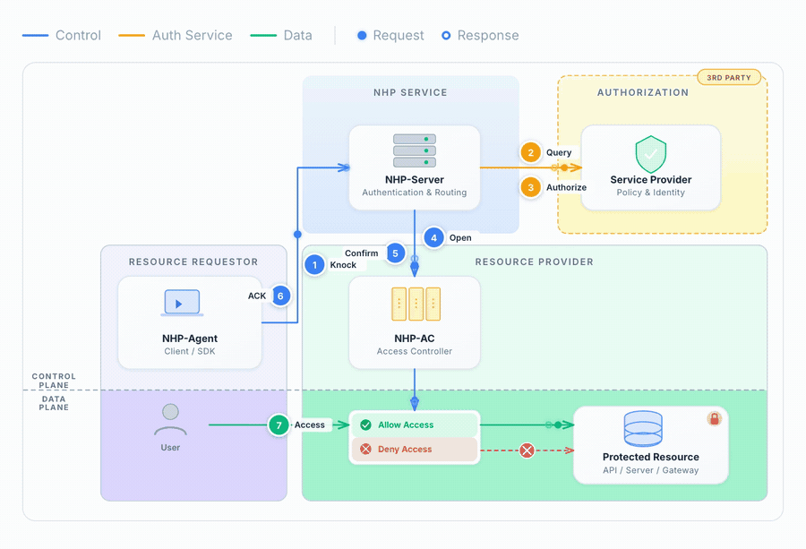

[](https://github.com/OpenNHP/opennhp/blob/main/README.md)
[](https://github.com/OpenNHP/opennhp/blob/main/README.zh-cn.md)
[](https://github.com/OpenNHP/opennhp/blob/main/README.zh-tw.md)
[](https://github.com/OpenNHP/opennhp/blob/main/README.de.md)
[](https://github.com/OpenNHP/opennhp/blob/main/README.ja.md)
[](https://github.com/OpenNHP/opennhp/blob/main/README.fr.md)
[](https://github.com/OpenNHP/opennhp/blob/main/README.es.md)
[](https://github.com/OpenNHP/opennhp/blob/main/README.id.md)


# OpenNHP: Toolkit Keamanan Zero Trust Open Source

[](https://github.com/OpenNHP/opennhp/actions/workflows/ubuntu-build.yml)
[](https://github.com/OpenNHP/opennhp/tags)

[](https://codecov.io/gh/OpenNHP/opennhp)
[](https://deepwiki.com/OpenNHP/opennhp)

**OpenNHP** adalah toolkit open source ringan berbasis kriptografi untuk menerapkan keamanan Zero Trust pada infrastruktur, aplikasi, dan data. OpenNHP merupakan implementasi referensi dari [**Cloud Security Alliance (CSA)**](https://cloudsecurityalliance.org/) *[spesifikasi Network-infrastructure Hiding Protocol (NHP)](https://cloudsecurityalliance.org/artifacts/stealth-mode-sdp-for-zero-trust-network-infrastructure)*, serta menghadirkan dua protokol inti:

- **Network-infrastructure Hiding Protocol (NHP):** Menyembunyikan port server, alamat IP, dan nama domain untuk melindungi aplikasi serta infrastruktur dari akses yang tidak sah.
- **Data-content Hiding Protocol (DHP):** Menjamin keamanan dan privasi data melalui enkripsi dan confidential computing, sehingga data *"dapat digunakan tetapi tidak terlihat."*

**[Website](https://opennhp.org) · [Visi](https://opennhp.org/vision/) · [Demo Langsung](https://opennhp.org/demo/) · [Dokumentasi](https://docs.opennhp.org) · [Discord](https://discord.gg/CpyVmspx5x)**

---

## Mengapa OpenNHP

Internet modern ibarat [hutan gelap](https://en.wikipedia.org/wiki/Dark_forest_hypothesis). Penyerang — yang semakin banyak didukung LLM yang memindai, melakukan fingerprinting, dan mengeksploitasi dengan kecepatan mesin melalui [Autonomous Vulnerability Exploitation](https://arxiv.org/abs/2404.08144) — menganggap setiap layanan yang dapat dijangkau sebagai target. [Gartner memproyeksikan](https://www.gartner.com/en/newsroom/press-releases/2024-08-28-gartner-forecasts-global-information-security-spending-to-grow-15-percent-in-2025) serangan siber berbasis AI akan meningkat pesat. Pertahanan tradisional mengautentikasi pengguna *setelah* jaringan mengizinkan mereka masuk, sehingga port, IP, dan domain yang terekspos tetap menjadi permukaan serangan permanen.

> **Di era AI, VISIBILITAS = KERENTANAN.**

OpenNHP membalik model tersebut: **tidak terlihat sampai dipercaya.** Setiap port, IP, dan hostname berada di balik gerbang default-deny. Akses hanya diberikan setelah knock yang ditandatangani secara kriptografis diautentikasi dan diotorisasi secara out-of-band. Penyerang tidak dapat mengeksploitasi sesuatu yang tidak dapat mereka temukan.

### Protokol penyembunyian jaringan generasi ketiga

NHP adalah langkah berikutnya dalam evolusi desain "sembunyikan layanan terlebih dahulu":

| Generasi | Protokol | Keterbatasan |
|---|---|---|
| 1 | Port Knocking | Plaintext, rentan terhadap replay |
| 2 | Single Packet Authorization (SPA) | Shared secrets, satu arah, biasanya hanya menyembunyikan port, umumnya C/C++ |
| **3** | **NHP** | Kriptografi modern, dua arah dengan status, menyembunyikan domain + IP + port, stateless dan dapat diskalakan secara horizontal, Go yang memory-safe |

NHP bekerja berdampingan dengan IAM, DNS, FIDO, dan policy engine Zero Trust yang sudah ada alih-alih menggantikannya — NHP memperluas stack Anda tanpa membuat fork terpisah.

---

## Arsitektur

OpenNHP menggunakan desain modular dengan tiga komponen inti, terinspirasi oleh [NIST Zero Trust Architecture](https://www.nist.gov/publications/zero-trust-architecture):



| Komponen Inti | Peran |
|-----------|------|
| **NHP-Agent** | Client yang mengirim permintaan knock terenkripsi untuk memperoleh akses |
| **NHP-Server** | Mengautentikasi dan mengotorisasi permintaan; berjalan terpisah dan secara arsitektural dipisahkan dari host yang dilindungi |
| **NHP-AC** | Access controller yang mengelola aturan firewall pada server yang dilindungi |

| Komponen Tambahan | Peran |
|-----------|------|
| **NHP-Relay** | Bridge HTTP-ke-UDP yang memungkinkan agent berbasis browser mengirim NHP knock melalui HTTPS |
| **NHP-KGC** | Key Generation Center untuk Identity-Based Cryptography (IBC) |

### Alur protokol

1. Agent mengirim knock terenkripsi (`NHP_KNK`) ke Server.
2. Server memvalidasi knock dan mengirim permintaan operasi (`NHP_AOP`) ke AC.
3. AC membuka firewall dan membalas (`NHP_ART`) ke Server.
4. Server mengembalikan acknowledgment (`NHP_ACK`) beserta informasi akses kepada Agent.
5. Agent mengakses resource yang dilindungi melalui AC.

### Kriptografi

OpenNHP menyediakan dua cipher suite yang dapat saling dipertukarkan:

- **`CIPHER_SCHEME_CURVE`** — Curve25519 + AES-256-GCM + BLAKE2s
- **`CIPHER_SCHEME_GMSM`** — SM2 + SM4-GCM + SM3

Keduanya menggunakan [Noise Protocol Framework](https://noiseprotocol.org/). Mode Identity-Based Cryptography (IBC) tersedia melalui Key Generation Center (KGC).

> Untuk detail protokol, model deployment, dan desain kriptografi, lihat [dokumentasi](https://docs.opennhp.org).

---

## Struktur Repository

```
opennhp/
├── nhp/              # Core protocol library (Go module)
│   ├── core/         # Packet handling, cryptography, Noise Protocol, device management
│   ├── common/       # Shared types and message definitions
│   ├── utils/        # Utility functions
│   ├── plugins/      # Plugin handler interfaces
│   ├── log/          # Logging infrastructure
│   └── etcd/         # Distributed configuration support
└── endpoints/        # Daemon implementations (Go module, depends on nhp)
    ├── agent/        # NHP-Agent daemon
    ├── server/       # NHP-Server daemon
    ├── ac/           # NHP-AC (access controller) daemon
    ├── db/           # NHP-DB (Data Broker for DHP)
    ├── kgc/          # NHP-KGC (Key Generation Center)
    └── relay/        # NHP-Relay daemon
```

---

## Mulai Cepat

### Prasyarat

- Go 1.26+
- `make`
- Docker dan Docker Compose (untuk demo full-stack)

### Build

```bash
# Build all components
make

# Build individual daemons
make agentd    # NHP-Agent
make serverd   # NHP-Server
make acd       # NHP-AC
make db        # NHP-DB
make relayd    # NHP-Relay
make kgc       # NHP-KGC

```

### Test

```bash
cd nhp && go test ./...
cd endpoints && go test ./...
```

### Jalankan dengan Docker

```bash
cd docker && docker-compose up --build
```

Ikuti [tutorial Quick Start](https://docs.opennhp.org/nhp_quick_start/) untuk menyimulasikan alur autentikasi lengkap di lingkungan Docker.

---

## Berkontribusi

Kami menyambut kontribusi! Harap baca [CONTRIBUTING.md](CONTRIBUTING.md) sebelum mengirim pull request.

**Catatan:** Semua commit harus ditandatangani dengan kunci GPG atau SSH yang terverifikasi.

```bash
git commit -S -m "your message"
```

---

## Keamanan

Menemukan kerentanan? Harap ikuti proses responsible disclosure di [SECURITY.md](SECURITY.md) alih-alih membuka issue publik.

---

## Sponsor

<a href="https://layerv.ai">
  
</a>
&nbsp;&nbsp;
<a href="https://www.atlascloud.ai/">
  
</a>
&nbsp;&nbsp;
<a href="https://cloud.tencent.com/">
  
</a>

---

## Lisensi

Dirilis di bawah [Lisensi Apache 2.0](LICENSE).

## Kontak

- Email: [support@opennhp.org](mailto:support@opennhp.org)
- Discord: [Bergabung dengan Discord kami](https://discord.gg/CpyVmspx5x)
- Website: [https://opennhp.org](https://opennhp.org)
