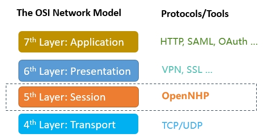

[](https://github.com/OpenNHP/opennhp/blob/master/README.md)
[](https://github.com/OpenNHP/opennhp/blob/master/README.zh-cn.md)


# OpenNHP: Zero Trust Network-infrastructure Hiding Protocol


---

## Challenge: AI transforms the Internet as a "Dark Forest" 

The rapid advancement of **AI** technologies, especially large language models (LLMs), is profoundly altering the cybersecurity landscape. The emergence of **Autonomous Vulnerability Exploitation (AVE)** marks a significant escalation in the AI era, streamlining the process of exploiting vulnerabilities, as discussed in [this research paper](https://arxiv.org/abs/2404.08144). This development places any exposed network services at heightened risk, resonating with the [Dark Forest Hypothesis](https://en.wikipedia.org/wiki/Dark_forest_hypothesis) of the Internet. AI-enabled tools continuously scan the digital environment, quickly identifying and leveraging weaknesses. As a result, the internet evolves into a **"Dark Forest,"** where **visibility equates to vulnerability**. 


This shifting paradigm necessitates a reevaluation of traditional cybersecurity methods, emphasizing proactive defenses, rapid response mechanisms, and possibly the adoption of network hiding technologies to protect critical infrastructure.

## Solution: Zero Trust Network-infrastructure Hiding Protocol

NHP, or **"Network-infrastructure Hiding Protocol,"** is a Zero Trust communication protocol that operates at the [Session layer of OSI network model](https://en.wikipedia.org/wiki/OSI_model), which is the best place for network visibility and connection management. Its primary goal is to keep protected resources hidden from unauthorized entities while allowing access exclusively to verified, authorized subjects through continuous verification. NHP draws inspiration from the *Single Packet Authorization (SPA)* protocol featured in the [Software Defined Perimeter (SDP) specification](https://cloudsecurityalliance.org/artifacts/software-defined-perimeter-zero-trust-specification-v2) published by the [Cloud Security Alliance (CSA)](https://cloudsecurityalliance.org). Beyond the capabilities of SPA, NHP enhances security, reliability, scalability, and extensibility. The detail comparison between NHP and SPA is listed [here](#comparison-between-spa-and-nhp).



**OpenNHP** is the open-source implementation of the NHP protocol, developed in *Golang*. It is designed with security-first principles, implementing a true zero-trust architecture at the session layer (the 5th layer) protocol in the OSI network model. Since the session layer is responsible for connection establishment and dialogue control, implementing zero trust at the session layer offers significant benefits:
- **Mitigate vulnerability risk:** The openness of TCP/IP protocols leads to a "trust by default" connection model, allowing anyone to establish a connection to a server port that provides services. Attackers exploit this openness to target server vulnerabilities. The NHP protocol implements the zero trust principle "never trust, always verify" by enforcing "deny-all" rules by default on the server side, only allowing authorized hosts to establish connections. This effectively mitigates vulnerability exploitation, particularly zero-day exploits.
- **Mitigate phishing attacks:** DNS hijacking is a serious threat to internet security and is used for malicious purposes such as phishing, stealing sensitive information, or spreading malware. The NHP protocol can function as an encrypted DNS resolution service to mitigate this problem. When the NHP-Agent on the client side sends a knock request to the controller component NHP-Server with the identifier (e.g., the domain name) of the protected resource, the NHP-Server will return the IP address and port number of the protected resource if the NHP-Agent is successfully authenticated. Since NHP communication is encrypted and mutually verified, the risk of DNS hijacking is effectively mitigated.
- **Mitigate DDoS attacks:** As mentioned above, a client cannot obtain the IP address and port number of protected resources without authentication. If the protected resources are distributed across multiple locations, the NHP server may return different IP addresses to different clients, making DDoS attacks significantly more difficult and expensive to execute.
- **Attack attribution:** The connection model of TCP/IP protocols is IP-based. With NHP, the connection model becomes identity (ID)-based. The connection initiator's identity must be authenticated before establishing the connection, making attacks much more identifiable and traceable. 

## Security Benefits

- Reduces attack surface by hiding infrastructure
- Prevents unauthorized network reconnaissance
- Mitigates vulnerability exploitation
- Stops phishing via encrypted DNS
- Protects against DDoS attacks
- Enables fine-grained access control
- Provides identity-based connection tracking

## Key Features

- Mitigates vulnerability exploitation by enforcing "deny-all" rules by default
- Prevents phishing attacks through encrypted DNS resolution
- Protects against DDoS attacks by hiding infrastructure
- Enables attack attribution through identity-based connections
- Default-deny access control for all protected resources
- Identity and device-based authentication before network access
- Encrypted DNS resolution to prevent DNS hijacking
- Distributed infrastructure to mitigate DDoS attacks
- Scalable architecture with decoupled components
- Integration with existing identity and access management systems
- Support for various deployment models (client-to-gateway, client-to-server, etc)
- Cryptographically secure using modern algorithms (ECC, Noise Protocol, IBC)

<details>
<summary>Click to expand feature details</summary>

- **Default-deny access control**: All resources are hidden by default, only becoming accessible after authentication and authorization.
- **Identity and device-based authentication**: Ensures that only known users on approved devices can gain access.
- **Encrypted DNS resolution**: Prevents DNS hijacking and associated phishing attacks.
- **DDoS mitigation**: Distributed infrastructure design helps protect against Distributed Denial of Service attacks.
- **Scalable architecture**: Decoupled components allow for flexible deployment and scaling.
- **IAM integration**: Works with your existing Identity and Access Management systems.
- **Flexible deployment**: Supports various models including client-to-gateway, client-to-server, and more.
- **Strong cryptography**: Utilizes modern algorithms like ECC, Noise Protocol, and IBC for robust security.
</details>

## Architecture and Workflow

The OpenNHP architecture is inspired by the NIST Zero Trust Architecture standard. It follows a modular design with the following core components: 


### OpenNHP Core Components:
#### NHP-Agent

The NHP-Agent is a client-side component that initiates communication and requests access to protected resources. It can be implemented as:

- A standalone client application
- An SDK integrated into existing applications
- A browser plugin
- A mobile app

The agent is responsible for:

- Generating and sending knock requests to the NHP-Server
- Maintaining secure communication channels
- Handling authentication flows

#### NHP-Server

The NHP-Server is the central controller that:

- Processes and validates knock requests from agents
- Interacts with the Authorization Service Provider for policy decisions
- Manages NHP-AC components to allow/deny access
- Handles key management and cryptographic operations

It can be deployed in a distributed or clustered configuration for high availability and scalability.

#### NHP-AC

NHP-AC (Access Control) components enforce access policies on protected resources. Key functions:

- Implement default deny-all rules
- Open/close access based on NHP-Server instructions
- Ensure network invisibility of protected resources
- Log access attempts

### Components that interact with OpenNHP: 
- **Protected Resources:** The resource provider is responsible for protecting these resources, such as API interfaces, application servers, gateways, routers, network devices, etc. In the SDP scenario, the Protected Resources are the SDP Gateway and Controller. 
- **Authorization Service Provider (ASP):** This provider validates access policies and provides the actual access addresses of Protected Resources. In the SDP Scenario, the ASP may be the SDP Controller. 

### Workflow

1. `NHP-Agent` sends knock request to `NHP-Server`
2. `NHP-Server` validates request and retrieves agent info
3. `NHP-Server` queries Authorization Service Provider
4. If authorized, `NHP-Server` instructs `NHP-AC` to allow access
5. `NHP-AC` opens connection and notifies `NHP-Server`
6. `NHP-Server` provides resource access details to `NHP-Agent`
7. `NHP-Agent` can now access the protected resource
8. Access is logged for auditing purposes

## Quick Start

Get OpenNHP up and running in minutes:

```bash
git clone https://github.com/opennhp/opennhp.git
cd opennhp
make
./nhp-server run
```

## Installation

Detailed installation instructions:

1. Clone the repository:
   ```bash
   git clone https://github.com/opennhp/nhp.git
   ```
2. Navigate to the project directory:
   ```bash
   cd nhp
   ```
3. Build the project:
   ```bash
   make
   ```
4. Install (optional):
   ```bash
   sudo make install
   ```

> ⚠️ Note: Running `sudo make install` requires root privileges. Make sure you trust the source before running this command.


## Deployment Models

OpenNHP supports multiple deployment models to suit different use cases:

- Client-to-Gateway: Secures access to multiple servers behind a gateway
- Client-to-Server: Directly secures individual servers/applications
- Server-to-Server: Secures communication between backend services
- Gateway-to-Gateway: Secures site-to-site connections

## Cryptographic Foundations

OpenNHP leverages state-of-the-art cryptographic algorithms:

- Elliptic Curve Cryptography (ECC): For efficient public key operations
- Noise Protocol Framework: For secure key exchange and identity verification
- Identity-Based Cryptography (IBC): For simplified key management at scale

## Comparison between SPA and NHP

NHP leverages modern cryptographic algorithms and programming language to ensure security and high performance, effectively addressing the limitations of SPA. 

| - | SPA |NHP | NHP Advantages  |
|:---|:---|:---|:---|
| **Architecture** | The SPA packet decryption and user/device authentication component is coupled with the network access control component in the SPA server. | NHP-Server (the packet decryption and user/device authentication component) and NHP-AC( the access control component) are decoupled. NHP-Server can be deployed in separate hosts and supports horizontal scaling. | <ul><li> Performance: the resource-consuming component NHP-server is separated from the protected server. </li><li>Scalability: NHP-server can be deployed in distributed or clustered mode.</li><li>Security: the IP address of the protected server is not visible to the client unless the authentication succeeded. </li></ul>|
| **Communication** | Single direction | Bi-direction | Better reliability with the status notification of access control |
| **Cryptographic framework** | PKI | IBC + Noise Framework |<ul><li>Security: proven secure key exchange mechanism to mitigate the MITM threats</li><li>Low cost: efficient key distribution for zero trust model</li><li>Performance: high performance encryption/decryption</li></ul>|
| **Capability of Hiding network infrastructure** | Only server ports | Domain, IP, and ports | More powerful against various attacks(e.g., vulnerabilities, DNS hijack, and DDoS attacks) |
| **Extensibility** | None, only for SDP | All-purpose | Support any scenario that needs service darkening |
| **Interoperability** | Not available | Customizable| NHP can seamlessly integrate with existing protocols (e.g., DNS, FIDO, etc.) |
| **Open Source Implementation** | [fwknop](https://github.com/mrash/fwknop) written in C++ | [OpenNHP](https://github.com/OpenNHP/opennhp) written in Go | <ul><li>Memory safety programming langauge, as highlighted in the [US Government report](https://www.whitehouse.gov/wp-content/uploads/2024/02/Final-ONCD-Technical-Report.pdf) </li><li>Better integration with cloud-native infrastructure</li></ul> |

## Contributing

We welcome contributions to OpenNHP! Please see our [Contributing Guidelines](CONTRIBUTING.md) for more information on how to get involved.


## License

OpenNHP is released under the [Apache 2.0 License](LICENSE).


## Contact

- Project Website: [https://github.com/OpenNHP/opennhp](https://github.com/OpenNHP/opennhp)
- Slack Channel: [Join our Slack](https://slack.opennhp.org)

For more detailed documentation, please visit our [Official Documentation](https://docs.opennhp.org).


## References

- [Software-Defined Perimeter (SDP) Specification v2.0](https://cloudsecurityalliance.org/artifacts/software-defined-perimeter-zero-trust-specification-v2). Jason Garbis, Juanita Koilpillai, Junaid lslam, Bob Flores, Daniel Bailey, Benfeng Chen, Eitan Bremler, Michael Roza, Ahmed Refaey Hussein. [*Cloud Security Alliance(CSA)*](https://cloudsecurityalliance.org/). Mar 2022.
- [AHAC: Advanced Network-Hiding Access Control Framework](https://www.mdpi.com/2076-3417/14/13/5593). Mudi Xu, Benfeng Chen, Zhizhong Tan, Shan Chen, Lei Wang, Yan Liu, Tai Io San, Sou Wang Fong, Wenyong Wang, and Jing Feng. *Applied Sciences Journal*. June 2024.
- Vulnerability Management Framework project. https://phoenix.security/web-vuln-management/ 

---

🌟 Thank you for your interest in OpenNHP! We look forward to your contributions and feedback.
