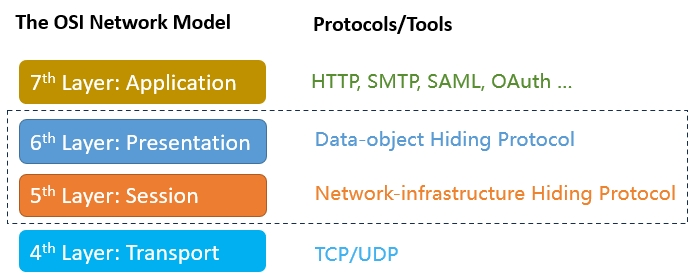

# OpenNHP: Open Source Zero Trust Security Toolkit for the AI Era

**OpenNHP** is a lightweight, cryptography-powered, open-source toolkit built to enforce Zero Trust security for infrastructure, applications, and data in the AI-driven world. By leveraging resource obfuscation and advanced encryption algorithms, OpenNHP effectively reduces attack surfaces and strengthens defense against cyber threats. It features two core protocols:

- **Network-infrastructure Hiding Protocol (NHP):** Conceals server ports, IP addresses, and domain names to protect applications and infrastructure from unauthorized access.
- **Data-object Hiding Protocol (DHP):** Ensures data security and privacy by employing encryption algorithms and confidential computing to make data *"usable but not visible"*.

---

## Challenge: AI transforms the Internet into a "Dark Forest"

The rapid evolution of **AI** technologies, particularly large language models (LLMs), is significantly reshaping the cybersecurity landscape. The emergence of **Autonomous Vulnerability Exploitation (AVE)** represents a major leap in the AI era, streamlining the exploitation of vulnerabilities, as highlighted in recent research such as [[1]](https://googleprojectzero.blogspot.com/2024/10/from-naptime-to-big-sleep.html), [[2]](https://arxiv.org/abs/2404.08144), [[3]](https://github.com/protectai/vulnhuntr) and etc. This development dramatically increases the risk for any exposed network services, reflecting the [Dark Forest Hypothesis](https://en.wikipedia.org/wiki/Dark_forest_hypothesis) of the Internet. AI-powered tools are continuously scanning the digital realm, quickly finding and exploiting weaknesses. Consequently, the Internet is evolving into a **"Dark Forest,"** where **VISIBILITY equates to VULNERABILITY**.

Gartner research anticipates a [sharp rise in AI-driven cyberattacks](https://www.gartner.com/en/newsroom/press-releases/2024-08-28-gartner-forecasts-global-information-security-spending-to-grow-15-percent-in-2025). To address these threats, CISA recently issued an executive order mandating a [14-day deadline for vulnerability remediation](https://www.cisa.gov/sites/default/files/2024-10/Proposed-Security-Requirements-EO-14117-21Oct24508.pdf). This shift necessitates a reevaluation of traditional cybersecurity approaches, emphasizing proactive defense, rapid response strategies, and the deployment of network-hiding technologies to protect critical infrastructure.

---

## NHP Quick Demo: Hiding Application Server Ports

Before diving into the details of OpenNHP, let's start with a quick demonstration of how OpenNHP protects a server from unauthorized access. You can see it in action by accessing the protected server at https://acdemo.opennhp.org.

### 1) The Protected Server is "Invisible" to Unauthenticated Users

By default, any attempt to connect to the protected server will result in a TIME OUT error, as all ports are closed, making the server appear offline and effectively *"invisible."*

Port scanning the server will also return a TIME OUT error.

### 2) After Authentication, the Protected Server Becomes Accessible

OpenNHP supports a variety of authentication methods, such as OAuth, SAML, QR codes, and more. For simplicity, this demo uses a basic username/password authentication service at https://demologin.opennhp.org to demonstrate the process.

Once you click the "Login" button, authentication is completed successfully, and you are redirected to the protected server. At this point, the server becomes *"visible"* and accessible on your device.

---

## Quick Start: Build and Test OpenNHP

Follow our [quick start tutorial](https://opennhp.org/nhp_quick_start/) to build the OpenNHP source code and test it in a Docker environment. You will get your own OpenNHP environment up, simulate the “invisible” network hiding behavior and test authentication workflows.

---

## Vision: Reinventing the Internet for Trust in the AI Era

The openness of TCP/IP protocols has driven the explosive growth of internet applications but also exposed vulnerabilities, allowing malicious actors to gain unauthorized access and exploit any exposed IP address. Although the [OSI network model](https://en.wikipedia.org/wiki/OSI_model) defines the *5th layer (Session Layer)* for managing connections, few effective solutions have been implemented to address this.

**NHP**, or the **"Network-infrastructure Hiding Protocol"**, is a lightweight cryptography-driven Zero Trust  protocol designed to function at the *OSI 5th Layer*, which is optimal for managing network visibility and connections. NHP's key objective is to conceal protected resources from unauthorized entities, granting access only to verified, authorized users through continuous verification, contributing to a more trustworthy Internet.

---

## Solution: OpenNHP Fixes the Network/Data Visibility Control

**OpenNHP** is the open-source implementation of the NHP/DHP protocol. It is cryptography-driven and designed with security-first principles, implementing a true zero-trust architecture at the *OSI Session and Presentation Layer*.

OpenNHP builds upon earlier research in network hiding technology, utilizing modern cryptographic framework and architecture to ensure security and high performance, thereby overcoming the limitations of previous technologies.

| Network Hiding Protocol | 1st Generation | 2nd Generation | 3rd Generation |
|:---|:---|:---|:---|
| **Core Technology** | [Port Knocking](https://en.wikipedia.org/wiki/Port_knocking) | [Single Packet Authorization (SPA)](https://cloudsecurityalliance.org/artifacts/software-defined-perimeter-zero-trust-specification-v2) | Network-resource Hiding Protocol (NHP) |
| **Authentication** | Port sequences | Shared Secrets | Modern Crypto Framework |
| **Architecture** | No Control Plane | No Control Plane | Scalable Control Plane |
| **Capability** | Hide Ports | Hide Ports | Hide Ports, IPs and Domains |
| **Access Control** | IP Level | Port Level | Application Level |
| **Open Source Projects** | [knock](https://github.com/jvinet/knock) *(C)* | [fwknop](https://github.com/mrash/fwknop) *(C++)* | [OpenNHP](https://github.com/OpenNHP/opennhp) *(Go)* |

> It is crucial to choose a **memory-safe** language like *Go* for OpenNHP development, as emphasized in the [US Government technical report](https://www.whitehouse.gov/wp-content/uploads/2024/02/Final-ONCD-Technical-Report.pdf). For a detailed comparison between **SPA and NHP**, refer to the [section below](#comparison-between-spa-and-nhp).

## Security Benefits

Since OpenNHP implements Zero Trust principles at the *OSI Session Layer*, it offers significant benefits:

- Reduces attack surface by hiding infrastructure
- Prevents unauthorized network reconnaissance
- Mitigates vulnerability exploitation
- Stops phishing via encrypted DNS
- Protects against DDoS attacks
- Enables fine-grained access control
- Provides identity-based connection tracking
- Attack attribution

## Architecture

The OpenNHP architecture is inspired by the [NIST Zero Trust Architecture standard](https://www.nist.gov/publications/zero-trust-architecture). It follows a modular design with the 3 core components: **NHP-Server**, **NHP-AC** and **NHP-Agent**, as illustrated in the below diagram.

> Please refer to the [OpenNHP Documentation](https://opennhp.org/) for detailed information about architecture and workflow.

## Core: Cryptographic Algorithms

Cryptography is at the heart of OpenNHP, providing robust security, excellent performance, and scalability by utilizing cutting-edge cryptographic algorithms. Below are the key cryptographic algorithms and frameworks employed by OpenNHP:

- **[Elliptic Curve Cryptography (ECC)](https://en.wikipedia.org/wiki/Elliptic-curve_cryptography):** Used for efficient public key cryptography.

> Compared to RSA, ECC offers superior efficiency with stronger encryption at shorter key lengths, improving both network transmission and computational performance. The table below highlights the differences in security strength, key lengths, and the key length ratio between RSA and ECC, along with their respective validity periods.

| Security Strength (bits) | DSA/RSA Key Length (bits) | ECC Key Length (bits) | Ratio: ECC vs. DSA/RSA | Validity |
|:------------------------:|:-------------------------:|:---------------------:|:----------------------:|:--------:|
| 80                       | 1024                      | 160-223               | 1:6                    | Until 2010 |
| 112                      | 2048                      | 224-255               | 1:9                    | Until 2030 |
| 128                      | 3072                      | 256-383               | 1:12                   | After 2031 |
| 192                      | 7680                      | 384-511               | 1:20                   | |
| 256                      | 15360                     | 512+                  | 1:30                   | |

- **[Noise Protocol Framework](https://noiseprotocol.org/):** Enables secure key exchange, message encryption/decryption, and mutual authentication.

> The Noise Protocol is built around the [Diffie-Hellman key agreement](https://en.wikipedia.org/wiki/Diffie%E2%80%93Hellman_key_exchange) and provides modern cryptographic solutions like mutual and optional authentication, identity hiding, forward secrecy, and zero round-trip encryption. Proven for its security and performance, it is already used by popular applications like [WhatsApp](https://www.whatsapp.com/security/WhatsApp-Security-Whitepaper.pdf), [Slack](https://github.com/slackhq/nebula) and [WireGuard](https://www.wireguard.com/).

- **[Identity-Based Cryptography (IBC)](https://en.wikipedia.org/wiki/Identity-based_cryptography):** Simplifies key distribution at scale.

> Efficient key distribution is essential for implementing Zero Trust. OpenNHP supports both PKI and IBC. While PKI has been widely used for decades, it depends on centralized Certificate Authorities (CA) for identity verification and key management, which can be time-consuming and costly. In contrast, IBC allows for a decentralized and self-governing approach to identity verification and key management, making it more cost-effective for OpenNHP's Zero Trust environment, where billions of devices or servers may need protection and onboarding in real-time.

- **[Certificateless Public Key Cryptography (CL-PKC)](https://en.wikipedia.org/wiki/Certificateless_cryptography):** Recommended IBC algorithm

> CL-PKC is a scheme that enhances security by avoiding key escrow and addressing the limitations of Identity-Based Cryptography (IBC). In most IBC systems, a user's private key is generated by a Key Generation Center (KGC), which introduces significant risks. A compromised KGC can lead to the exposure of all users' private keys, requiring full trust in the KGC. CL-PKC mitigates this issue by splitting the key generation process, so the KGC only has knowledge of a partial private key. As a result, CL-PKC combines the strengths of both PKI and IBC, offering stronger security without the drawbacks of centralized key management.

Further reading:

> Please refer to the [OpenNHP Documentation](https://opennhp.org/cryptography/) for detailed explanation of cryptographic algorithms used in OpenNHP.

## Key Features

- Mitigates vulnerability exploitation by enforcing "deny-all" rules by default
- Prevents phishing attacks through encrypted DNS resolution
- Protects against DDoS attacks by hiding infrastructure
- Enables attack attribution through identity-based connections
- Default-deny access control for all protected resources
- Identity and device-based authentication before network access
- Encrypted DNS resolution to prevent DNS hijacking
- Distributed infrastructure to mitigate DDoS attacks
- Scalable architecture with decoupled components
- Integration with existing identity and access management systems
- Support for various deployment models (client-to-gateway, client-to-server, etc)
- Cryptographically secure using modern algorithms (ECC, Noise Protocol, IBC)

Click to expand feature details

- **Default-deny access control**: All resources are hidden by default, only becoming accessible after authentication and authorization.
- **Identity and device-based authentication**: Ensures that only known users on approved devices can gain access.
- **Encrypted DNS resolution**: Prevents DNS hijacking and associated phishing attacks.
- **DDoS mitigation**: Distributed infrastructure design helps protect against Distributed Denial of Service attacks.
- **Scalable architecture**: Decoupled components allow for flexible deployment and scaling.
- **IAM integration**: Works with your existing Identity and Access Management systems.
- **Flexible deployment**: Supports various models including client-to-gateway, client-to-server, and more.
- **Strong cryptography**: Utilizes modern algorithms like ECC, Noise Protocol, and IBC for robust security.

## Deployment

OpenNHP supports multiple deployment models to suit different use cases:

- Client-to-Gateway: Secures access to multiple servers behind a gateway
- Client-to-Server: Directly secures individual servers/applications
- Server-to-Server: Secures communication between backend services
- Gateway-to-Gateway: Secures site-to-site connections

> Please refer to the [OpenNHP Documentation](https://opennhp.org/deploy/) for detailed deployment instructions.

## Comparison between SPA and NHP
The Single Packet Authorization (SPA) protocol is included in the [Software Defined Perimeter (SDP) specification](https://cloudsecurityalliance.org/artifacts/software-defined-perimeter-zero-trust-specification-v2) released by the [Cloud Security Alliance (CSA)](https://cloudsecurityalliance.org/). NHP improves security, reliability, scalability, and extensibility through a modern cryptographic framework and architecture, as demonstrated in the [AHAC research paper](https://www.mdpi.com/2076-3417/14/13/5593).

| - | SPA |NHP | NHP Advantages  |
|:---|:---|:---|:---|
| **Architecture** | The SPA packet decryption and user/device authentication component is coupled with the network access control component in the SPA server. | NHP-Server (the packet decryption and user/device authentication component) and NHP-AC( the access control component) are decoupled. NHP-Server can be deployed in separate hosts and supports horizontal scaling. | <ul><li> Performance: the resource-consuming component NHP-server is separated from the protected server. </li><li>Scalability: NHP-server can be deployed in distributed or clustered mode.</li><li>Security: the IP address of the protected server is not visible to the client unless the authentication succeeded. </li></ul>|
| **Communication** | Single direction | Bi-direction | Better reliability with the status notification of access control |
| **Cryptographic framework** | Shared Secretes | PKI or IBC, Noise Framework |<ul><li>Security: proven secure key exchange mechanism to mitigate the MITM threats</li><li>Low cost: efficient key distribution for zero trust model</li><li>Performance: high performance encryption/decryption</li></ul>|
| **Capability of Hiding network infrastructure** | Only server ports | Domain, IP, and ports | More powerful against various attacks(e.g., vulnerabilities, DNS hijack, and DDoS attacks) |
| **Extensibility** | None, only for SDP | All-purpose | Support any scenario that needs service darkening |
| **Interoperability** | Not available | Customizable| NHP can seamlessly integrate with existing protocols (e.g., DNS, FIDO, etc.) |

## Performance Benchmarks

| Operation | Throughput | Latency |
|-----------|------------|---------|
| Authentication | 10K req/s | < 10ms |
| Port Hiding | 100K req/s | < 1ms |
| DNS Resolution | 50K req/s | < 5ms |

*Tested on AWS t3.xlarge instance

## Contributing

We welcome contributions to OpenNHP! Please see our [Contributing Guidelines](CONTRIBUTING.md) for more information on how to get involved.

## Sponsors

## License

OpenNHP is released under the [Apache 2.0 License](LICENSE).

## Contact

- Project Website: [https://github.com/OpenNHP/opennhp](https://github.com/OpenNHP/opennhp)
- Email: [opennhp@gmail.com](mailto:support@opennhp.org)
- Slack Channel: [Join our Slack](https://opennhp.slack.com/)

For more detailed documentation, please visit our [Official Documentation](https://docs.opennhp.org).

## References

1. [From Naptime to Big Sleep: Using Large Language Models To Catch Vulnerabilities In Real-World Code](https://googleprojectzero.blogspot.com/2024/10/from-naptime-to-big-sleep.html), Google Big Sleep team. Google Project Zero. Oct 2024.
2. [LLM Agents can Autonomously Exploit One-day Vulnerabilities](https://arxiv.org/abs/2404.08144). Richard Fang, Rohan Bindu, Akul Gupta, Daniel Kang. arxiv. April 2004.
3. [VulnHuntr: Zero shot vulnerability discovery using LLMs](https://github.com/protectai/vulnhuntr). VulnHuntr Open Source Project: https://github.com/protectai/vulnhuntr.
4. [Software-Defined Perimeter (SDP) Specification v2.0](https://cloudsecurityalliance.org/artifacts/software-defined-perimeter-zero-trust-specification-v2). Jason Garbis, Juanita Koilpillai, Junaid lslam, Bob Flores, Daniel Bailey, Benfeng Chen, Eitan Bremler, Michael Roza, Ahmed Refaey Hussein. [*Cloud Security Alliance(CSA)*](https://cloudsecurityalliance.org/). Mar 2022.
5. [AHAC: Advanced Network-Hiding Access Control Framework](https://www.mdpi.com/2076-3417/14/13/5593). Mudi Xu, Benfeng Chen, Zhizhong Tan, Shan Chen, Lei Wang, Yan Liu, Tai Io San, Sou Wang Fong, Wenyong Wang, and Jing Feng. *Applied Sciences Journal*. June 2024.
6. [STALE: A Scalable and Secure Trans-Border Authentication Scheme Leveraging Email and ECDH Key Exchange](https://www.mdpi.com/2079-9292/14/12/2399). Jiexin Zheng, Mudi Xu, Jianqing Li, Benfeng Chen, Zhizhong Tan, Anyu Wang, Shuo Zhang, Yan Liu, Kevin Qi Zhang, Lirong Zheng, and Wenyong Wang. *Electronics*. June 2025.
7. [DRL-AMIR: Intelligent Flow Scheduling for Software-Defined Zero Trust Networks](https://www.techscience.com/cmc/v84n2/62920). Wenlong Ke, Zilong Li, Peiyu Chen, Benfeng Chen, Jinglin Lv, Qiang Wang, Ziyi Jia and Shigen Shen. *CMC*. July 2025.
8. Noise Protocol Framework. https://noiseprotocol.org/
9. Vulnerability Management Framework project. https://phoenix.security/web-vuln-management/ 
10. [Research on Secure and Trusted Data Interaction Architecture for AI Agents](https://www.cqvip.com/journal/36269/36269).Shuo Zhang,Rui Song,Huibin Xu,Nan Li,Wanyue Xie,Benfeng Chen.Computer Engineering and Applications.August 2025.
---

🌟 Thank you for your interest in OpenNHP! We look forward to your contributions and feedback.
