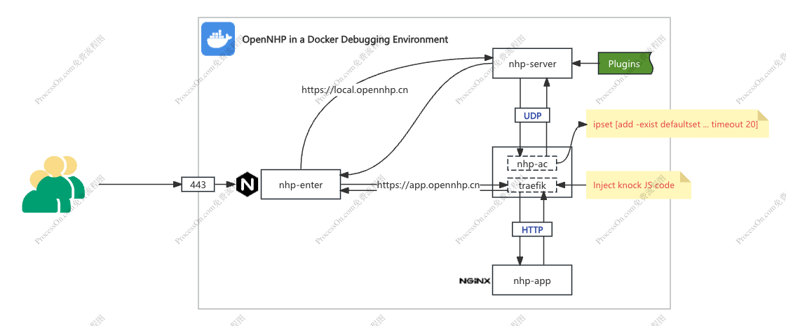

# Docker 本地调试环境

本地搭建的 Docker 调试环境，通过 Docker 模拟搭建出 nhp-server, nhp-ac, traefik, app 等，环境可用于：
- plugins 插件调试
- 基础逻辑验证
- 本机性能压测



## build 基础镜像

```shell
cd ./docker
docker build -t opennhp-base:latest -f Dockerfile.base ../..
```

## 配置 resource.toml 

位于：./docker/nhp-server/plugins/example/etc/resource.toml 
采用以下命令，查看 nhp-ac 的 docker ip

```shell
docker inspect -f '{{range .NetworkSettings.Networks}}{{.IPAddress}}{{end}}' nhp-ac
```
运行后，将得到两个 docker IP， 如：172.19.0.5172.21.0.4，将两个 IP 分别配置到配置文件，如下：

```toml
["demo".Resources."demoServer2"]
ACId = "testAC-1"
Hostname = "app.opennhp.cn"
Addr.Ip = "172.19.0.5"
Addr.Port = 80 # empty or 0 for all ports
Addr.Protocol = ""
PortSuffix = false

["demo".Resources."demoServer"]
ACId = "testAC-1"
Hostname = "app.opennhp.cn"
Addr.Ip = "172.21.0.4"
Addr.Port = 80 # empty or 0 for all ports
Addr.Protocol = ""
PortSuffix = false
```

## 启动环境
***注： 进入 docker 目录(cd ./docker)***
```shell
docker compose up -d
```

## 初步测试
http://localhost:62206/plugins/example?resid=demo&action=login

- 页面正常显示
- 点击登录后，自动跳转
### 验证 ipset 规则
```shell
% docker exec -it nhp-ac ipset list
```
如出现以下结果，则说明成功写入，意味着敲门成功

***Name: defaultset 下面多了两条规则***

```shell
Name: defaultset
Type: hash:ip,port,ip
Revision: 5
Header: family inet hashsize 1024 maxelem 1000000 timeout 120 counters
Size in memory: 656
References: 7
Number of entries: 2
Members:
192.168.65.1,udp:80,172.19.0.4 timeout 15 packets 0 bytes 0
192.168.65.1,tcp:80,172.19.0.4 timeout 15 packets 0 bytes 0

Name: defaultset_down
Type: hash:ip,port,ip
Revision: 5
Header: family inet hashsize 1024 maxelem 1000000 timeout 121 counters
Size in memory: 208
References: 2
Number of entries: 0
Members:

Name: tempset
Type: hash:net,port
Revision: 7
Header: family inet hashsize 1024 maxelem 1000000 timeout 5 counters
Size in memory: 456
References: 2
Number of entries: 0
Members:
```

### 下一步，配置本地 https

- 本地 https 证书生成
进入 ./docker/certs ，执行以下命令
```
openssl req -x509 -newkey rsa:4096 -sha256 -days 365 -nodes \
  -keyout server.key -out server.crt -subj "/CN=opennhp.cn" \
  -addext "subjectAltName=DNS:opennhp.cn,IP:127.0.0.1"
```

- 添加 /etc/hosts 配置

```
127.0.0.1       local.opennhp.cn
127.0.0.1       app.opennhp.cn
```

- 验证

https://local.opennhp.cn/plugins/passcode?resid=demo&action=login

input passcode: 123456

## 压测

```shell
ab -k -n 10000 -c 100 'http://local.opennhp.cn/plugins/passcode?resid=demo&action=valid&passcode=123456'
```