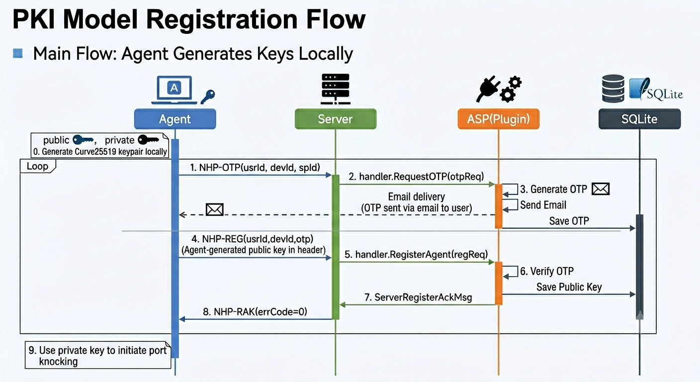

# Agent Register — Current State Analysis & Implementation Plan

> Branch: `feature/agent-register` | Date: 2026-06-24 | Based on `main`

## 1. Requirements Overview

Per the NHP protocol specification (T/CCF 0002—2024), implement the Agent Register functionality for the NHP protocol, involving the following message types:

| Message | Type Code | Direction | Purpose |
| --- | --- | --- | --- |
| **NHP-OTP** | 12 | Agent → Server | Request a one-time password (optional prerequisite) |
| **NHP-REG** | 13 | Agent → Server | Agent registers its public key with the Server |
| **NHP-RAK** | 14 | Server → Agent | Confirm successful key registration |

Two key distribution modes are supported:
- **PKI mode**: Traditional public key infrastructure — Agent registers its public key directly with NHP-Server via NHP-REG
- **IBC/CL-PKC mode**: Identity-Based Cryptography / Certificateless Public Key Cryptography — key distribution via KGC

### 1.1 Design Decisions (Confirmed)

| Decision | Resolution | Notes |
| --- | --- | --- |
| OTP delivery channel | **Email** | ASP plugin sends OTP via email |
| Key generation | **Agent first, Relay fallback** | Agent generates its own key pair (e.g., js-agent in the browser); if the environment is constrained, the NHP-Relay API generates keys as a fallback |
| Public key storage | **SQLite** | NHP-Server persists registered Agent public keys in SQLite |

## 2. Current Implementation State

### 2.1 Already Implemented (Foundation)

#### Packet Type Definitions
- `nhp/core/packet.go:28-30` — `NHP_OTP`(12), `NHP_REG`(13), `NHP_RAK`(14) are all defined
- `nhp/core/packet.go:85-104` — `HeaderTypeToDeviceType` mapping complete: REG/OTP→AGENT, RAK→SERVER
- `nhp/core/transaction.go:34,39,87,93` — REG/RAK registered as a transaction request/response pair

#### Message Structures
- `nhp/common/nhpmsg.go:31-53` — `AgentOTPMsg`, `AgentRegisterMsg`, `ServerRegisterAckMsg` structs are complete
- `nhp/common/types.go:47-57` — `NhpOTPRequest`, `NhpRegisterRequest` wrapper types are complete

#### Server-Side Handling
- `endpoints/server/udpserver.go:938-942` — `recvMessageRoutine` correctly dispatches NHP_OTP, NHP_REG
- `endpoints/server/msghandler.go:169-204` — `HandleOTPRequest`: parse → lookup plugin → call `RequestOTP()`, no response sent back
- `endpoints/server/msghandler.go:208-276` — `HandleRegisterRequest`: parse → extract public key → lookup plugin → call `RegisterAgent()` → send NHP_RAK response

#### Client-Side Requests
- `endpoints/agent/request.go:14-75` — `RequestOtp()`: construct `AgentOTPMsg` → send NHP_OTP → fire-and-forget
- `endpoints/agent/request.go:77-163` — `RegisterPublicKey()`: construct `AgentRegisterMsg` → send NHP_REG → block waiting for NHP_RAK → return result

#### Plugin Interface
- `nhp/plugins/serverpluginhandler.go:23-24` — `RequestOTP`, `RegisterAgent` defined in the `PluginHandler` interface
- `nhp/plugins/serverpluginhandler.go:36-41` — Symbol table includes `sRequestOTP`, `sRegisterAgent` for reflective loading

#### KGC Infrastructure
- `endpoints/kgc/` — Complete CL-PKC key generation logic (SM2 curve + SM3 hash)
- Supports four CLI commands: `setup` (generate master key), `keygen` (generate user key), `sign`, `verify`

#### Protocol Header IBC Support
- `nhp/core/scheme/curve/header.go:17-24` — Curve25519 header reserves a 64+16 byte IBC Identity ciphertext slot
- `nhp/core/scheme/gmsm/header.go:17-24` — GMSM header has the same reservation
- `nhp/common/packet.go:7` — `NHP_FLAG_CL_PKC` header flag defined (bit 2)
- `nhp/core/initiator.go:32,387-389` — `MsgData.ClPkc` flag propagates to the header `NHP_FLAG_CL_PKC`

### 2.2 Gaps / To Be Implemented

#### A. Plugin-Side Implementation Is Empty
The example plugin (`examples/server_plugin/basic/main.go`) **does not export** `RequestOTP`, `RegisterAgent`, or `ListService`. The current basic plugin only implements `AuthWithNHP` and `AuthWithHttp`, causing the REG/OTP flow to fail with `ErrAuthHandlerNotFound` because `handler == nil` (no plugin found for the ASP).

Other plugins (authenticator, oidc) also do not implement these three methods.

#### B. KGC Is an Offline CLI Tool Only
The current `endpoints/kgc/` is a pure CLI tool with no network service capability. The protocol specification's "Agent initiates NHP-OTP / NHP-REG to a KGC server" scenario cannot be realized.

#### C. Header IBC Identity Field Is Not Populated
- `nhp/core/scheme/curve/curve.go:75` — `Identity()` returns `nil`
- `nhp/core/scheme/gmsm/gmsm.go:88` — `Identity()` returns `nil`
- `MidPublicKey()` returns `nil` in both schemes

This means even when the `NHP_FLAG_CL_PKC` flag is set, the 80-byte IBC Identity ciphertext slot in the header remains zero — IBC/CL-PKC mode is effectively unusable.

#### D. REG/OTP Flow Not Integrated with Upper Call Chain
The Agent-side `RequestOtp()` and `RegisterPublicKey()` methods are implemented but have two gaps:
1. **No upper-level caller**: `UdpAgent` has no public API method for external consumers (HTTP API, CLI, js-agent) to trigger OTP request and registration flow
2. **No auto-trigger logic**: On first connection, if the server returns an "unregistered" error, the Agent does not automatically initiate the registration flow

#### E. Server-Side Lacks Public Key Storage Mechanism
After `HandleRegisterRequest` passes the public key to the plugin's `RegisterAgent` method, the plugin needs to persist that key. Currently undefined:
- Public key storage interface (database / file / etcd)
- Registered Agent peer table management

#### F. Protocol Specification IBC Registration Fields Not Implemented
The protocol spec Table D.4 defines IBC identity public key registration fields (NHP type flag, user-readable identity, device unique identifier, random number, validity period), and Table D.5 defines KGC-issued user digital certificate fields. None of these exist in the current implementation.

## 3. Implementation Plan

### 3.1 Overall Architecture

```text
┌─────────┐  NHP-OTP(12)  ┌──────────┐  HTTP/Email/SMS  ┌─────┐
│  Agent  │ ─────────────→│  Server  │ ────────────────→│ ASP │
│         │               │          │                   │     │
│         │  NHP-REG(13)  │          │                   └─────┘
│         │ ─────────────→│          │
│         │               │          │
│         │  NHP-RAK(14)  │          │
│         │ ←─────────────│          │
└─────────┘               └──────────┘

PKI mode: Agent ←→ Server (direct public key registration, ASP validates OTP)
IBC mode: Agent ←→ KGC (identity-based key registration and distribution via KGC)
```

### 3.2 Phased Implementation

#### Phase 1: PKI Mode — Complete the REG/OTP/RAK Core Chain (Current)

**Goal**: Make the Agent registration flow end-to-end functional in PKI mode.

**Design premises**:
- OTP is delivered by the ASP plugin via **Email**
- Agent key pair is **preferably generated by the Agent itself** (e.g., js-agent using Web Crypto API in the browser); if the environment is constrained, the NHP-Relay HTTP API generates keys as a fallback
- Registered Agent public keys are persisted using **SQLite**

**Work items**:

1. **Implement `RequestOTP` in the ASP plugin — Email delivery**
   - File: `examples/server_plugin/basic/main.go`
   - Functionality: Receive OTP request → generate random code (6 digits) → send email via SMTP
   - Configuration: SMTP server address, port, auth credentials, sender address, email template
   - Storage: Associate OTP with (userId, deviceId), set expiry (recommended 5 min), store in SQLite

2. **Implement `RegisterAgent` in the ASP plugin — validation + key registration**
   - File: same as above
   - Functionality:
     - Validate OTP (match userId/deviceId, not expired)
     - Write Agent public key (carried in NHP-REG header by Agent) associated with (userId, deviceId) into SQLite
     - Return `ServerRegisterAckMsg`

3. **NHP-Server SQLite public key storage**
   - File: new `endpoints/server/keystore.go`
   - Functionality: SQLite-based Agent public key table CRUD + OTP management
   - Schema: see section 3.5

4. **NHP-Relay key generation API (fallback)**
   - File: new `endpoints/relay/keygen_api.go`
   - Functionality: HTTP API for Agents that cannot generate keys themselves; generates and returns a Curve25519 key pair
   - Note: This is auxiliary and does not affect the core registration flow

5. **js-agent registration page**
   - File: new `endpoints/js-agent/examples/reg.html`
   - Entry point: `https://reg.opennhp.org`
   - Functionality:
     - User fills in userId, deviceId, email address
     - Clicks "Get Code" → js-agent locally generates Curve25519 key pair → sends NHP-OTP → Server/ASP sends email OTP
     - User enters received OTP → clicks "Register" → sends NHP-REG (public key in header)
     - On success, save private key locally (localStorage or download as file)
   - Tech stack: Plain HTML + ES Module, consistent with existing `relay-test.html` style, reusing `@opennhp/agent` SDK
   - SDK extension needed: expose `requestOtp()` and `registerPublicKey()` methods (currently only internal)

6. **Error codes**
   - File: `nhp/common/errors.go`
   - New codes:
     - `ErrOTPInvalid` — OTP validation failed
     - `ErrOTPExpired` — OTP has expired
     - `ErrPublicKeyAlreadyRegistered` — public key already registered by another user
     - `ErrAgentAlreadyRegistered` — device already registered (for upper-layer semantic distinction)
     - `ErrAgentNotRegistered` — Agent attempted knock without registering

7. **js-agent SDK method exposure**
   - Files: `endpoints/js-agent/src/index.ts`, `NHPAgent.ts`
   - New public methods:
     - `requestOtp(target)` → sends NHP-OTP, returns void
     - `registerPublicKey(target, otp)` → sends NHP-REG, returns registration result
   - These methods are already implemented in the native Agent (`request.go`); the js-agent side needs the corresponding TypeScript implementation

#### 3.2.1 Demo Deployment Changes

A new domain `reg.opennhp.org` hosts the js-agent registration page, requiring the following infrastructure changes:

| Component | File | Change |
| --- | --- | --- |
| DNS | `terraform/demo/dns.tf` | Add `reg.opennhp.org` CNAME → relay public IP |
| Nginx vhost | `deploy/nginx/reg.conf.template` (**new file**) | New vhost, root `/var/www/jsagent/reg/`, shares relay EC2 instance with existing `agent.opennhp.org` |
| CI/CD | `.github/workflows/deploy-demo-v2.yml` | Add `reg.html` deployment step in `deploy-jsagent` job |
| TLS | Auto-provisioned via certbot/ACME with SAN `reg.opennhp.org` | Shared or separate cert with relay |

Post-deployment directory structure (relay EC2):

```text
/var/www/jsagent/
  ├── index.html          # existing relay-test.html (agent.opennhp.org)
  ├── config.json
  ├── reg/
  │   └── index.html      # registration page (reg.opennhp.org)
  └── nhp-js/
      └── dist/           # SDK build artifacts
```

#### Phase 2: IBC/CL-PKC Mode (Future)

1. **KGC network service transformation**
   - Convert KGC from a CLI tool to a UDP network service (similar to NHP-Server)
   - Support receiving NHP-OTP, NHP-REG messages and responding with NHP-RAK

2. **Header IBC Identity field population**
   - Implement `Identity()` and `MidPublicKey()` methods
   - In CL-PKC mode, encrypt and write the user identity public key into the header Identity field

3. **IBC registration flow**
   - Implement identity public key registration fields per Table D.4
   - Implement user digital certificate generation and distribution per Table D.5
   - Support SM9/CPK algorithms (domestic IBC standards)

### 3.3 Key Code Change Checklist

| File | Change Type | Description |
| --- | --- | --- |
| `examples/server_plugin/basic/main.go` | New methods | Export `RequestOTP` (Email SMTP), `RegisterAgent` (validate OTP + register public key) |
| `endpoints/server/keystore.go` | **New file** | SQLite Agent public key storage: schema, CRUD, OTP management |
| `endpoints/relay/keygen_api.go` | **New file** | NHP-Relay HTTP API: generates Curve25519 key pair for Agents that cannot self-generate (fallback) |
| `nhp/common/errors.go` | New codes | Registration error codes (`ErrOTPInvalid`, `ErrPublicKeyAlreadyRegistered`, etc.) |
| `endpoints/agent/udpagent.go` | Extension | Expose `Register()` public method; local key generation (`nhp/core` ECDH) |
| `endpoints/agent/request.go` | Extension | `RegisterPublicKey` uses Agent's locally generated public key (consistent with current impl) |
| `endpoints/server/msghandler.go` | Extension | `HandleRegisterRequest` coordinates key registration + SQLite storage + RAK response |
| `endpoints/server/config.go` | Extension | New `DatabasePath` config option |
| `endpoints/js-agent/src/NHPAgent.ts` | Extension | Expose `requestOtp()`, `registerPublicKey()` public methods |
| `endpoints/js-agent/examples/reg.html` | **New file** | Agent registration page (`reg.opennhp.org`), OTP request + registration flow UI |
| `terraform/demo/dns.tf` | Extension | New `reg.opennhp.org` DNS record |
| `deploy/nginx/reg.conf.template` | **New file** | `reg.opennhp.org` Nginx vhost config |
| `.github/workflows/deploy-demo-v2.yml` | Extension | Deploy js-agent registration page to relay EC2 |
| `docs/features/agent-register.md` | This document | Current state analysis & implementation plan |

### 3.4 PKI Mode Registration Flow



**Fallback flow: Agent cannot self-generate keys, uses NHP-Relay HTTP API**

```text
Agent                              Relay(HTTP API)
  │                                  │
  │  POST /api/keygen                │
  │  {usrId, devId}                  │
  │ ───────────────────────────────→ │
  │                                  │ Generate Curve25519 key pair
  │  {publicKey, privateKey}         │
  │ ←─────────────────────────────── │
  │                                  │
  │ (then continue primary flow      │
  │  steps 1–9)                      │
```

### 3.5 SQLite Storage Design

#### 3.5.1 OTP Table

```sql
CREATE TABLE otp_records (
    id         INTEGER PRIMARY KEY AUTOINCREMENT,
    usr_id     TEXT NOT NULL,
    dev_id     TEXT NOT NULL,
    otp_code   TEXT NOT NULL,
    created_at INTEGER NOT NULL,  -- Unix timestamp (seconds)
    expires_at INTEGER NOT NULL,  -- Unix timestamp (seconds)
    used       INTEGER DEFAULT 0  -- 0=unused, 1=used
);
CREATE INDEX idx_otp_usr_dev ON otp_records(usr_id, dev_id);
```

#### 3.5.2 Agent Public Key Table

```sql
CREATE TABLE agent_keys (
    id         INTEGER PRIMARY KEY AUTOINCREMENT,
    usr_id     TEXT NOT NULL,
    dev_id     TEXT NOT NULL,
    public_key TEXT NOT NULL UNIQUE,  -- globally unique, prevents key reuse
    cipher     INTEGER DEFAULT 0,     -- 0=Curve25519, 1=GMSM
    created_at INTEGER NOT NULL,      -- Unix timestamp (seconds)
    expires_at INTEGER,               -- NULL means never expires
    active     INTEGER DEFAULT 1,     -- 0=revoked, 1=active
    UNIQUE(usr_id, dev_id)            -- one user+device pair, supports multi-device per user
);
CREATE INDEX idx_agent_usr ON agent_keys(usr_id);
CREATE INDEX idx_agent_pubkey ON agent_keys(public_key);
```

#### 3.5.3 Registration Conflict Handling Strategy

| Scenario | Condition | Strategy | Error Code |
| --- | --- | --- | --- |
| Public key conflict | Same `public_key`, different `usr_id` | **Reject** | `ErrPublicKeyAlreadyRegistered` |
| Device re-registration | Same `usr_id` + `dev_id` | **Overwrite** (key rotation) | No error, update `public_key` + `created_at` |
| Multi-device registration | Same `usr_id`, different `dev_id` | **Allow** | No error, insert new record |
| Same user+device+key | All identical | **Idempotent**, treat as already registered | Return success, no update |

#### 3.5.4 Database Location

- Default path: `<exe_dir>/data/nhp_server.db`
- Configurable via `DatabasePath` in `config.toml`

### 3.6 Key Data Flow Points

- **OTP flow**: Agent → Server (NHP-OTP) → Plugin (RequestOTP), Plugin generates random code, sends via SMTP Email, writes OTP to SQLite, Server does not send an NHP response
- **REG flow**: Agent → Server (NHP-REG, header carries Agent's self-generated public key + body carries OTP) → Plugin (RegisterAgent), Plugin validates OTP → writes public key to SQLite → Server replies with NHP-RAK confirmation
- **Key generation (primary)**: Agent locally generates Curve25519 key pair (js-agent uses Web Crypto API, native Agent uses `nhp/core` ECDH)
- **Key generation (fallback)**: When the Agent environment is constrained, keys are generated and returned via NHP-Relay HTTP API `POST /api/keygen`
- **Public key direction**: Agent → Server (via Noise header static public key), consistent with current implementation, no changes needed
- **OTP validation**: Plugin queries SQLite to verify OTP validity (match userId/deviceId, not expired, unused)

### 3.7 Protocol Specification Mapping

| Spec Section | Content | Current State | This Phase |
| --- | --- | --- | --- |
| D.3.1 NHP-REG | Agent registers public key, type 13 | Message structure complete, plugin logic empty | Implement plugin `RegisterAgent` |
| D.3.2 NHP-OTP | Request OTP, type 12 | Message structure complete, plugin logic empty | Implement plugin `RequestOTP` |
| D.3.3 NHP-RAK | Registration ack, type 14, body may be empty | Message structure complete, send logic complete | No change needed (done) |
| D.3.4 IBC key distribution | SM9/CPK identity-based key registration | KGC CLI only, header IBC field empty | Phase 2 |
| D.3.5 CL-PKC | Certificateless public key cryptography | KGC algorithm complete, network layer missing | Phase 2 |

## 4. Risks & Considerations

1. **Backward compatibility**: `PluginHandlerSymbol` already performs nil checks for all optional methods (`nhp/plugins/serverpluginhandler.go:90-106`). When an old plugin does not export `RequestOTP` / `RegisterAgent`, it returns `errPluginNotImplemented` rather than panicking. Old plugins load without modification — only REG/OTP functionality is unavailable. No extra work needed.

2. **Public key storage security**: The Agent public key table must be tamper-proof. In production, use a database or etcd for persistence rather than in-memory storage.

3. **OTP security**: OTP seeds must be stored securely. OTP validity should be limited to a reasonable window (recommended 5 minutes).

4. **Replay attack prevention**: The Counter field in the header already provides anti-replay capability; REG messages reuse this mechanism.

5. **Commit signing**: All commits must be GPG/SSH signed per the project CLAUDE.md requirements.

## 5. Outstanding Clarifications & Decision Items

The following lists **missing information** and **decisions needed** before entering the implementation phase, based on the current design premises (Email OTP, Agent-first key generation, SQLite storage).

### 5.1 Items Needing Clarification

#### I1. Agent Key Generation Path

Primary path: Agent generates its own key pair (public key carried in Noise header), consistent with current implementation.

Fallback path: Agent calls NHP-Relay HTTP API when it cannot self-generate.

```text
Primary:  Agent (local key gen) ──NHP-REG (pubkey in header)──→ Server ──register pubkey──→ SQLite
Fallback: Agent ──POST /api/keygen──→ Relay ──generate key pair──→ return keys to Agent
          Agent (using returned keys) ──NHP-REG──→ Server ──register pubkey──→ SQLite
```

**Needs clarification**:

- Is it feasible for js-agent to generate Curve25519 key pairs in the browser using Web Crypto API? (SubtleCrypto.generateKey supports Ed25519 but not directly Curve25519/X25519; may need an additional library like `@noble/curves`)
- Does the fallback API `POST /api/keygen` (provided by NHP-Relay) require authentication, or is TLS sufficient?
- Security considerations for transmitting private keys over the Relay HTTP API

#### I2. Email Sending Configuration & Runtime

- Are the SMTP server address, port, and auth credentials fixed or configurable?
- Who defines the sender address and email content template? In the plugin config file (TOML)?
- Is multi-provider email support needed (e.g., AWS SES, Alibaba Cloud Mail Push)? Is a single SMTP implementation sufficient for this phase?

#### I3. Trigger for Agent Initial Registration

- Does the Agent actively invoke a `register` CLI command, or does it auto-trigger registration after the first knock is rejected (unregistered)?
- If auto-triggered, how does the Server distinguish "unregistered" from "authentication failed"? A new error code like `ErrAgentNotRegistered` is needed.

#### I4. Post-Registration Key Storage (Agent Side)

- After the Agent receives the server-returned key pair, where is it stored?
  - In-memory (lost on restart, requires re-registration)
  - Local file (e.g., `agent_key.json`, similar to Server's `config.toml` storage)
  - System keychain (macOS Keychain / Linux Secret Service)

#### I5. Relationship Between Registered Agents and Existing Peer Table

The current Server peer table is statically configured via `server.toml`. Registered Agents are dynamic additions:

- Should registered Agent public keys be written to the `server.toml` peer list, or maintained only in SQLite?
- During knock authentication, should SQLite be checked first or the static peer table? What is the priority?

### 5.2 Decision Items

#### D1. Whether NHP-RAK Message Body Needs Extension

In the primary path, the Agent generates its own keys; NHP-RAK only needs to confirm the registration result. The current `ServerRegisterAckMsg` (errCode + errMsg + aspId) is sufficient — **no extension needed**, consistent with protocol spec D.3.3 (body may be empty).

The fallback key distribution happens over a separate HTTP API, not the NHP protocol channel.

**Conclusion**: NHP-RAK message body stays as-is, no changes needed.

#### D2. SQLite Driver Choice

| Option | Driver | Characteristics |
| --- | --- | --- |
| A | `github.com/mattn/go-sqlite3` | Go community standard, cgo dependency |
| B | `modernc.org/sqlite` | Pure Go, no cgo, cross-compilation friendly |

**Recommendation**: Option B (`modernc.org/sqlite`). The project has multiple modules and involves cross-compilation (eBPF, ARM); a pure Go solution is simpler to build.

#### D3. OTP Format

| Option | Format | Characteristics |
| --- | --- | --- |
| A | 6-digit random number | Simple, email-friendly |
| B | TOTP (time-based) | No storage needed, but requires shared secret |
| C | Random string (alphanumeric) | Higher security |

**Recommendation**: Option A, 6-digit numeric code. Consistent with SMS verification code UX, user-friendly.

#### D4. SQLite Database File Path

| Option | Path | Use Case |
| --- | --- | --- |
| A | `<exe_dir>/data/nhp_server.db` | Single-instance deployment |
| B | Configurable `DatabasePath` in `config.toml` | Flexible deployment |
| C | Fixed system path e.g. `/var/lib/nhp-server/keys.db` | Production deployment |

**Recommendation**: Option B, configurable with Option A as the default. Aligns with the project's existing configuration management pattern (TOML files).

#### D5. Whether Plugin Needs Direct SQLite Access

| Option | Description |
| --- | --- |
| A | Plugin gets SQLite operation interface via `NhpServerPluginHelper` |
| B | Plugin only does OTP generation/validation logic; SQLite operations are handled uniformly by the Server |

**Recommendation**: Option B. The Plugin's responsibility is ASP business logic (generate OTP, send Email, validate OTP). Data persistence is managed by the Server, avoiding direct database access by plugins and maintaining separation of concerns.

### 5.3 Summary: Blocking Items Requiring Resolution Before Implementation

| # | Item | Type | Priority | Blocking |
| --- | --- | --- | --- | --- |
| 1 | SMTP configuration approach (I2) | Clarification | P0 | 🔴 Blocks Plugin config design |
| 2 | Agent-side key storage location (I4) | Clarification | P0 | 🔴 Blocks Agent-side storage impl |
| 3 | js-agent browser Curve25519 generation approach (I1) | Clarification | P0 | 🔴 Impacts js-agent key gen impl |
| 4 | Registration trigger method (I3) | Clarification | P1 | 🟡 Impacts CLI/API design |
| 5 | SQLite driver choice (D2) | Decision | P1 | 🟡 Impacts go.mod dependency |
| 6 | OTP format (D3) | Decision | P1 | 🟡 Impacts Plugin OTP logic |
| 7 | SQLite vs Peer table relationship (I5) | Clarification | P1 | 🟡 Impacts Knock auth flow |
| 8 | Relay fallback API auth method (I1) | Clarification | P1 | 🟡 Impacts Relay keygen API design |
| 9 | Plugin-SQLite boundary (D5) | Decision | P2 | 🟢 Architecture refinement, non-blocking |
| 10 | Database file path (D4) | Decision | P2 | 🟢 Has default, adjustable later |

## 6. Reference File Paths

| Concern | Path |
| --- | --- |
| Packet type definitions | `nhp/core/packet.go:15-45` |
| Message structs | `nhp/common/nhpmsg.go:31-53` |
| Request wrapper types | `nhp/common/types.go:47-57` |
| Server REG/OTP handling | `endpoints/server/msghandler.go:167-276` |
| Client REG/OTP requests | `endpoints/agent/request.go:14-163` |
| Plugin interface definition | `nhp/plugins/serverpluginhandler.go:17-28` |
| Protocol header IBC field | `nhp/core/scheme/curve/header.go:17-24` |
| KGC implementation | `endpoints/kgc/kgc.go` |
| Example plugin | `examples/server_plugin/basic/main.go` |
| Protocol documentation | `docs/protocol/header.md` |
