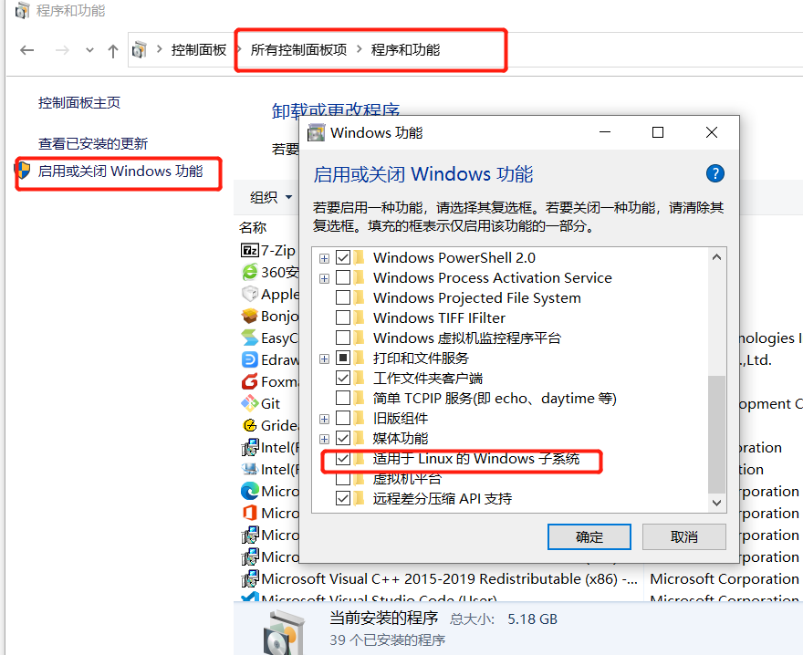
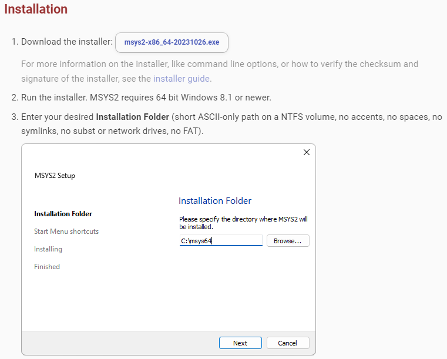

# OpenNHP 빌드
{: .fs-9 }


---

## 1. WSL 환경 준비

**참고:** Windows 10/11에서는 `WSL` 서브시스템을 통해 Linux를 실행할 수 있습니다. 자세한 내용은 WSL 공식 문서를 참고하십시오: <https://learn.microsoft.com/ko-kr/windows/wsl/install>

- **【WSL 기능 활성화】** Win10에서는 WSL을 사용하여 Linux를 설치하려면 먼저 WSL을 활성화해야 합니다. 설정 화면은 아래 그림을 참고하십시오.
   
- **【WSL에 Linux 설치】** WSL에 Ubuntu Linux를 설치하는 것을 권장합니다. PowerShell에서 다음 명령을 실행하여 설치합니다:

   ```bat
   wsl --update
   wsl --install -d Ubuntu
   ```

   다음과 같은 문제가 발생하면 다음을 참고하십시오: <https://blog.csdn.net/weixin_44293949/article/details/121863559>

   ```text
   无法从 'https://raw.githubusercontent.com/microsoft/WSL/master/distributions/DistributionInfo.json’提取列表分发。无法解析服务器的名称或地址
   Error code: Wsl/WININET_E_NAME_NOT_RESOLVED
   ```

- **【WSL 환경의 IP 주소】** WSL의 Linux 환경에서 다음 명령을 실행하여 IP 주소를 확인합니다:

|        호스트        |                    IP 주소 확인 명령                     |
| :----------------: | :-----------------------------------------------------: |
|   WSL 내 Linux 호스트   |            `hostname -I \| awk '{print $1}'`            |
| WSL 호스트 Windows 머신 | `ip route show \| grep -i default \| awk '{ print $3}'` |

## 2. 시스템 요구 사항

- 2.1 `Go 언어` 환경: **Go 1.26**. 설치 패키지 다운로드 주소: <https://go.dev/dl/>
  - **Windows 및 macOS** 환경에서는 다운로드한 설치 프로그램을 통해 Go를 설치합니다.
  - **Linux** 환경에서는 패키지 관리 도구를 통해 직접 설치할 수 있습니다: `sudo apt install golang `
  - 설치가 완료되면 `go version` 명령을 실행하여 Go 버전을 확인합니다.
  - **Windows 및 macOS** 환경에서는 다운로드한 설치 프로그램을 통해 Go를 설치합니다.
  - **Linux** 환경에서는 패키지 관리 도구를 통해 직접 설치할 수 있습니다: `sudo apt install golang` 또는 다음 명령으로 수동 설치할 수 있습니다:

   ```bash
      1. sudo apt-get update
      2. wget https://go.dev/dl/go1.21.0.linux-amd64.tar.gz
      3. sudo tar -xvf go1.21.0.linux-amd64.tar.gz
      4. sudo mv go /usr/local
      5. export GOROOT=/usr/local/go
      6. export GOPATH=$HOME/go
      7. export PATH=$GOPATH/bin:$GOROOT/bin:$PATH
      8. source ~/.profile
   ```

  - 설치가 완료되면 `go version` 명령을 실행하여 Go 버전을 확인합니다.
- 2.2 `GCC` 환경:
  - **Linux 및 macOS**: **GCC 8.0** 이상.
    - GCC 버전 확인 명령: `gcc -v`
    - GCC 설치: `sudo apt install build-essential`
  - **Windows**:
    1. 첫 번째 단계: **mingw64 설치**. mingw64는 msys2의 패키지 관리 도구를 통해 다운로드할 수 있습니다. msys2 설치 시스템 요구 사항과 다운로드·설치 튜토리얼은 다음을 참고하십시오: <https://www.msys2.org/>.
    

    2. 두 번째 단계: **GCC 설치**. msys2 콘솔에서 다음 명령을 입력합니다:

       ```bash
       pacman -S mingw-w64-ucrt-x86_64-gcc
       ```

    3. 세 번째 단계: **GCC 설정**. GCC 도구 경로를 Windows의 *%PATH%* 환경 변수에 추가합니다. 예를 들어 mingw-w64-gcc의 설치 경로가 `C:\Program Files\MSYS2\`라면 다음 명령을 실행해야 합니다

       ```bat
       setx PATH "%PATH%;C:\Program Files\MSYS2\ucrt64\bin
       ```
       실행이 성공하면 새 명령 프롬프트 창을 열어 *gcc* 버전을 확인합니다
       ```bat
       gcc --version
       ```

  - **참고:** Windows에서는 `WSL` 서브시스템을 통해 Linux를 실행할 수 있습니다. 자세한 내용은 WSL 공식 문서를 참고하십시오: <https://learn.microsoft.com/ko-kr/windows/wsl/install>
    - WSL에서 Ubuntu 최신 버전 v22를 실행하는 것을 권장하며, Windows의 PowerShell에서 다음 명령을 실행하여 설치합니다:
      ```bat
      wsl --install --distribution Ubuntu-22.04
      ```

<small>*참고: 2.1과 2.2가 완료된 상태에서 프로젝트 디렉터리에서 바로 빌드 명령 `.\build.bat` 을 실행하면, 일반적으로 `시스템이 지정된 경로를 찾을 수 없습니다` 또는 ` 'lib'은(는) 내부 또는 외부 명령, 실행할 수 있는 프로그램, 또는 배치 파일이 아닙니다.` 라는 오류가 발생합니다. 2.3에서는 이 문제를 해결하는 방법을 참고용으로 제공합니다.*</small>

- 2.3 `lib` 환경:


  - 빌드 실행 명령에서는 lib 도구를 사용합니다. 이는 .lib 파일을 생성하는 도구로, 일반적으로 정적 라이브러리 링크나 심볼 테이블 내보내기(Windows에서 .dll 파일과 함께 사용하기 위한 .lib 파일 생성)에 사용됩니다. lib이 내부 또는 외부 명령이 아니라는 오류 메시지가 나타나면 시스템이 lib 도구를 찾지 못했다는 의미입니다.

  - **해결('lib'은(는) 내부 또는 외부 명령, 실행할 수 있는 프로그램, 또는 배치 파일이 아닙니다 문제):** Visual Studio와 Visual Studio tools를 설치합니다.

    - lib 도구는 Microsoft의 라이브러리 관리 도구로, 일반적으로 Visual Studio의 Microsoft Build Tools와 함께 설치됩니다. Visual Studio가 설치되어 있고, lib.exe를 포함하는 C++ 빌드 도구(C++ Build Tools) 구성 요소가 선택되어 있는지 확인하십시오.

    - Visual Studio가 아직 설치되어 있지 않다면 Visual Studio 공식 웹사이트에서 다운로드하여 설치할 수 있습니다: https://visualstudiomicrosoft.com/zh-hans/ 설치 시 "데스크톱 개발(C++)" 워크로드를 선택하면 lib.exe 및 기타 필요한 도구가 포함됩니다.

    - Visual Studio를 설치한 후에는 반드시 Visual Studio 개발자 명령 프롬프트(Developer Command Prompt)를 사용하여 lib 명령이 포함된 `build.bat` 파일을 실행해야 합니다. 이 명령줄 도구는 lib.exe와 같은 빌드 도구의 환경 변수를 자동으로 로드합니다.

   - **해결(시스템이 지정된 경로를 찾을 수 없다는 오류 문제):** `build.bat` 파일의 경로를 변경합니다

     - `build.bat` 파일을 열어 다음을 찾습니다
     ```bat
     call "C:\Program Files (x86)\Microsoft Visual Studio\2019\Community\VC\Auxiliary\Build\vcvarsall.bat" x64
     ```

     - 자신의 Visual Studio 설치 디렉터리 경로로 수정합니다. 예를 들어:
     ```bat
     call "F:\develop\visualstu\VC\Auxiliary\Build\vcvarsall.bat" x64
     ```

- 2.4 `clang` 빌드 환경(선택 사항):

  - **참고:**
    - clang 빌드 도구와 관련하여, clang은 Linux만 지원하며 Windows는 지원하지 않으므로 Windows에서는 clang을 설치할 필요가 없습니다.
    - eBPF 모듈 빌드와 관련하여, eBPF는 Windows를 지원하지 않으며 Linux 및 커널 5.6 버전 이상에서만 지원됩니다.
  - clang 버전 확인 명령: `clang --version`
  - **Linux Ubuntu**:
    - clang llvm libbpf-dev 설치: `sudo apt install clang llvm libbpf-dev`
  - **Linux Centos**:
    - clang llvm libbpf-dev 설치: `sudo yum install clang llvm libbpf-dev -y`


## 3. 빌드

1. 코드 저장소 가져오기

   ```bash
   git clone https://github.com/OpenNHP/opennhp.git
   ```

2. Go 환경

   ```bash
   go env -w GOPROXY="https://goproxy.cn,direct"
   ```

3. 빌드
   - **Linux 및 macOS**: 코드 루트 디렉터리에서 스크립트를 실행합니다
   `make`
   - **Windows**: 코드 루트 디렉터리에서 *BAT* 파일을 실행합니다
   `build.bat`<br>
   <small>*(참고: Windows에서 빌드 중 오류가 발생하면 다음 방법을 시도해 보십시오: Visual Studio의 developer command prompt for VS 명령 창에서 프로젝트 디렉터리로 이동한 후 `./build.bat` 명령을 실행합니다)*</small>
   - **Linux에서 eBPF 빌드**: 코드 루트 디렉터리에서 스크립트를 실행합니다
   `make ebpf`<br>
   <small>*(참고: `make ebpf` 명령을 실행하면 ebpf 모듈도 함께 빌드됩니다)*</small>

## 4. 결과

빌드된 바이너리 파일은 모두 코드 디렉터리 하위의 `release` 서브디렉터리에 있습니다.

- **NHP-Server** 의 실행 파일과 설정 파일: `release\nhp-server` 서브디렉터리
- **NHP-AC** 의 실행 파일과 설정 파일: `release\nhp-ac` 서브디렉터리
- **NHP-Agent** 의 실행 파일과 설정 파일: `release\nhp-agent` 서브디렉터리
- **NHP-DB** 의 실행 파일과 설정 파일: `release\nhp-db` 서브디렉터리
- **NHP-KGC** 의 실행 파일과 설정 파일: `release\nhp-kgc` 서브디렉터리
- 모든 바이너리 파일을 하나의 `tar` 파일로 패키징: `release\archive` 서브디렉터리

---
