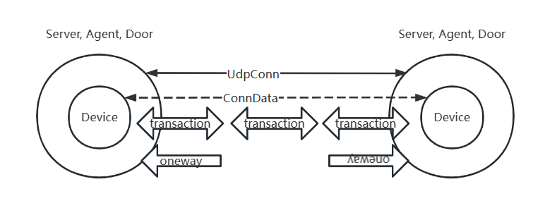

# OpenNHP 코드 해설
{: .fs-9 }


---

## 1. 계층 구조

1. 상위 로직 컴포넌트 계층은 UDP 연결의 수립, 유지 및 종료를 담당합니다.
2. Device 계층은 다음을 담당합니다: 1. 상위 계층의 평문 메시지를 NHP 패킷으로 변환하여 연결로 전송; 2. 연결로부터 수신한 NHP 패킷을 평문 메시지로 변환하여 상위 계층에 제공하여 처리.
3. 상위 로직 컴포넌트가 제공


## 2. 연결 관리

1. 상위 로직 컴포넌트는 여러 개의 연결(UdpConn)을 생성하고 유지할 수 있으며, 실제 필요에 따라 필요한 객체 멤버를 생성합니다. 각 UdpConn은 패킷 송수신 작업을 위해 하나의 스레드를 실행합니다.
2. 각 UdpConn은 Device 계층의 ConnData를 생성해야 하며, 실제 연결의 원격 주소, 패킷 송수신 채널, 쿠키 등을 Device ConnData에 전달합니다.
3. 각 UdpConn은 여러 번의 양방향 트랜잭션(transaction) 또는 단방향 패킷 전송을 허용합니다. (agent는 예외이며, 원칙적으로 agent는 요청마다 새로운 연결을 생성합니다.)
4. 각 트랜잭션은 상호작용을 유지하기 위한 자체 스레드와 채널을 생성하며, 타임아웃 후 스스로 소멸합니다. Local transaction(로컬에서 생성된 상호작용)은 device가 통합 관리하며, Remote transaction(원격에서 생성된 상호작용)은 원격 연결이 관리합니다. transaction의 응답은 패킷 송수신 시 해당 transaction 스레드를 찾아 후속 작업을 수행해야 합니다.

## 3. 객체 명명

1. 상위 로직 컴포넌트는 송수신 방향에서 여러 개의 역할(신원)을 가질 수 있으며, Device 계층에서는 initiator와 responder를 사용하여 요청자와 응답자를 나타냅니다.

## 4. 패킷 버퍼의 생성과 소멸(회수)

1. 처리량을 높이기 위해 패킷 버퍼는 자동 가비지 컬렉션 메커니즘을 사용하지 않고 waitpool 할당/회수 메커니즘을 사용합니다.
2. 수신: device는 패킷 버퍼를 생성하여 네트워크 데이터를 수신하고, NHP 패킷 헤더에 따라 패킷을 파싱 및 검증합니다. 파싱 결과는 ResponderSessionParams 구조체에 저장됩니다(이름이 이해하기 어려워 향후 변경될 수 있습니다). 평문 메시지도 여전히 패킷 버퍼를 사용합니다. 버퍼의 소멸은 두 가지 경우로 나뉘는데, 단방향 통신의 구조체는 상위 애플리케이션이 평문 메시지를 획득한 후 소멸되고, transaction 수신 버퍼는 transaction이 종료된 후 소멸됩니다.
3. 송신: device는 패킷 버퍼를 생성하여 패킷 헤더를 채우고 메시지를 암호화한 후 InitiatorSessionParams 구조체에 저장하여 전송합니다. transaction 송신은 상대측 응답을 받지 못한 경우 재전송을 시도합니다. 버퍼의 소멸은 두 가지 경우로 나뉘는데, 단방향 통신의 구조체는 전송 후 소멸되고, transaction 송신 버퍼는 transaction이 종료된 후 소멸됩니다.

**메시지의 암호화와 복호화:**
연결에서 수신한 UDP 원시 데이터는 device가 파싱하여 device의 MsgToPacketQueue 큐에 넣고 백엔드 처리를 기다립니다.
메시지를 연결로 전송할 때는 initiatorsessionstarter 구조체를 구성하여 메시지 정보와 연결 정보를 전달하고, device의 MsgToPacketQueue 큐에 넣으면 device가 메시지를 암호화하여 전송합니다.

## 5. NHP-Device 아키텍처 설계

1. Device는 NHP 패킷과 메시지 간의 변환을 담당합니다. Device 초기화 시 타입과 개인 키를 지정해야 합니다. Device는 자신의 타입에 따라 해당하는 패킷만 처리합니다.

2. 송수신 패킷을 담는 버퍼는 비교적 크기 때문에 Device의 메모리 Pool이 통합적으로 할당 및 회수합니다(Go의 백그라운드 가비지 컬렉션에 의존할 경우 고동시성 상황에서 막대한 메모리 오버헤드가 발생합니다). 따라서 개발 시 버퍼의 할당 **Device.AllocatePoolPacket\(\)** 과 회수 **Device.ReleasePoolPacket\(\)** 에 반드시 주의해야 합니다.

   - 패킷 버퍼 회수 지점은 다음과 같습니다
     - 송신 패킷이 전송된 후 (로컬 transaction은 제외)
     - 수신 패킷 파싱이 완료된 시점 (원격 transaction은 제외)
     - 로컬 또는 원격 transaction 스레드가 정지될 때

3. 상위 로직은 인터페이스 **SendMsgToPacket** 을 호출하여 메시지를 암호화된 패킷으로 변환하고 연결로 전송합니다.

4. 상위 로직은 인터페이스 **RecvPacketToMsg** 를 호출하여 암호화된 패킷을 메시지로 파싱한 후 **DecryptedMsgQueue** 큐에 넣고 처리를 기다립니다 (일반적인 경우).

   - 특수한 경우: 요청 발신자가 이미 수신 채널을 지정한 경우, 파싱된 메시지는 일반 메시지 큐에 넣어 대기시키지 않고 요청자가 지정한 메시지 채널 **ResponseMsgCh** 로 전달됩니다.

5. 상호작용(**transaction**): 하나의 요청이 하나의 응답을 기다려야 하는 작업을 상호작용이라고 합니다. Device가 발신한 상호작용 요청은 로컬 상호작용(**LocalTransaction**)이며, Device가 수신한 상호작용 요청은 원격 상호작용(**RemoteTransaction**)입니다. 응답 패킷은 요청 패킷이 생성한 **ChainKey** 를 계승해야 하므로, 모든 상호작용의 분배는 Device가 관리합니다.

6. 연결 컨텍스트(**ConnectionData**): 상위 로직에서 전달되는 연결과 관련된 모든 정보이며, Device는 메시지를 암호화한 후 패킷을 연결로 전송합니다. 하나의 연결에서 여러 개의 **transaction** 을 수행할 수 있습니다.

7. 전송 요청을 생성할 때는 **MsgAssembler** 구조체를 생성해야 합니다.

   - Agent와 AC는 메시지 타입 **HeaderType**, 상대측 **RemoteAddr**, 상대측 공개 키 **PeerPk**, 메시지 평문 **Message**(특별한 경우가 아니면 메시지 압축을 사용)를 반드시 입력해야 합니다. 작성이 완료된 **MsgAssembler** 를 각자의 **sendMessageRoutine\(\)** 에 전달하면 새 연결을 수립하거나 기존 연결을 찾아 변환된 패킷을 전송할 수 있습니다.

   - Server는 메시지 타입 **HeaderType**, 연결 컨텍스트 **ConnData**, 상대측 공개 키 **PeerPk**, 메시지 평문 **Message**(특별한 경우가 아니면 메시지 압축을 사용)를 반드시 입력해야 합니다. 작성이 완료된 **MsgAssembler** 를 **Device.SendMsgToPacket\(\)** 에 전달하면 변환된 패킷을 전송할 수 있습니다.

   - 상호작용이 존재하는 경우, 이전에 획득한 **\*PacketParserData** 를 **MsgAssembler** 구조체의 **PrevParserData** 필드에 직접 채워 넣음으로써 **RemoteAddr**, **ConnData**, **PeerPk** 의 입력을 생략할 수 있습니다.

   - 요청이 응답 데이터를 기대하는 경우, **PacketParserData** 를 수신하는 채널을 생성하고 **MsgAssembler** 구조체의 **ResponseMsgCh** 필드에 값을 할당해야 합니다.

## 6. NHP-Server

### 6.1 NHP-Server 아키텍처 설계


1. Server는 시작 시 특정 포트를 리스닝하며 Agent와 AC의 연결을 기다립니다. Server와의 통신은 Agent 또는 AC가 능동적으로 트리거합니다. Server가 Agent나 AC로 능동적으로 연결을 수립하는 경우는 존재하지 않으며, 일반적으로 이러한 연결은 방화벽이나 NAT를 넘어야 하므로 수립될 수 없습니다.
   - 특수한 경우: Server가 Agent가 발신한 노크(knock) 요청을 수신하여 처리할 때, 인증 후 능동적으로 AC에 개문(open) 요청을 발신하고 응답을 기다려야 합니다.

2. 메시지를 전송할 때는 생성된 **MsgAssembler** 를 **sendMsgCh** 로 전송합니다(기존 연결에서 **ConnData** 를 반드시 지정해야 함). **MsgAssembler** 는 암호화된 후 이 연결을 통해 발신됩니다.

3. 패킷을 수신하면 패킷을 복호화하여 평문 메시지를 획득합니다. **msghandler** 가 각각 처리를 수행합니다.

### 6.2 NHP-Server 설정 파일

`etc/config.json`

```json
{
  // (mandatory) private key in base64 format
  "privateKey": "eHdyRHKJy/YZJsResCt5XTAZgtcwvLpSXAiZ8DBc0V4=",
  // (mandatory) specify the udp listening port
  "listenPort": 62206,
  // whether to validate peer's public key when receiving NHP packet from agent. If true, server must have a pre-recorded public key pool (in "agents" field) of all allowed agents. If false, server skip public key validation, so it reduces secure level.
  "disableAgentValidation": false,
  // list of preset allowed AC peers. only public key and expire time are needed. It has the same effect as AddACPeer()
  "acs": [
    {
      // type: NHP-AC
      "type": 3,
      // public key in base64 format
      "pubKeyBase64": "Fr5jzZDVpNh5m9AcBDMtHGmbCAczHyPegT8IxQ3XAzE=",
      // expire time for the public key (seconds from epoch)
      "expireTime": 1716345064
    }
  ],
  // list of preset allowed agent peers. only public key and expire time are needed. It has the same effect as AddAgentPeer()
  "agents": [
    {
      // type: NHP-Agent
      "type": 1,
      // public key in base64 format
      "pubKeyBase64": "WnJAolo88/q0x2VdLQYdmZNtKjwG2ocBd1Ozj41AKlo=",
      // expire time for the public key (seconds from epoch)
      "expireTime": 1716345064
    }
  ],
  // (optional) placeholder of preset url for possible authorization service provider
  "asps": {
    "abc.com": {
      "aspId": "abc.com",
      "urlAddr": "http://120.92.16.228:30088",
      "urlOTP": "/nhp/api/v1/preAuth",
      "urlReg": "/nhp/api/v1/registerAgent",
      "urlAuth": "/nhp/api/v1/verifyAuth",
      "urlList": "/nhp/api/v1/resourceList"
    }
  },
  // (optional) specify other source IP addresses to be opened by the ac that may come along with certain agent IP address 
  "srcAsscAddrs": {
    "192.168.2.27": [
      {
        "ip": "192.168.2.26",
        "port": 54222
      },
      {
        "ip": "192.168.2.28",
        "port": 54223
      }
    ]
  },
  // preset resources for udp knocking
  "udpRess": {
    // ID of authorization service provider
    "abc_group": {
      // ID of resource group
      "app_resource_group_000": {
        // skip service provider authorization and use this preset resource group
        "skipAuth": true,
        // set the desired open time for this resource group (in second)
        "opnTime": 120,
         "resInfo": {
          // name of resource
          "apiServer": {
            // (optional) hostname overrides addr.ip at knock feedback
            "host": "api.abc.com",
            // (mandatory) request ac to open which layer 4 address and protocol of this resource
            "addr": {
              // (mandatory) request ac to open traffic destinated to the public IP address of this resource
              "ip": "12.34.56.78",
              // (optional) request ac to open traffic destinated to the port number where this resource hosts on. empty or 0 means open all port numbers.
              "port": 443,
              // (optional) protocol, "tcp": request ac to open only tcp traffic, "udp": request ac to open only udp traffic, empty: request ac to open tcp + udp + icmp echo traffic
              "proto": "tcp"
            },
          }
         }
      }
    }
  },
  // preset resources for http knocking
  "httpRess": {
    // ID of authorization service provider
    "abc_group": {
      // ID of the resource group, usually it means AppId
      "app_resource_group_001": {
        // set the desired open time for this resource group (in second)
        "opnTime": 120,
        // contains multiple resources
        "resInfo": {
          // name of resource
          "apiServer": {
            // (optional) hostname overrides addr.ip at knock feedback
            "host": "api.abc.com",
            // (mandatory) request ac to open which layer 4 address and protocol of this resource
            "addr": {
              // (mandatory) request ac to open traffic destinated to the public IP address of this resource
              "ip": "12.34.56.78",
              // (optional) request ac to open traffic destinated to the port number where this resource hosts on. empty or 0 means open all port numbers.
              "port": 443,
              // (optional) protocol, "tcp": request ac to open only tcp traffic, "udp": request ac to open only udp traffic, empty: request ac to open tcp + udp + icmp echo traffic
              "proto": "tcp"
            },
            // (optional) the private layer 4 address of the ac. In some network, server may communicate with ac using private addresses. 
            "acAddr": {
              "ip": "172.16.1.2",
              "port": 443
            },
            // whether to append ":port" at the end of hostname/ip at knock feedback. For example, set this field to false if this resource use https and requesting ac to open port 443.
            "portSuffix": false
          },
          // another resource
           "webServer": {
            "host": "www.abc.com",
            "addr": {
              "ip": "23.45.67.89",
              "port": 8080,
              "proto": ""
            },
            "portSuffix": true
          }
        },
        // (optional) additional key info for server calling further authroization APIs
        "accessKey": "b3458c581ef0efb7b669",
        "secretKey": "f21c2a02c09a641a11cf"
      }
    },
    // another authorization service provider
    "xyz_org": {
      "abcd1234": {
        "opnTime": 120,
        "resInfo": {
          "udpServer": {
            "host": "server.xyz.net",
            "addr": {
              "ip": "1.2.3.4",
              "port": 443,
              "proto": "udp"
            },
            "portSuffix": false
          }
        },
        // (optional) additional key info for server calling further authroization APIs
        "appKey": "demo-l2T0J3U3mQZ3",
        "appSecret": "hVqd8eOqCFg5cc1D2ouACs3q"
      }
    }
  }
}
```

## 7. NHP-AC

### 7.1 NHP-AC 아키텍처 설계

1. AC는 여러 대의 Server와 상호 통신을 지원합니다. 모든 연결은 AC가 Server를 향해 능동적으로 시작합니다. AC는 하트비트 패킷과 NHP-AOL 패킷을 전송하여 Server와의 연결을 유지합니다.

2. AC와 Server 간의 통신이 실패하면 연결을 재수립하려 시도하며, 어떤 Server와도 연결을 수립할 수 없는 상태가 지속되면 실효(invalid) 상태로 진입합니다.

3. AC는 시작 후 미리 설정된 서버와 주기적으로 연결을 수립하고 유지하기 시작합니다(AC는 사설망 내부에 위치할 가능성이 높으므로 서버가 먼저 연결을 시작할 수 없습니다). 연결 시 NHP_DOL 메시지를 전송하고, 서버의 응답을 받은 후 연결을 확인합니다. 연결 유지 중에는 상황에 따라 NHP_KPL 메시지를 전송하여 연결을 유지합니다. **maintainServerConnectionRoutine** 에 의해 구현됩니다.

4. AC는 서버가 전송한 NHP_DOP 메시지를 처리하여 요청자의 serviceId, appId가 일치하는지 판단하고 IPSET 작업을 수행한 후, 완료되면 NHP_DRT 메시지를 반환합니다.

5. 메시지를 전송할 때는 생성된 **MsgAssembler** 를 **sendMsgCh** 로 전송합니다(**RemoteAddr** 을 반드시 지정해야 함). 연결이 아직 수립되지 않은 경우 AC는 연결 수립을 시도하고 이를 기록합니다. 동시에 이 연결에 대해 수신 스레드를 시작합니다. **MsgAssembler** 는 암호화된 후 이 연결을 통해 발신됩니다.

6. 패킷을 수신하면 패킷을 복호화하여 평문 메시지를 획득합니다. **msghandler** 가 각각 처리를 수행합니다.

### 7.2 NHP-AC IP 허용 모드

IP 허용 모드는 두 가지로 구분됩니다:

1. ipPassMode가 0(기본값)일 때는 즉시 허용 모드이며, 접근 제어(문)가 열릴 때 노크 발신지 IP 주소를 기준으로 합니다.

2. ipPassMode가 1일 때는 사전 접근 모드이며, 접근 제어가 열리기 전에 먼저 해당 프로토콜의 임시 포트를 개방하고 server의 임시 포트와 임시 접근 토큰을 반환합니다. 짧은 시간 내에 agent가 임시 접근 토큰을 가지고 임시 연결을 수행해야 하며, 임시 연결이 유효하면 개방 시 허용은 이 임시 연결의 발신지 IP를 기준으로 합니다.

### 7.3 NHP-AC 설정 파일

`etc/config.toml`

```toml
[AC]
  # (optional) assign an unique id for this ac
  ACId = "abc_group_ac_001"
  # (mandatory) specify the private key in base64 format
  ACPrivateKey = "+B0RLGbe+nknJBZ0Fjt7kCBWfSTUttbUqkGteLfIp30="
  # 0: default, passing the knock source IP
  # 1: use pre-access procedure to determine the passing source IP
  IpPassMode = 0
  # (optional) ID of authorization service provider this ac belongs to
  AuthServiceId = "abc_group" 
  # (optional) ID of resources controlled by this ac
  ResourceIds = ["abc_group_web_server", "abc_group_api_server"]
  # (optional) ID of organization
  OrganizationId = "5f3e36149fa95c0414408ad4"

# server peers list
[[Servers]]
  # (optional) the server's hostname. Its resolved address overrides the "Ip" field
  Host = ""
  # IP address of the server peer
  Ip = "192.168.80.35"
  # listening port for the server peer
  Port = 62206
  # type: NHP-Server
  Type = 2
  # specify the server peer's public key in base64 format
  PublicKey = "WqJxe+Z4+wLen3VRgZx6YnbjvJFmptz99zkONCt/7gc="
  # expire timestamp of the public key (seconds from epoch)
  ExpireTime = 1716345064

# another server
#[[Servers]]
#  Ip = "192.168.135.1"
#  Port = 7776
#  Type = 2
#  PublicKey = "dstv1KlD2oVXiwgOxWtgZd+YmrOhU46W3emTGrHRADk="
#  ExpireTime = 1716345064

```

## 8. NHP-Agent

### 8.1 NHP-Agent 아키텍처 설계

1. Agent는 Server와만 통신합니다. Agent는 Server로 능동적으로 단기 연결을 시작합니다. Agent가 연결을 수립하지 않은 상태에서 Server의 메시지를 수동적으로 수신하는 경우는 존재하지 않습니다.

2. 메시지를 전송할 때는 생성된 **MsgAssembler** 를 **sendMsgCh** 로 전송합니다(**RemoteAddr** 을 반드시 지정해야 함). 연결이 아직 수립되지 않은 경우 agent는 연결 수립을 시도하고 이를 기록합니다. 동시에 이 연결에 대해 수신 스레드를 시작합니다. **MsgAssembler** 는 암호화된 후 이 연결을 통해 발신됩니다.

3. 패킷을 수신하면 패킷을 복호화하여 평문 메시지를 획득합니다. **msghandler** 가 각각 처리를 수행합니다.

### 8.2 NHP-Agent 설정 파일

`etc/config.json`

```json
{
  // (mandatory) specify the private key in base64 format
  "privateKey": "+Jnee2lP6Kn47qzSaqwSmWxORsBkkCV6YHsRqXCegVo=",
  // (optional) ID of authorization service provider this agent belongs to
  "aspId": "abc_group",
  // (mandatory) an user object is necessary to carry out knock requests
  "user": {
    "userId": "zengl",
    "devId": "0123456789abcdef",
    "orgId": "abc.com.cn"
  },
  // preset resources to begin knock after start
  "knockRess": [
    {
      "aspId": "abc_group",
      "resId": "app_resource_group_001",
      "serverKey": "WqJxe+Z4+wLen3VRgZx6YnbjvJFmptz99zkONCt/7gc="
    }
  ],
  // list of preset allowed server peers to send knock request. It has the same effect as AddServer()
  "servers": [
    {
      // (optional) the server's hostname. Its resolved address overrides the "Ip" field
      "host": "",
      // IP address of the server peer
      "ip": "192.168.80.35",
      // listening port for the server peer
      "port": 62206,
      // type: NHP-Server
      "type": 2,
      // public key in base64 format
      "pubKeyBase64": "WqJxe+Z4+wLen3VRgZx6YnbjvJFmptz99zkONCt/7gc=",
      /// expire time for the public key (seconds from epoch)
      "expireTime": 1716345064
    }
  ]
}
```

## 9. Log 설계

로그(log) 설계는 비동기 쓰기 방식을 채택합니다. 동기 로그 쓰기 방식과 비교했을 때, 호출 시점에 로그 파일 쓰기 I/O 작업을 즉시 수행하여 정상적인 비즈니스 로직에 영향을 주지 않으며, 고동시성 상황에서는 여러 개의 로그를 하나로 모아 한 번의 파일 쓰기로 병합함으로써 파일 I/O 작업 횟수를 대폭 줄일 수 있습니다.

Logger 객체는 단독으로 생성하여 사용할 수도 있고(**NewLogger()**), 애플리케이션 시작 시 패키지 전역 변수 **glbLogger** 를 지정하여 프로젝트 전체에서 사용할 수도 있습니다.

주의: 애플리케이션이 종료되기 전에 Logger.Close() 를 호출하여 마지막으로 캐시된 로그가 파일에 기록되도록 해야 합니다.
