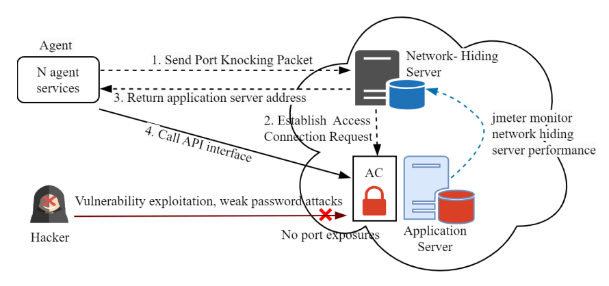
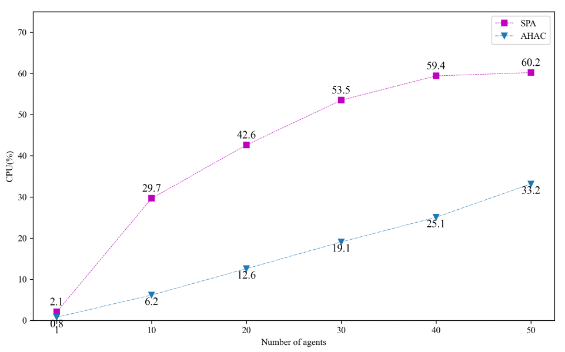
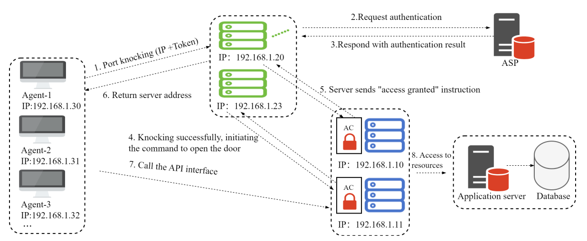
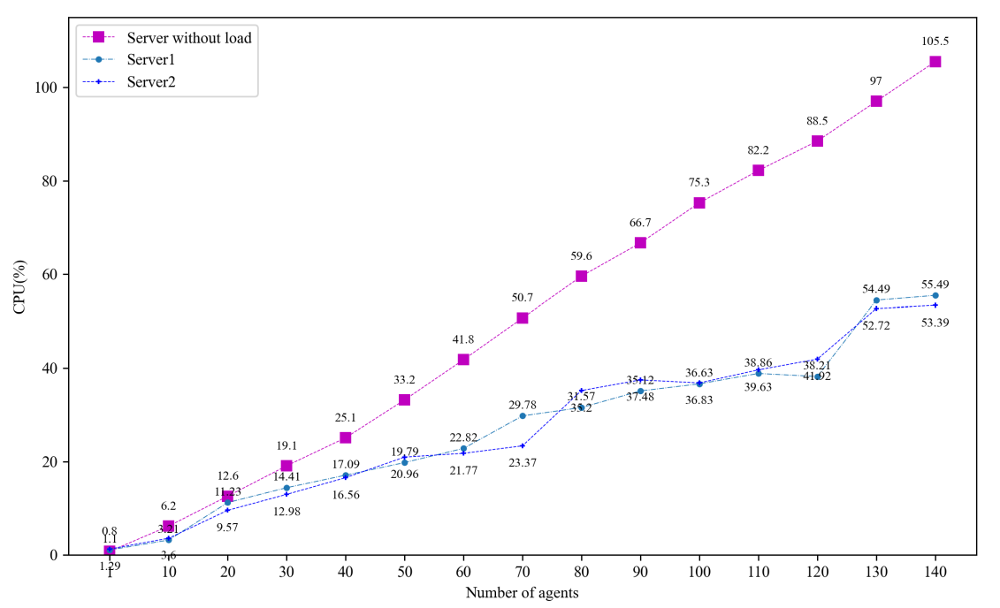
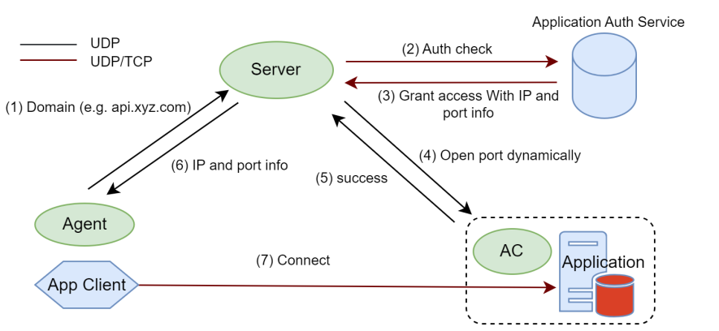
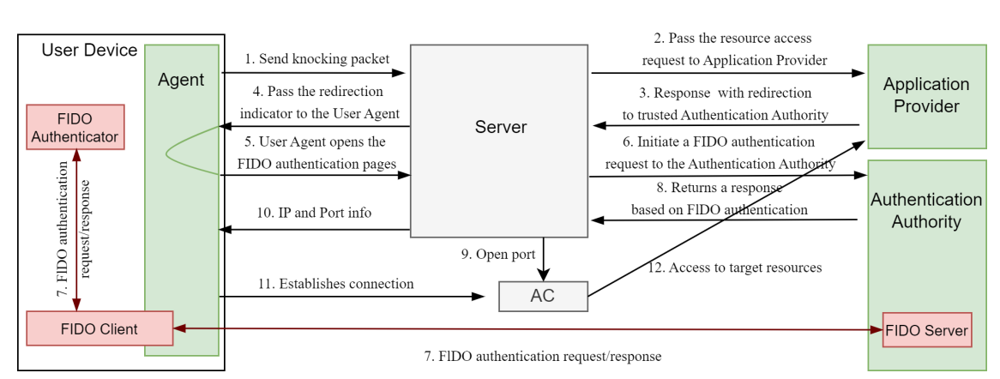
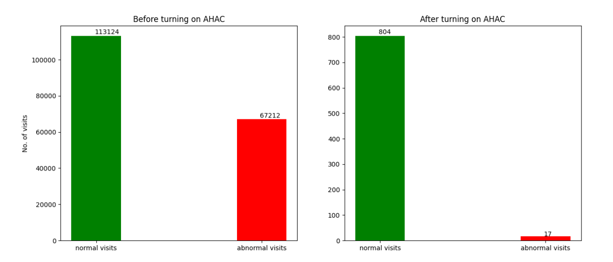

# NHP와 SPA 비교
{: .fs-9 }

참고: 아래 내용은 《Applied Sciences》 저널 2024년 14권 13호에 게재된 논문 《AHAC: Advanced Network-Hiding Access Control Framework》에서 발췌한 것입니다. 특히 AHAC 프레임워크는 NHP(OpenNHP) 기술 체계의 핵심 구성 요소 중 하나임을 강조할 가치가 있습니다.

---

- [NHP와 SPA 비교](#nhp와-spa-비교)
- [목차:](#목차)
  - [1. 장점 비교](#1-장점-비교)
  - [2. 성능 비교](#2-성능-비교)
    - [2.1 암호화 알고리즘 오버헤드](#21-암호화-알고리즘-오버헤드)
    - [2.2 성능 오버헤드](#22-성능-오버헤드)
  - 
  - [3. 고가용성 비교](#3-고가용성-비교)
  - [4. 확장성 비교](#4-확장성-비교)
    - [4.1 DNS 통합](#41-dns-통합)
    - [4.2 FIDO 통합](#42-fido-통합)
  - [5. 호환성 비교](#5-호환성-비교)
  
## 1. 장점 비교

NHP는 노이즈 프로토콜, 키 쌍, ECDH 알고리즘을 결합하여 강력한 양방향 인증 메커니즘을 제공합니다. 전통적인 방식과 비교했을 때 NHP는 성능, 확장성, 보안성 면에서 뚜렷한 우위를 보입니다. NHP는 C/C++, Python, Java, Go 등 다양한 프로그래밍 언어를 지원하며, 고도로 확장 가능한 아키텍처를 제공하여 기기 검증 능력을 강화하고 재전송 공격을 방어하며 IP 증폭 문제를 근본적으로 해결합니다. NHP는 특히 강력한 인증과 암호화가 필요한 기업 IAM 시스템 및 보안 리소스 접근과 같은 시나리오에 적합하며, 성능을 최적화하고 고가용성을 높여 복잡한 환경에서의 원활한 호환성과 높은 보안성을 보장합니다. 이에 비해 SPA는 나름의 장점이 있지만, 보안성, 성능, 확장성 면에서 여전히 NHP에 미치지 못합니다.

|              | SPA                            | NHP                            |
| ------------ | ------------------------------ | ------------------------------ |
| 개발 언어     | C, C++                        | C/C++, Python, Java, Go     |
| 통신         | 단일 패킷 인가                       | 노이즈 프로토콜, ECDH                |
| 시스템 아키텍처     | 복잡성, 암호화된 패킷, 방화벽 | 선진성, 확장성, 노이즈 프로토콜   |
| 인증         | UDP 노크, IP 증폭 문제         | 기기 지문, UDP 및 TCP 노크      |
| 암호 프레임워크     | RSA, AES                      | 노이즈 프로토콜, ECDH                |
| 성능         | 중간 수준 오버헤드, 효율적                | 최적화, 최소화된 오버헤드              |
| 네트워크 은닉 능력 | 서비스/애플리케이션 포트만                | 도메인명, IP 및 포트                |
| 가용성       | 높은 부하                         | 고가용성, 확장 가능한 클러스터          |
| 확장성     | 복잡한 구현                       | FIDO+NHP, 고도로 확장 가능, 통합 용이 |
| 호환성     | 다양한 시스템, 통합이 필요할 수 있음                 | 높음, 크로스 플랫폼, 미래 지향적 |
| 보안성       | 강력한 암호화, 키 관리 위험           | 주소 은닉, 상호 인증             |
| 적용 시나리오     | 고보안 시나리오                   | 확장 가능한 고보안 환경             |

## 2. 성능 비교

### 2.1 암호화 알고리즘 오버헤드

SPA는 RSA 암호화 알고리즘을 사용하고, NHP는 ECC 암호화 알고리즘을 사용합니다. 우리는 보안 강도와 키 길이를 기준으로 RSA와 ECC의 가성비를 비교했으며, 그 결과는 아래 표와 같습니다. 동일한 보안 표준 하에서 ECC 알고리즘의 키 길이는 RSA 알고리즘보다 현저히 짧습니다. 또한 RSA 메시지 서명으로 생성되는 암호문 크기는 대략 키 길이와 같습니다. 따라서 네트워크 메시지의 신원을 검증할 때, NHP는 더 큰 RSA2048 메시지 서명(256바이트)을 전송하여 검증하는 대신, 더 짧은 ECC 무작위 키(32바이트 또는 64바이트)를 사용하여 ECDH 교환을 수행함으로써 계산 오버헤드를 줄일 뿐만 아니라 귀중한 대역폭 자원을 더욱 효율적으로 절약합니다. 이러한 전략은 NHP가 시스템 효율성과 자원 활용 측면에서 SPA에 비해 뚜렷한 우위를 지님을 보여줍니다.

| 보안 강도(비트) | SPA(최소 공개키 길이(비트)) | NHP(최소 공개키 길이(비트)) | NHP vs SPA(키 길이 비율) | 유효 기간     |
| ---------------- | -------------------------- | ------------------------- | ---------------------- | ---------- |
| 80               | 1024                       | 160-223                   | 1:6                   | 2010년까지 |
| 112              | 2048                       | 224-255                   | 1:9                   | 2010년까지 |
| 128              | 3072                       | 256-383                   | 1:12                  | 2031년 이후 |
| 192              | 7680                       | 384-511                   | 1:20                  |            |
| 256              | 15360                      | 512+                      | 1:30                  |            |

우리는 실험을 통해 RSA와 ECC의 암복호화 시간을 측정했으며, 구체적인 결과는 아래 표와 같습니다. 실험에서는 암호화와 복호화의 반복 횟수를 늘려, 두 알고리즘이 다양한 조건에서 보이는 성능을 테스트했습니다. 결과에 따르면, RSA와 ECC의 암복호화 시간은 반복 횟수가 증가함에 따라 모두 늘어나지만, ECC의 시간 오버헤드는 항상 RSA보다 현저히 낮았습니다. 특히 반복 횟수가 늘어날수록 ECC의 우위는 더욱 뚜렷해지며, RSA의 시간 오버헤드는 최대 ECC의 약 800배에 달했습니다. 이 뚜렷한 격차는 NHP가 암복호화 효율성 면에서 SPA보다 명백히 우수함을 보여주며, 실제 애플리케이션에서 더 효율적인 암호화 알고리즘을 선택하는 데 유력한 근거를 제공합니다.

| 반복 횟수(회) | SPA      | NHP    |
| -------------- | -------- | ------ |
| 1              | 0.34s    | 687us  |
| 10             | 2.48s    | 3.60ms |
| 100            | 27.54s   | 0.03s  |
| 200            | 61.18s   | 0.06s  |
| 500            | 136.23s  | 0.16s  |
| 1000           | 287.61s  | 0.32s  |
| 10000          | 2832.42s | 3.81s  |

### 2.2 성능 오버헤드

NHP의 성능을 종합적으로 평가하기 위해, 우리는 아래 그림과 같은 실험 환경을 구축하여 NHP와 SPA에 대한 부하 성능 테스트를 진행했습니다. 이 환경은 Agent 배포 영역과 네트워크 은닉 배포 영역이라는 두 개의 주요 영역으로 구성됩니다.

네트워크 은닉 배포 영역에서는 네트워크 은닉 서버와 애플리케이션 서버를 핵심 구성 요소로 통합했습니다. 테스트 환경의 안정성과 일관성을 보장하기 위해, 동일한 사양(4코어 CPU, 8G 메모리)의 머신 세 대를 선정했습니다. Agent 배포 영역에서는 n개의 agent 서비스를 실행했으며, 이 서비스들은 초당 한 번씩 노크 요청을 보내는 빈도로 네트워크 은닉 서버와 통신합니다. 동시에 네트워크 은닉 서버에는 JMeter 컴포넌트를 배포하여 성능을 시뮬레이션하고 모니터링했습니다. 애플리케이션 서버 측에도 마찬가지로 JMeter 서비스를 배포하여 네트워크 은닉 서버의 성능 자원 소비를 실시간으로 추적했습니다. 이러한 구성을 통해 NHP와 SPA의 성능을 종합적으로 모니터링하고 비교할 수 있었습니다.

실험 환경의 일관성을 유지한 상태에서, 배포 방안에 따라 각각 1, 10, 20, 30, 40, 50개의 agent를 선정하여 NHP와 SPA에 대한 성능 테스트를 진행했습니다. 테스트 결과는 표 4와 같으며, 가로축은 실험에 참여한 agent 수를, 세로축은 테스트 기간 동안의 CPU 사용률 변화를 나타냅니다. 이러한 구성을 통해 agent 수가 증가함에 따라 NHP와 SPA가 CPU 자원 소비 면에서 보이는 서로 다른 양상을 직관적으로 관찰할 수 있습니다.

실험 결과에 따르면, Agent 수가 증가함에 따라 NHP와 SPA의 CPU 부하는 모두 상승하는 추세를 보였습니다. 그러나 Agent 수가 더욱 증가함에 따라 NHP의 성능 우위가 점차 두드러지기 시작했으며, CPU 부하가 대략 SPA의 절반 수준에 머물러 뚜렷한 효율성 향상을 보였습니다.
> 참고: 이론적으로는 NHP의 성능이 SPA보다 약 1000배 향상되어야 하지만, 실제 테스트에서는 약 1배 향상에 그쳤습니다. 원인을 분석해보면, 주요 요인으로는 네트워크 오버헤드가 성능에 미치는 뚜렷한 영향, 가비지 컬렉션 메커니즘으로 인한 성능 손실, 그리고 하드웨어 환경의 차이가 있습니다. 또한 코드 보안성과 암호화 알고리즘 구현을 고려하여 메모리 안전 언어인 Go를 선택했지만, 그 가비지 컬렉션 메커니즘 역시 성능에 일정한 영향을 미쳤습니다.

## 3. 고가용성 비교

NHP는 분산 아키텍처를 통해 제로 트러스트 서비스의 고가용성을 실현하며, 노크 모듈과 접근 제어 모듈이 서로 다른 호스트에 배포되도록 보장하여 자원 점유를 방지하고 탄력적 확장성을 높입니다. 장애가 발생하더라도 서비스를 원활하게 전환하여 시스템 기능과 응답 속도를 유지할 수 있습니다. 이러한 설계는 시스템의 견고성과 안정성을 강화하고, 서비스 장애가 전체 시스템에 미치는 영향을 줄여줍니다. 아래 그림과 같습니다.

NHP는 노크 검증 서비스의 수평적 탄력 확장을 지원하며, 실시간 부하에 따라 서비스 인스턴스 수를 동적으로 조정할 수 있습니다. 이 기능은 뛰어난 탄력성과 확장성을 제공하여, 높은 부하 상황에서도 서비스가 신속하고 안정적으로 응답하도록 보장합니다. 각 서비스 인스턴스는 노크 요청을 처리하고 비즈니스 세션을 유지할 수 있으며, 이러한 설계는 처리 능력을 향상시킬 뿐만 아니라 내결함성을 강화하여 비즈니스 연속성과 안정성을 보장합니다. 테스트 결과를 보면, NHP는 고가용성 면에서 SPA에 비해 뚜렷하게 향상되었습니다.

## 4. 확장성 비교

NHP는 데이터 통신을 위해 신뢰할 수 있고, 통제 가능하며, 안정적이고, 검증 가능한 기반을 제공하도록 설계되었지만, 통신 시나리오와 환경의 다양성과 복잡성을 고려할 때 NHP 역시 다양한 맞춤형 요구에 대응할 수 있는 우수한 확장성을 갖추어야 합니다. NHP의 확장성은 다음 몇 가지 측면에서 나타납니다:

- SPA의 단방향 노크 메커니즘과 비교했을 때, NHP의 양방향 통신 메커니즘은 더욱 풍부한 확장 능력을 제공하며, 리소스의 실제 IP 주소를 은닉하고 데이터 통신 전후의 키 교환을 지원함으로써 프라이버시 컴퓨팅 및 데이터 유통 시나리오의 보안을 강화합니다.

- 인가 서비스 제공자(ASP) 인터페이스를 통해, NHP는 리소스 요청자의 요청 내용을 ASP에 투명하게 전달할 수 있어, 더욱 엄격한 신원 인증과 권한 통제를 실현합니다.

- NHP의 리소스 식별자는 중국어, 영어 및 기호를 포함한 임의의 문자열 형식을 지원하여 데이터 리소스에 더 강력한 설명력을 제공하며, DNS 해석 기능을 갖추어 더욱 안전하고 암호화되고 프라이버시가 보장되는 도메인명 해석 서비스를 제공합니다.

따라서 NHP의 확장성 아키텍처는 DNS 및 FIDO와의 통합 등 전형적인 응용 시나리오를 포괄합니다.

### 4.1 DNS 통합

DNS는 인터넷 기반 서비스로서 웹사이트 운영에 매우 중요하지만, 그 보안성은 오랫동안 주목받지 못했으며, 신뢰할 수 없는 UDP 프로토콜을 사용하기 때문에 DNS 하이재킹, 서비스 거부 공격 등 다양한 보안 취약점이 존재합니다. 따라서 DNS 보안을 강화하는 것이 매우 중요합니다. 네트워크 은닉 기술을 통합함으로써, DNS 해석은 양방향 암호화 채널을 통해 이루어져 기밀성과 변조 방지 능력을 보장하며, 동시에 신원 인증을 거친 사용자만이 해석할 수 있도록 하여 DDoS 공격과 하이재킹을 효과적으로 방어합니다. 구체적인 구현 방안은 아래 그림과 같으며, 이 방식은 DNS 보안성을 크게 향상시켜 사용자에게 더욱 신뢰할 수 있는 DNS 서비스를 제공합니다.

- 단계 1: 네트워크 은닉 프록시(클라이언트, 브라우저 등)가 도메인명을 통해 네트워크 은닉 서버로 요청을 시작합니다.

- 단계 2: 네트워크 은닉 서버가 네트워크 은닉 프록시로부터 도메인명 패킷 요청을 수신하면, 즉시 애플리케이션 인증 서버로 조회 인증 요청을 보내 해당 요청의 합법성과 권한을 검증합니다.

- 단계 3: 인증 서버는 네트워크 은닉 서버가 보낸 인증 요청 메시지를 수신한 후, 엄격한 검증 절차를 거쳐 신원이 진실하고 유효함이 확인되면 접근 권한을 부여합니다. 이어서 인증 서버는 목표 리소스의 실제 IP 주소, 포트 번호 등 핵심 정보를 포함한 인가 접근 자격 증명을 네트워크 은닉 서버로 신속히 회신합니다.

- 단계 4: 인가 조회를 성공적으로 통과한 후, 네트워크 은닉 서버는 목표 리소스가 위치한 접근 제어 시스템으로 즉시 개문(開門) 요청을 보냅니다. 이 요청은 네트워크 은닉 프록시가 필요한 목표 리소스에 원활하게 접근할 수 있도록 하여, 이후 작업을 순조롭게 완료할 수 있도록 합니다.

- 단계 5: 접근 제어 시스템은 네트워크 은닉 서버가 보낸 개문 요청을 수신한 후, 즉시 엄격한 검증 절차를 수행합니다. 이 검증 과정은 요청된 목표 리소스가 보호 대상 리소스와 완전히 일치하는지 확인하여 시스템의 안전성과 신뢰성을 보장하기 위한 것입니다. 검증을 통과하면, 접근 제어 시스템은 네트워크 은닉 프록시에서 보호 대상 리소스로의 연결 통로를 신속히 개방하여 장애 없는 접근을 허용합니다.

- 단계 6: 접근 제어 시스템이 네트워크 은닉 프록시에 대한 접근 권한을 성공적으로 개방하면, 네트워크 은닉 서버는 이 작업을 신속히 확인하고 목표 리소스의 IP 주소와 포트 정보를 반환합니다. 이어서 이 정보는 네트워크 은닉 프록시로 신속히 전달되어, 목표 리소스를 정확히 찾아 접근할 수 있도록 합니다.

- 단계 7: 네트워크 은닉 프록시는 보호 대상 리소스의 IP 주소와 포트 정보를 수신한 후, 즉시 목표 리소스에 대한 정상적인 비즈니스 접근 권한을 시작하여 접근 과정이 원활하게 이루어지도록 하고, 효율적이고 안전한 리소스 상호작용을 실현합니다.

### 4.2 FIDO 통합

FIDO는 웹 신원 인증 면에서 뛰어난 성능을 보이지만, 서버의 잠재적 취약점은 여전히 해커에게 악용되어 FIDO의 인증을 우회하고 서버에 직접 침입하여 데이터를 탈취하거나 파괴할 수 있습니다. FIDO를 NHP와 통합하면 FIDO의 취약점 방어 부족을 효과적으로 보완할 수 있어, 인터넷 노출면에 더욱 포괄적인 방어 방안을 제공할 수 있습니다. 구체적인 구현 방안은 아래 그림과 같으며, 상세한 구현 단계는 다음과 같습니다.

- (1) 사용자 프록시(즉, 에이전트)가 네트워크 은닉 서버(즉, 서버)로 포트 노크 패킷을 전송하여, 세션 내에서 이미 인증되었지만 보증 수준이 상대적으로 낮은 민감 리소스에 접근을 시도합니다.

- (2) 서버는 포트 노크 패킷을 수신한 후, 리소스 접근 요청을 애플리케이션 제공자에게 전달합니다.

- (3) 애플리케이션 제공자는 응답하여 회신 메시지를 서버로 보내는 동시에, 포트 노크 메시지를 신뢰할 수 있는 인증 기관으로 리다이렉트하여 더 높은 보증 수준의 FIDO 기반 인증을 요청합니다.

- (4) 서버는 애플리케이션 제공자의 응답을 받은 후, 리다이렉트 지시자를 에이전트에게 전달합니다.

- (5) 에이전트는 리다이렉트 메시지를 받은 후, FIDO 인증 페이지를 직접 엽니다.

- (6) 서버는 에이전트의 FIDO 인증 페이지를 수신한 후, 즉시 인증 기관에 FIDO 인증 요청을 시작합니다.

- (7) FIDO 서버는 요청 메시지를 받은 후 FIDO 요청을 완료하고 응답합니다.

- (8) 인증 기관은 엄격한 FIDO 검증 과정을 거친 후, FIDO 기반 인증 응답을 서버로 반환합니다.

- (9) FIDO 신원이 진실하고 유효하며 인증에 성공하면, 서버는 접근 제어(즉, AC) 시스템에 애플리케이션 제공자의 포트를 개방하여 에이전트의 연결을 수락하도록 요청합니다.

- (10) 서버는 에이전트에게 인증 성공을 알리고, 리소스 접근을 위한 IP/포트를 제공합니다.

- (11) AC 시스템은 에이전트에게 접근 권한을 성공적으로 부여합니다.

- (12) 에이전트는 애플리케이션 제공자와 연결을 맺어 리소스에 접근합니다.

## 5. 호환성 비교

SPA 프로토콜과 비교했을 때, NHP의 핵심 목표 중 하나는 신뢰 가능한 국산화(信创) 환경 및 중국 내 제로 트러스트 표준 체계와의 우수한 호환성입니다. 암호화 알고리즘 면에서 NHP는 국제 암호 알고리즘(RSA, SHA256, AES 등)과 중국 국가 암호(SM2, SM3, SM4) 알고리즘을 모두 지원하며, 패킷 헤더의 길이에 따라 암호화 시간을 조정할 수 있습니다. 소프트웨어 및 하드웨어 호환성 면에서 NHP는 국내외 주류 CPU 하드웨어 및 운영체제(Kunpeng, x86, Loongson, Sunway 등 포함)에 적합합니다. 또한 NHP는 곧 공포될 국가 표준 《정보 보안 기술 제로 트러스트 참조 아키텍처》의 규정 요구 사항을 준수하여 해당 표준과의 호환성을 보장합니다. 아래 그림과 같습니다.

---
