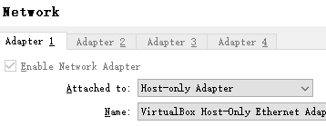
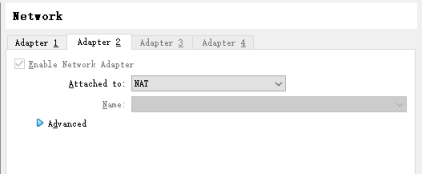
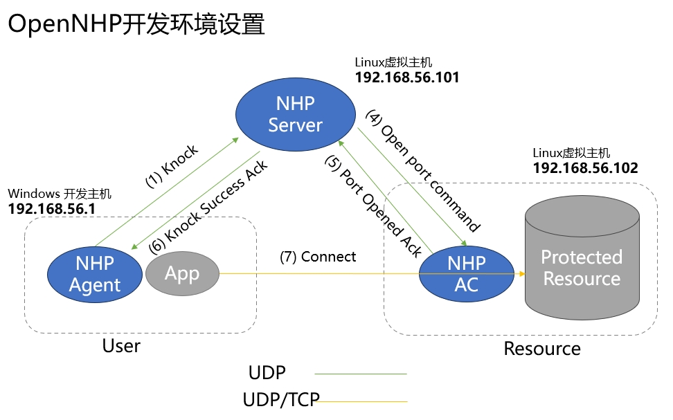

# OpenNHP 배포
{: .fs-9 }


---

## 1. OpenNHP 구성 요소 설명

앞 장의 빌드 단계에 따르면, 빌드 결과는 *release* 디렉터리에 출력되며, 이 디렉터리 아래의 세 개 하위 디렉터리는 각각 OpenNHP의 세 가지 핵심 구성 요소인 *nhp-agent*, *nhp-server*, *nhp-ac*를 포함합니다.

- **nhp-agent 에이전트:** 노크 요청을 시작하는 모듈로, 노크 요청에는 데이터 접근자의 신원 및 디바이스 정보가 담겨 있으며, 일반적으로 사용자 단말 디바이스에 설치됩니다.
- **nhp-server 서버:** 노크 요청을 처리하고 검증하는 모듈로, 일반적으로 서버 프로그램입니다. 노크 요청을 검증하고 외부 인가 서비스 제공자(ASP)와 상호작용하여 인증 작업을 수행하며, NHP 접근 제어기(AC)를 제어하여 개방 동작을 수행하는 기능을 포함합니다.
- **nhp-ac 접근 제어기:** 접근 제어를 실행하는 모듈로, 일반적으로 서버 프로그램입니다. 이 모듈은 기본적으로 "전부 거부(deny all)"하는 보안 정책을 실행하여 보호 대상 리소스의 네트워크 은닉 상태를 보장하며, 일반적으로 보호 대상 리소스와 동일한 호스트에 위치합니다. 인가된 NHP 에이전트에 대한 접근을 개방하거나 인가가 만료된 NHP 에이전트에 대한 접근을 차단하는 역할을 하며, NHP 서버가 반환한 파라미터에 따라 NHP 에이전트에 대한 허용 동작을 실행합니다.

## 2. OpenNHP 개발/테스트 환경 구축

### 2.1 개발/테스트 환경: Windows/macOS 개발 호스트 + Linux 가상 머신

개발 호스트가 Windows 또는 macOS라고 가정하면, 가상 머신 환경(예: VirtualBox)을 설치하고 두 대의 Linux 가상 머신을 생성하여 간단한 OpenNHP 테스트 환경을 구축할 수 있습니다. 가상 머신을 생성할 때, 네트워크 카드 옵션을 `"Host-only Adapter"`로 설정하면(아래 그림 참고) 가상 머신의 IP와 개발 호스트의 IP가 동일한 서브넷에 속하게 할 수 있습니다.

 

 **참고:** 해당 가상 머신이 동시에 인터넷 접속 능력을 갖추도록 하려면, `"NAT"` 네트워크 카드를 추가로 하나 더 설정할 수 있습니다.
 

이제 NHP 세 가지 핵심 구성 요소의 환경 구성은 다음과 같습니다.

- 【nhp-server】 Linux 가상 호스트에서 실행되며, IP 주소는 *192.168.56.101*
- 【nhp-ac】 Linux 가상 호스트에서 실행되며, IP 주소는 *192.168.56.102*
- 【nhp-agent】 Windows/macOS 개발 호스트에서 실행되며, IP 주소는 *192.168.56.1*

### 2.2 개발/테스트 환경의 네트워크 토폴로지 및 기본 정보

 

| 서버 이름 | IP 주소 | 기본 설정 정보  |
|:--:|:--:|:--:|
| NHP-Server | 192.168.56.101  | **공개키:** WqJxe+Z4+wLen3VRgZx6YnbjvJFmptz99zkONCt/7gc=<br/>**개인키:** eHdyRHKJy/YZJsResCt5XTAZgtcwvLpSXAiZ8DBc0V4= <br/> **Hostname:** localhost <br/> **ListenPort:** 62206 <br/> **aspId:** example |
| NHP-AC | 192.168.56.102  | **공개키:** Fr5jzZDVpNh5m9AcBDMtHGmbCAczHyPegT8IxQ3XAzE=<br/>**개인키:** +B0RLGbe+nknJBZ0Fjt7kCBWfSTUttbUqkGteLfIp30=<br/>**ACId:** testAC-1 <br/> 보호 대상 리소스의 **resId:** test |
| NHP-Agent | 192.168.56.1  | **공개키:** WnJAolo88/q0x2VdLQYdmZNtKjwG2ocBd1Ozj41AKlo=<br/>**개인키:** +Jnee2lP6Kn47qzSaqwSmWxORsBkkCV6YHsRqXCegVo= <br/> **UserId:** agent-0 |

**【주의】** 각 구성 요소마다 대응하는 설정 파일이 있으며, 올바르게 설정해야 정상적으로 시작할 수 있습니다. 설정 파일 형식에 관해서는 아래 각 구성 요소의 "설정 파일" 관련 내용을 참고하십시오.

**【참고】** 0.3.3 버전부터 각 구성 요소 설정 파일 내 대부분의 필드는 동적 업데이트를 지원합니다. 자세한 내용은 각 설정 파일의 주석 설명을 참고하십시오.

### 2.3 NHP-Server의 설정 및 실행

#### 2.3.1 NHP-Server 시스템 요구사항

- Linux 서버 또는 Windows

#### 2.3.2 NHP-Server 실행

*release* 디렉터리 아래의 *nhp-server* 디렉터리를 대상 머신에 복사합니다. *etc* 디렉터리 아래의 `toml` 파일을 설정한 뒤(자세한 파라미터는 다음 절 참고), `nhp-serverd run`을 실행합니다.

- Linux 환경:

   ```bash
   nohup ./nhp-serverd run 2>&1 &
   ```

- Windows 환경:

   ```bat
   nhp-serverd.exe run
   ```

*【선택 사항】* UDP 포트 노출 차단: `iptables_default.sh`를 실행

#### 2.3.3 NHP-Server 서버의 설정 파일

- 기본 설정: [config.toml](https://github.com/OpenNHP/opennhp/tree/main/server/main/etc/config.toml)  
- 접근 제어기 피어 목록 설정: [ac.toml](https://github.com/OpenNHP/opennhp/tree/main/server/main/etc/ac.toml)  
- 클라이언트 피어 목록 설정: [agent.toml](https://github.com/OpenNHP/opennhp/tree/main/server/main/etc/agent.toml)  
- http 서비스 설정: [http.toml](https://github.com/OpenNHP/opennhp/tree/main/server/main/etc/http.toml)  
- 서버 플러그인 읽기 설정: [resource.toml](https://github.com/OpenNHP/opennhp/tree/main/server/main/etc/resource.toml)  
- 소스 주소 연관 목록: [srcip.toml](https://github.com/OpenNHP/opennhp/tree/main/server/main/etc/srcip.toml)  
- 서버 플러그인 리소스 설정: [resource.toml](https://github.com/OpenNHP/opennhp/tree/main/server/main/etc/resource.toml)  

### 2.4 NHP-AC의 설정 및 실행

#### 2.4.1 NHP-AC 시스템 요구사항

- Linux 서버, 커널이 **ipset**을 지원해야 함. 다음 명령으로 ipset 지원 여부를 확인할 수 있습니다.

   ```bash
   lsmod | grep ip_set 
   ```

#### 2.4.2 NHP-AC 실행

*release* 디렉터리 아래의 *nhp-ac* 디렉터리를 대상 머신에 복사합니다. *etc* 디렉터리 아래의 `toml` 파일을 설정한 뒤(자세한 파라미터는 다음 장 참고), `iptables_default.sh`를 실행하여 방화벽 규칙을 추가합니다. 이 시점에서 외부 연결은 수립될 수 없습니다. 이후 `nhp-acd run`을 실행합니다.

**【주의】** `nhp-acd`와 `iptables_default.sh`는 **root** 권한으로 실행해야 합니다.

- Linux 환경:

   ```bash
   su
   ./iptables_default.sh
   nohup ./nhp-acd run 2>&1 &
   ```

`iptables_default.sh`가 iptables에 적용한 변경 사항을 되돌리고 싶다면, 다음 명령을 실행하여 제거할 수 있습니다.

   ```bash
   iptables -F
   ```

#### 2.4.3 NHP-AC 접근 제어기 설정 파일

- 기본 설정: [config.toml](https://github.com/OpenNHP/opennhp/tree/main/ac/main/etc/config.toml)  
- 서버 피어 목록: [server.toml](https://github.com/OpenNHP/opennhp/tree/main/ac/main/etc/server.toml)  

### 2.5 NHP-Agent의 설정 및 실행

#### 2.5.1 NHP-Agent 시스템 요구사항

- 모든 플랫폼: Windows, Linux, macOS, Android, iOS

#### 2.5.2 NHP-Agent 실행

*release* 디렉터리 아래의 *nhp-agent* 디렉터리를 대상 머신에 복사합니다. *etc* 디렉터리 아래의 `toml` 파일을 설정한 뒤(자세한 파라미터는 다음 장 참고), `nhp-agentd run`을 실행합니다.

- Linux 환경:

   ```bash
   nohup ./nhp-agentd run 2>&1 &
   ```

- Windows 환경:

   ```bat
   nhp-agentd.exe run
   ```

#### 2.5.3 NHP-Agent의 설정 파일

- 기본 설정: [config.toml](https://github.com/OpenNHP/opennhp/tree/main/agent/main/etc/config.toml)  
- 노크 대상 설정: [resource.toml](https://github.com/OpenNHP/opennhp/tree/main/agent/main/etc/resource.toml)  
- 서버 피어 목록: [server.toml](https://github.com/OpenNHP/opennhp/tree/main/agent/main/etc/server.toml)  

### 2.6 NHP 네트워크 은닉 효과 테스트

NHP의 네트워크 은닉 효과를 검증하려면, nhp-agent 호스트 *(IP: 192.168.56.1)*에서 `nmap 스캔(80번 포트를 예로 함)`으로 nhp-ac 호스트 *(IP: 192.168.56.102)*를 테스트하면 됩니다. 이 외에도, 별도의 가상 머신(해커의 스캔 공격을 시뮬레이션)에서 nhp-ac 호스트를 스캔하여 효과를 확인할 수 있습니다.

| 테스트 케이스 | 테스트 명령 | 테스트 목적  | 예상 결과  |
|:--:|:--:|:--:|:--:|
| nhp-agent 미실행 |`nmap -sS -p 80 192.168.56.102` | AC의 Agent에 대한 은닉 테스트 | 80/tcp filtered  |
| nhp-agent 실행 중 |`nmap -sS -p 80 192.168.56.102` | AC의 Agent에 대한 개방 테스트 | 80/tcp open  |
| nhp-agent 실행 중 |`nmap -sS -p 80 192.168.56.102` | AC의 해커에 대한 은닉 테스트 | 80/tcp filtered  |

## 3. 로그 설명

### 3.1 로그 파일 위치

로그 파일은 각 구성 요소의 *logs* 디렉터리 아래에 생성되며, 날짜를 파일명으로 사용합니다. `tail` 명령으로 확인할 수 있습니다.

- nhp-server의 로그 확인

   ```bash
   tail -f release/nhp-server/logs/server-2024-03-10.log
   ```

- nhp-ac의 로그 확인

   ```bash
   tail -f release/nhp-ac/logs/ac-2024-03-10.log
   ```

- nhp-agent의 로그 확인

   ```bash
   tail -f release/nhp-agent/logs/agent-2024-03-10.log
   ```

### 3.2 로그 파일 형식

로그의 형식은 다음과 같습니다.

   ```text
   타임스탬프 코드 위치 NHP 구성 요소 이름 [로그 레벨] 로그 메시지
   ```

로그 레벨은 다음과 같은 단계로 구분됩니다.

- Error
- Critical
- Warning
- Info
- Debug

## 4. 부록 A: 자주 묻는 질문(FAQ)

- **Q:** Windows 플랫폼에서 컴파일 오류: `running gcc failed: exec: "gcc": executable file not found in %PATH%` 
  **A:** `gcc` 컴파일 도구가 설치되어 있지 않기 때문입니다. 위 문서의 3.1.3 단계를 따라 GCC를 설치하십시오.

- 로그에 다음 오류가 표시됨: `NHP-AC [Critical] received stale packet from 192.168.56.101:62206, drop packet`. 
   【원인】 수신 측은 패킷 수신 시간에 대한 요구사항이 있으며, 데이터 패킷의 발신 시간이 수신 시간보다 10분 이상 앞설 수 없습니다.
   【해결】 두 머신의 시간을 동기화하십시오.

- 인증 1회 후 개방되는 시간을 어떻게 조정하나요? 지정된 포트만 개방하도록 어떻게 제한하나요?
   【방법】 nhp-server/plugins/ 아래 해당 플러그인 모듈에서 etc/resource.toml 파일을 찾으면, 그 안에서 리소스의 포트, 지속 시간, id 등의 정보를 설정할 수 있습니다. nhp-agent로 노크하는 경우 기본값은 example 플러그인입니다. 위챗 QR코드 스캔으로 노크하는 경우에는 wxweb 플러그인을 사용합니다.

- 설정이 적용되었는지 어떻게 확인하나요?
   【방법】 server와 ac의 로그에 기록이 남습니다. 또한 ac 시스템에서 ipset -L 명령을 입력하면 인가된 소스 IP, 목적지 포트, 지속 시간을 확인할 수 있습니다.

- nhp-agent 노크는 성공했지만 접근이 되지 않는 경우의 가능한 원인.

   문제 원인: ***nhp-server가 nhp-ac로 하달하여 ipset에 추가하는 레코드 중 resource 대상이 요청 내의 resource 대상 IP와 일치하지 않을 가능성***이 있습니다. 이런 상황은 resource와 nhp-ac가 동일한 서버에 있는 경우에 발생할 수 있습니다. 먼저 ipset 규칙을 수동으로 설정해 볼 수 있습니다.
   ``` shell
   sudo ipset add defaultset [SourceIP],tcp:80,[ResourceIP]
   ```
   ***SourceIP는 소스 IP, 즉 Agent의 공인 IP이며, tcpdump 또는 ipset list로 확인할 수 있습니다***
   ***ResourceIP는 요청 대상 리소스의 IP*** 이 IP는 nhp-server의 ./plugins/example/etc/resource.toml에 대응합니다. <span style="color:red">요청과 일치하지 않으면 노크는 성공하지만 요청이 되지 않는 문제가 발생합니다.</span>

   패킷 캡처 디버깅: ```nhp-ac``` 측에서 ```tcpdump -i any port 80```(상황에 따라 조정)

   해결 방법: 사용 가능한 IP를 nhp-server의 ```./plugins/example/etc/resource.toml``` 설정 내 ```Addr.Ip = ""```에 설정하십시오.
