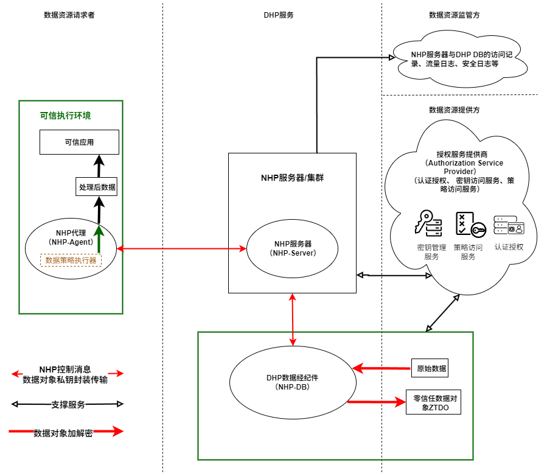
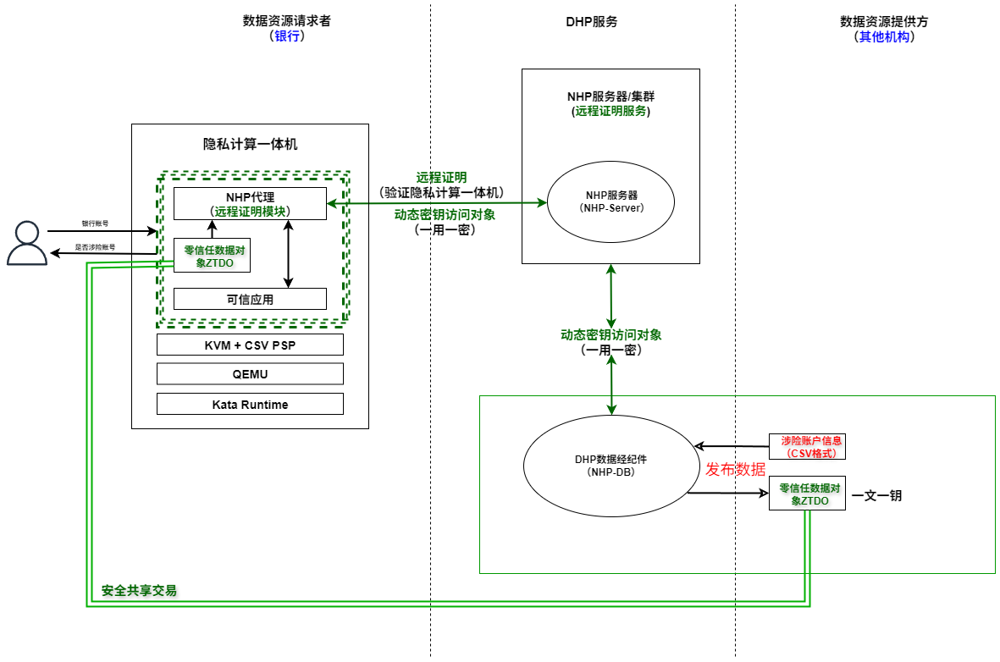

# DHP 빠른 시작
{: .fs-9 }

nhp-server, nhp-db, nhp-agent를 시뮬레이션하는 로컬 Docker 디버깅 환경입니다. 이 환경은 다음 용도로 사용할 수 있습니다:
{: .fs-6 .fw-300 }

- OpenDHP의 동작 방식을 빠르게 이해
- 기본적인 로직 검증
{: .fs-6 .fw-300 }


---

## 1. 개요

OpenDHP의 주요 목적은 데이터 주권을 강화하는 것으로, 데이터 가용성을 유지하면서 데이터 비가시성을 보장하고, 전체 데이터 생명주기에 걸쳐 데이터 프라이버시를 유지합니다.

이 빠른 시작 가이드는 개발자가 OpenDHP Docker 환경을 빠르게 구축하고, 소스 코드를 빌드하며, OpenDHP의 핵심 기능을 테스트하는 데 도움을 줍니다. 이 환경은 가볍고 사용하기 쉽게 설계되어, OpenDHP를 빠르게 테스트하고 디버깅하고자 하는 개발자에게 매우 적합합니다.

### 1.1 아키텍처


#### 1.1.1 네트워크 토폴로지

| 컨테이너 이름        | IP            | 설명                                                                                                       |
| ------------------  | ------------  | --------------------------------------------------------------------------------------------------------- |
| NHP-Agent           | 177.7.0.8     | nhp-agentd, 포트 매핑: 443→Host: 8443                                                                       |
| NHP-Server          | 177.7.0.9     | nhp-serverd, 개방 포트 62206                                                                               |
| NHP-DB              | 177.7.0.12    | nhp-db, 데이터 배포에 사용                                                                                   |

### 1.2 테스트 시나리오
#### 1.2.1 시나리오 설명
위험 계좌 식별의 포괄성과 정확성을 높이기 위해, 은행은 내부 리스크 통제 식별 외에도 다른 은행, 지불 기관, 공안 또는 규제 플랫폼이 제공하는 위험 계좌 정보와 연계 검증을 수행할 수 있습니다. 데이터 보안과 사용자 프라이버시를 보장하기 위해, 각 참여 주체는 기밀 컴퓨팅 기술을 통해 협업하여 특정 계좌에 위험 행위가 존재하는지 판단하며, 사용자 데이터를 직접 평문으로 노출하는 것을 방지합니다.

#### 1.2.2 시나리오 아키텍처


## 2. Docker 환경 설치
이 부분에 대해서는 [NHP 빠른 시작](/kr/nhp_quick_start/)의 관련 섹션을 참조하세요.

## 3. 환경 실행 및 설정

아래 시작 명령을 실행하면, 시작 과정에서 nhp-server, nhp-db, nhp-agent 이미지가 각각 빌드됩니다.

### 3.1 모든 서비스 시작

```shell
cd ./docker
docker compose -f docker-compose.dhp.yaml up -d
```

### 3.2 DHP 모드로 nhp-agent 시작
`nhp-agent`는 기본적으로 자동 시작되지 않으므로 수동으로 시작해야 합니다.

```shell
docker exec -it nhp-agent /bin/bash
/nhp-agent/nhp-agentd dhp
```

### 3.3 nhp-db 시작
`nhp-db`는 기본적으로 자동 시작되지 않으므로 수동으로 시작해야 합니다.

```shell
docker exec -it nhp-db /bin/bash
/nhp-db/nhp-db run
```

### 3.4 DHP 관련 파라미터 설정
에이전트와 TEE 키는 최초 시작 시 생성되므로, nhp-server에 에이전트 공개키를 설정하여 신뢰를 구축하고, nhp-db에 TEE 공개키를 설정하여 신뢰를 구축해야 합니다. 또한 nhp-server에 신뢰 실행 환경을 설정하여 원격 증명 보고서를 평가할 수 있도록 해야 합니다.

#### 3.4.1 에이전트 공개키를 nhp-server에 설정
이 기본 Docker 환경에서는 8443 포트가 이미 nhp-agent를 위해 호스트에 매핑되어 있으므로, 호스트에서 https://localhost:8443 을 통해 nhp-agent의 HTTP 인터페이스에 접근할 수 있습니다. 다음 curl 명령을 사용하여 에이전트의 공개키를 가져올 수 있습니다.

```shell
curl --insecure https://localhost:8443/api/v1/key/agent
{"publicKey":"f+HWVbhQ6ZR3e+INU7ZSGyn3XNls5TUdbZWlPmj/1v890WLDW7RcnnbJmqqufymK+Yb99dadX+PlhK4qFYxtOg=="}
```
다음으로, nhp-server에 에이전트 공개키를 설정합니다.
```shell
docker exec -it nhp-server /bin/bash
vi /nhp-server/etc/agent.toml
# list the agent peers for the server under [[Agents]] table

# PubKeyBase64: public key for the agent in base64 format.
# ExpireTime (epoch timestamp in seconds): peer key validation will fail when it expires.
[[Agents]]
PubKeyBase64 = "f+HWVbhQ6ZR3e+INU7ZSGyn3XNls5TUdbZWlPmj/1v890WLDW7RcnnbJmqqufymK+Yb99dadX+PlhK4qFYxtOg=="
ExpireTime = 1924991999
```
에이전트 공개키를 설정한 후, 다음 curl 명령으로 에이전트 상태를 확인할 수 있습니다:
```shell
curl --insecure https://localhost:8443/api/v1/status/agent
{"attestationVerified":false,"running":true,"trustedByNHPDB":false,"trustedByNHPServer":true}
```
`trustedByNHPServer`가 `true`로 표시되는 것을 확인할 수 있으며, 이는 해당 에이전트가 NHP 서버에 의해 신뢰되었음을 의미합니다.
#### 3.4.2 TEE 증명을 nhp-server에 설정
다음 curl 명령을 사용하여 TEE 원격 증명 보고서를 가져올 수 있습니다.

**참고:** 이 원격 증명 보고서는 비 TEE 환경에서 컨테이너 정보를 기반으로 생성된 것이며, 비 TEE 환경은 테스트 목적으로만 사용됩니다.

```shell
curl --insecure https://localhost:8443/api/v1/attestation/tee
{"measure":"3460bc69b9d273ad15c91074d8fd41abc5d5ccac50730d2e0495d08558848e34","serial number":"3460bc69b9d273ad15c91074d8fd41abc5d5ccac50730d2e0495d08558848e34"}
```
다음으로, nhp-server에 원격 증명 정보를 설정해야 합니다.
```shell
docker exec -it nhp-server /bin/bash
vi /nhp-server/etc/tee.toml
# list trusted execution environments under [[TEEs]] table

# Measure: cryptographic hashes that ensure the integrity of software and data within the TEE.
# SerialNumber: unique serial number of the TEE.

[[TEEs]]
Measure = "19178a674248bbca705863bbf75ecaa049fcf3dfcc5ff59a80dcc5cbb60dae59"
SerialNumber = "TMEX300023050201"

[[TEEs]]
Measure = "3460bc69b9d273ad15c91074d8fd41abc5d5ccac50730d2e0495d08558848e34"
SerialNumber = "3460bc69b9d273ad15c91074d8fd41abc5d5ccac50730d2e0495d08558848e34"
```
에이전트 공개키를 설정한 후, 다음 curl 명령으로 에이전트 상태를 확인할 수 있습니다:
```shell
curl --insecure https://localhost:8443/api/v1/status/agent
{"attestationVerified":true,"running":true,"trustedByNHPDB":false,"trustedByNHPServer":true}
```
`attestationVerified`가 `true`로 표시되는 것을 확인할 수 있으며, 이는 TEE가 NHP 서버에 의해 신뢰되었음을 의미합니다.
#### 3.4.3 TEE 공개키를 nhp-db에 설정
다음 curl 명령을 사용하여 TEE 공개키를 가져올 수 있습니다.
```shell
curl --insecure https://localhost:8443/api/v1/key/tee
{"publicKey":"pup5OzTTZjddv+WBgbUBkvHuBgJoBg0DU+I2c7Qj4lHlrVM8N/Yl9F6DEnbGFBWB89xrN6VLhYAIM4Xv+mu4KA=="}
```
다음으로, nhp-db에 TEE 공개키를 설정해야 합니다.
```shell
docker exec -it nhp-db /bin/bash
vi /nhp-db/etc/tee.toml
# Configuration for trusted execution environment.

# TEEPublicKeyBase64: base64 encoded public key of TEE (Trusted Execution Environment).
[[TEEs]]
TEEPublicKeyBase64 = "pup5OzTTZjddv+WBgbUBkvHuBgJoBg0DU+I2c7Qj4lHlrVM8N/Yl9F6DEnbGFBWB89xrN6VLhYAIM4Xv+mu4KA=="
ExpireTime = 1924991999
```
## 4. 은행 위험 계좌 시나리오 테스트
### 4.1 데이터 리소스 배포
다음 명령을 사용하여 데이터 리소스를 배포할 수 있습니다:
```shell
docker exec -it nhp-db /bin/bash
cd /nhp-db
./nhp-db run --mode encrypt --data-source-type online --source ./demo/risk.involved.accounts.csv --output ./risk.involved.accounts.csv.demo.ztdo --smart-policy ./demo/smart.policy.json --metadata ./demo/metadata.json
```
`Successfully register or update data object which doId is <doId>.`라는 메시지가 표시되면, 데이터 리소스가 성공적으로 배포된 것입니다.

### 4.2 데이터 리소스 요청
#### 4.2.1 신뢰 애플리케이션 작성 및 컴파일
신뢰 애플리케이션과의 간편하고 통일된 통신을 위해, 우리는 모델 컨텍스트 프로토콜(Model Context Protocol, 줄여서 MCP)을 채택했습니다. 이는 신뢰 애플리케이션이 MCP 서버로 구현되고, NHP Agent에 내장된 클라이언트가 MCP 클라이언트로서 신뢰 애플리케이션과 통신함을 의미합니다. MCP 프레임워크는 거의 모든 프로그래밍 언어를 지원하므로, 어떤 언어로든 신뢰 애플리케이션을 구현하는 것이 매우 간단하고 직관적입니다.

다음은 이 데모에서 사용되는, Golang으로 작성된 간단한 신뢰 애플리케이션 예제입니다.
```go
package main

import (
	"context"
	"encoding/csv"
	"fmt"
	"io"
	"os"

	"github.com/mark3labs/mcp-go/mcp"
	"github.com/mark3labs/mcp-go/server"
)

func main() {
    s := server.NewMCPServer("trusted application", "1.0.0",
        server.WithToolCapabilities(true),
    )

    s.AddTool(
        mcp.NewTool("verify_account",
            mcp.WithDescription("Verify account to check whether there are any risk factors associated with the account"),
            mcp.WithString("path",
                mcp.Required(),
                mcp.Description("path to file which records the account details"),
            ),
            mcp.WithString("account_id",
                mcp.Description("account id"),
				mcp.Required(),
            ),
        ),
        verifyAccountHandler,
    )

    // Start STDIO server
    if err := server.ServeStdio(s); err != nil {
        fmt.Fprintf(os.Stderr, "Server error: %v\n", err)
        os.Exit(1)
    }
}

func verifyAccountHandler(ctx context.Context, req mcp.CallToolRequest) (*mcp.CallToolResult, error) {
    path, err := req.RequireString("path")
    if err != nil {
        return mcp.NewToolResultError(err.Error()), nil
    }

    accountId, err := req.RequireString("account_id")
    if err != nil {
        return mcp.NewToolResultError(err.Error()), nil
    }

	is_risk, err := findRecord(path, accountId)
	if err != nil {
		return mcp.NewToolResultError(err.Error()), nil
	}

    return mcp.NewToolResultText(fmt.Sprintf(`{"account_id":"%s","is_risk": %t}`, accountId, is_risk)), nil
}

func findRecord(path string, accountId string) (bool, error) {
	f, err := os.Open(path)
	if err != nil {
		return false, err
	}
	defer f.Close()

	r := csv.NewReader(f)
	r.Comma = ','

	for {
		record, err := r.Read()
		if err != nil {
			if err == csv.ErrFieldCount {
				continue
			}

			if err == io.EOF {
				return false, nil
			}

			return false, err
		}

		if record[0] == accountId {
			return true, nil
		}
	}
}
```
이를 `ta`라는 이름의 바이너리 파일로 컴파일했다고 가정합니다.

#### 4.2.2 신뢰 애플리케이션 등록
다음 명령을 사용하여 신뢰 애플리케이션을 등록할 수 있습니다:
```shell
curl --insecure --request POST --url https://localhost:8443/api/v1/ta/register --header 'content-type: multipart/form-data' --form file=@ta --form 'description=trusted application demo'
[
  {
    "method": "POST",
    "name": "/api/v1/ta/ceca4572-644b-4bde-a4b6-ac6048f8fba6/verify_account",
    "description": "Verify account to check whether there are any risk factors associated with the account",
    "params": [
      {
        "name": "doId",
        "description": "identifier of the data object",
        "type": "string"
      },
      {
        "name": "account_id",
        "description": "account id",
        "type": "string"
      }
    ]
  }
]
```
등록에 성공하면, 신뢰 애플리케이션이 노출하는 HTTP RESTful API에 접근할 수 있습니다.

#### 4.2.3 작업 실행
다음 curl 명령을 사용하여 이러한 노출된 RESTful API를 호출하여 프라이버시 보호 연산을 실행할 수 있습니다:
```shell
curl --insecure --request POST --url https://localhost:8443/api/v1/ta/ceca4572-644b-4bde-a4b6-ac6048f8fba6/verify_account --header 'content-type: application/json' --data '{"doId": "47d2b67c-ef80-45fc-814d-effd23baf788", "account_id": "62230121012345678901"}'
```
실행 후, `{"account_id":"62230121012345678901","is_risk":false}`라는 응답을 받게 되며, 이는 해당 계좌가 위험 계좌가 아님을 나타냅니다.

NHP Agent, 신뢰 애플리케이션 및 데이터가 모두 신뢰 실행 환경(TEE)의 보호를 받기 때문에, 데이터 리소스 소비자는 데이터 리소스에 직접 접근할 수 없습니다. 데이터에 대한 모든 작업은 TEE 내부의 통제되고 검증된 실행 흐름을 통해서만 이루어져야 하며, 이를 통해 데이터가 항상 기밀성을 유지하고 연관된 스마트 데이터 정책에 따라 처리되도록 보장합니다. 전체 DHP 설계는 소비자가 데이터를 사용할 수는 있지만 데이터의 원본 내용을 영원히 확인하거나 추출할 수 없도록 보장합니다.
