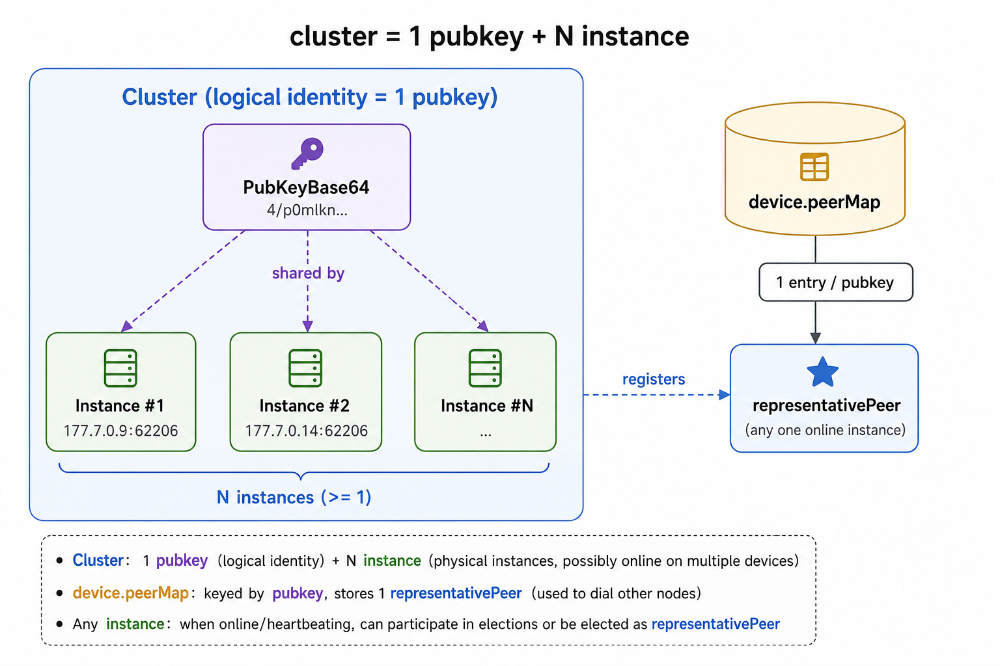
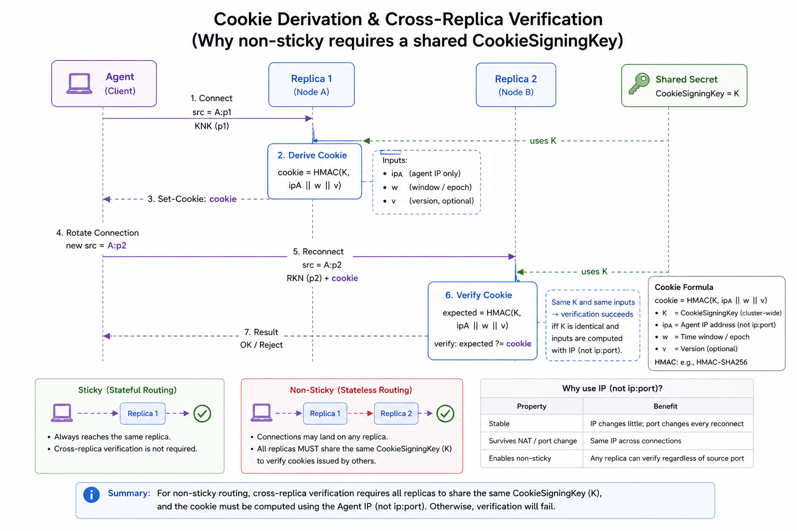
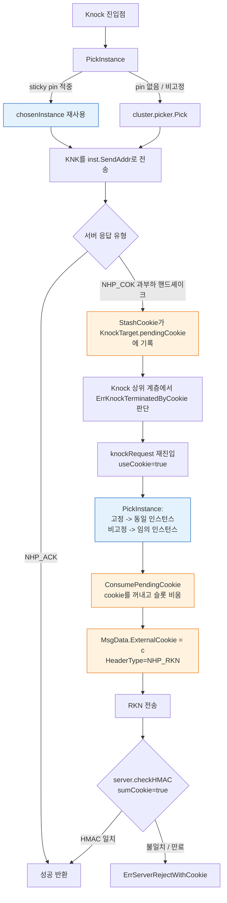
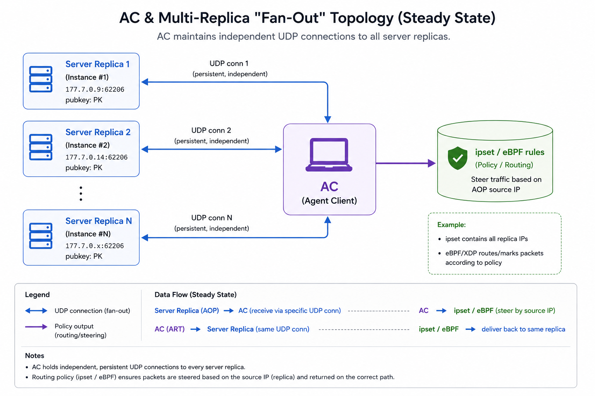
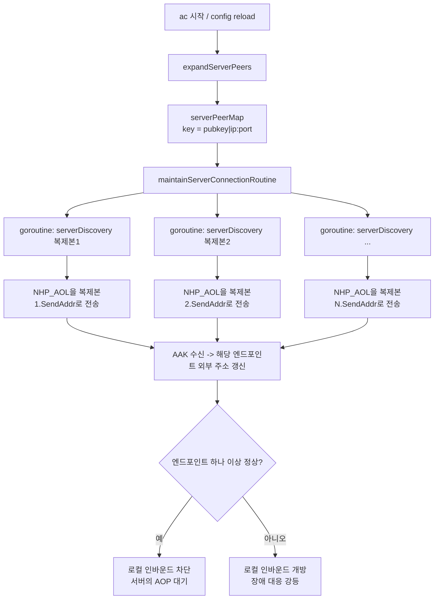
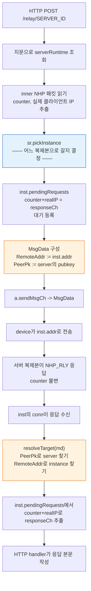

# 다중 nhp-server 인스턴스 클러스터: Agent / AC / Relay 구현 설명

> 적용 브랜치: `feat/phase2-multi-instance-peers`
> 범위: NHP-Agent / NHP-AC / NHP-Relay에서 "하나의 nhp-server 논리적 identity(동일한 pubkey) 아래 여러 물리적 인스턴스를 두는" 부하 분산과 장애 상호 통신 능력을 지원.
> 공용 기반: [nhp/common/loadbalance](../../nhp/common/loadbalance/loadbalance.go) selector, [nhp/core/responder.go](../../nhp/core/responder.go) 무상태 cookie.
> English version: [../multi-server.en.md](../multi-server.en.md)

---

## 0. 공용 모델

### 0.1 클러스터의 형태

어느 엔드포인트든 "클러스터"는 다음을 의미한다:

| 개념 | 정의 |
| --- | --- |
| 논리적 identity | nhp-server 공개키/개인키 쌍(`PubKeyBase64`) |
| 물리적 인스턴스 | 하나의 `host:port`(각 인스턴스는 독립적으로 리스닝) |
| 클러스터 | 1개의 pubkey + N개의 instance; N개의 instance는 pubkey를 공유하고 각각 주소가 다름 |
| `representativePeer` | device.peerMap에 등록할 때 사용하는 "대표" `UdpPeer`; identity는 pubkey로 색인되므로 하나만 등록 가능 |



### 0.2 부하 분산 picker(공유)

[nhp/common/loadbalance/loadbalance.go](../../nhp/common/loadbalance/loadbalance.go)는 제네릭 `Picker[T Weighted]`를 제공하며, 세 엔드포인트가 공유한다:

- `SchemeRandom` — 균등 확률 무작위
- `SchemeWeightedRandom`(기본값) — `Weight()`에 따른 가중 무작위; weight=0은 1로 올림
- `SchemeRoundRobin` — 원자적 카운터 기반 라운드 로빈, 락 없음

### 0.3 무상태 cookie(선행 의존성)

클러스터 내 임의의 nhp-server 복제본이 동료가 발급한 cookie를 검증할 수 있으려면, 다음 세 가지 조건이 동시에 성립해야 한다: **공유 cookie 서명 키** + **IP 기준(포트 제외) 파생** + **agent 정적 공개키 바인딩**:

```text
cookie = HMAC-SHA256(CookieSigningKey, remoteIP || agentStaticPubKey || windowIndex)
```

- 검증 윈도우: 현재 + 이전 윈도우(기본 60초), 윈도우 경계를 넘어도 사용 가능.
- IP만 사용하고 포트는 사용하지 않음: Agent가 인스턴스를 전환할 때 UDP conn마다 임시 소스 포트가 다르며, 포트는 KNK와 RKN 사이에서 바뀔 수 있다. IP로 파생해야 다른 복제본에서도 동일한 cookie를 계산할 수 있다.
- agent 정적 공개키 바인딩: 바인딩하지 않으면 동일 NAT/CGN 출구 IP를 공유하는 두 agent가 같은 윈도우 내에서 동일한 cookie를 파생하게 된다 — 그중 하나가 자신의 정상적인 KNK로 cookie를 받으면, 같은 NAT 뒤의 다른 agent가 무관한 RKN에서 이를 재생(replay)할 수 있다. agent 정적 공개키는 전역적으로 고유하므로 복제본 간 파생은 여전히 성립한다. Server는 cookie 검증 전에 IK static 필드에서 agent 공개키를 추출하며, **와이어 프로토콜은 변경되지 않는다**. agent는 이 바인딩 계층을 전혀 인지하지 못한다.
- 설정: `CookieSigningKeyBase64`, `CookieTimeWindowSeconds`, 자세한 내용은 [responder.go:23-58](../../nhp/core/responder.go#L23-L58), [udpserver.go:235-270](../../endpoints/server/udpserver.go#L235-L270) 참조.



---

## 1. NHP-Agent

### 1.1 핵심 타입

| 타입 | 파일 | 설명 |
| --- | --- | --- |
| `ClusterConfig` | [clusterconfig.go](../../nhp/common/clusterconfig/clusterconfig.go) | 공유 TOML 구조 —— 하나의 `[[Servers]]` 블록. nhp-agent는 type alias를 통해 `agent.ClusterConfig`로 재노출 |
| `InstanceConfig` | 위와 동일 | 하나의 `[[Servers.Instances]]` |
| `ServerCluster` | [cluster.go:48-90](../../endpoints/agent/cluster.go#L48-L90) | 런타임 클러스터 객체(picker, sticky 플래그, `representativePeer` 포함) |
| `ServerInstance` | [cluster.go:11-46](../../endpoints/agent/cluster.go#L11-L46) | 하나의 물리적 인스턴스; `loadbalance.Weighted` 구현 |
| `KnockTarget` | [udpagent.go:76-117](../../endpoints/agent/udpagent.go#L76-L117) | 리소스 → 클러스터 바인딩 + 고정 상태(`chosenInstance`) + cookie 임시 저장(`pendingCookie`) |

### 1.2 리소스 → 클러스터 바인딩

[`FindServerClusterFromResource`](../../endpoints/agent/udpagent.go) —— `resource.toml`은 참조 필드 중 반드시 하나만 설정해야 한다(둘 다 설정하거나 둘 다 설정하지 않으면 거부됨):

1. **`Cluster`**(`resource.toml` 권장): 사람이 읽기 쉬운 클러스터 이름으로, `serverClusterByName`에서 색인하여 조회한다. 공개키를 rotate할 때는 `server.toml`만 수정하면 되고 `resource.toml`은 건드릴 필요가 없다.
2. **`ServerPubKey`**(SDK 권장): 클러스터의 base64 공개키로, `KnockResource`를 프로그래밍 방식으로 구성하는 호출자를 위한 것이다(예: `endpoints/agent/main/export.go`, `endpoints/agent/iossdk/export.go`).

조회 실패 → nil을 반환하고 에러 로그를 남긴다. **더 이상 host:port 폴백이 없다** —— 기존의 `ServerHostname/ServerIp/ServerPort` 필드는 삭제되었다. `ServerPubKey`가 설정된 경우 코드에서 이 필드들이 소리 없이 무시되어, `resource.toml`에 agent가 실제로는 전혀 접근하지 않는 주소가 표시되는 문제가 있었기 때문이다.

### 1.3 인스턴스 선택(PickInstance)

[`KnockTarget.PickInstance`](../../endpoints/agent/udpagent.go#L162-L188):

```text
PickInstance():
  if Sticky && chosenInstance != nil:
    pin := cluster.FindInstanceByAddr(chosenInstance.HostPort())   // reload 후 인스턴스 객체가 교체된 경우 처리
    if pin != nil:
       chosenInstance = pin                                          // 새 객체 채택
       return chosenInstance
    chosenInstance = nil                                              // pin이 무효화됨, 재선택
  inst := cluster.Pick()                                              // picker 경유(random / weighted / rr)
  if Sticky: chosenInstance = inst
  return inst
```

### 1.4 흐름도: KNK → COK → RKN



핵심 포인트(코드 참조):

- **cookie는 더 이상 ConnData.CookieStore를 거치지 않는다**: [knock.go:144-164](../../endpoints/agent/knock.go#L144-L164)에서 NHP_COK을 수신하면 `StashCookie`가 UDP conn의 CookieStore가 아니라 `KnockTarget`에 기록한다 —— 비고정 모드에서는 다음 RKN이 다른 conn을 사용하게 되므로 CookieStore가 비어 있다.
- **RKN은 `MsgData.ExternalCookie`로 전달된다**: [knock.go:108-118](../../endpoints/agent/knock.go#L108-L118)에서 cookie를 `ExternalCookie` 필드에 담고, `initiator.go:444`는 HMAC을 계산할 때 이 필드를 우선 사용한다(기본 conn 레벨 CookieStore 값을 덮어씀).
- **종료(exit)도 동일 인스턴스로**: [knock.go:198-219](../../endpoints/agent/knock.go#L198-L219)의 `ExitKnockRequest`도 동일하게 `PickInstance`를 호출하며, 고정 모드에서는 KNK가 선택한 인스턴스를 재사용하여 서버가 동일한 복제본에서 세션을 올바르게 정리할 수 있도록 보장한다.

### 1.5 고정(sticky) vs 비고정 결정

| 모드 | 사용 시점 | 인스턴스 간 cookie 공유 키 필요 여부 |
| --- | --- | --- |
| `Sticky=true`(기본값) | 클러스터 내에 통일된 `CookieSigningKey`가 설정되지 않았거나 확실하지 않을 때; KNK/RKN/Exit이 모두 동일 복제본에서 처리됨 | 불필요 |
| `Sticky=false` | 모든 복제본에 `CookieSigningKey`와 윈도우가 통일되어 있을 때; 실제로 트래픽을 분산하고 싶을 때 | **필수** —— 그렇지 않으면 RKN이 동일한 cookie 상태를 갖지 않은 복제본에 도달해 실패한다 |

---

## 2. NHP-AC

### 2.1 Agent / Relay와의 근본적 차이

AC 측의 "다중 인스턴스"는 **운영 토폴로지**다: 하나의 AC가 동일한 논리적 nhp-server 클러스터 아래의 여러 복제본을 동시에 서비스해야 한다(각 복제본이 개별적으로 AOP / KPL을 AC로 보낸다). AC는 모든 복제본과의 연결을 병렬로 유지해야 하며, 그중 "하나를 고르는" 것이 아니다. 따라서 AC는 **picker가 필요 없고**, 대신 **모든 엔드포인트로 fan-out**한다.



### 2.2 설정: 공유되는 `[[Servers.Instances]]` 구조

nhp-ac와 nhp-agent는 동일한 TOML 스키마를 공유한다 —— [nhp/common/clusterconfig/clusterconfig.go](../../nhp/common/clusterconfig/clusterconfig.go) 참조:

```toml
[[Servers]]
PubKeyBase64 = "..."
ExpireTime   = 1924991999

  [[Servers.Instances]]
  Ip   = "10.0.0.9"
  Port = 62206

  [[Servers.Instances]]
  Ip   = "10.0.0.14"
  Port = 62206

# 레거시 단일 인스턴스 형식(로드 시 자동 업그레이드되며 deprecation 경고 출력):
# [[Servers]]
# Hostname = ""
# Ip = "10.0.0.9"
# Port = 62206
# PubKeyBase64 = "..."
```

[`normalizeAndExpand`](../../endpoints/ac/config.go)는 먼저 `clusterconfig.Normalize`를 호출하고(레거시 형태 자동 업그레이드 포함), 이후 각 클러스터의 Instances를 N개의 `core.UdpPeer`로 전개한다: pubkey는 모두 동일하고 주소만 다르다. 결과는 `serverPeerMap`에 저장되며, key는 [`endpointKey`](../../endpoints/ac/config.go) = `pk=<key>|host=<host>|ip=<ip>:<port>`로, 동일 pubkey의 서로 다른 주소가 서로를 덮어쓰지 않도록 보장한다.

### 2.3 흐름도: AOL이 모든 엔드포인트로 동시 전송



### 2.4 AOP → ART는 동일 연결로

서버의 어떤 복제본이 `NHP_AOP`를 하달하면:

1. 해당 AOP는 **특정 복제본**의 UDP 소스 주소에서 온 것이며, AC는 이를 대응하는 엔드포인트 연결로 해석한다.
2. [`HandleUdpACOperations`](../../endpoints/ac/msghandler.go#L25-L87)가 처리를 완료하면(ipset / ebpf 규칙 개방), `NHP_ART`를 **동일한 연결**의 `transaction.NextMsgCh`로 회신한다.
3. AC는 "모든 복제본에 전파"하지 않는다 —— AOP는 단일 요청이며, 요청한 쪽에만 응답한다.

> 복제본 간 상태 동기화("agent X가 이미 개방되었으니 당신도 허용하라")는 **AC의 책임이 아니며**, 서버 클러스터 측에서 자체적으로 해결해야 한다(공유 화이트리스트 / 상태 브로드캐스트 / 공유 IPSet 등). AC의 의미는 "묻는 쪽에 답한다"이다.

### 2.5 실패/온라인 전환

- 단일 엔드포인트 하트비트 실패: 해당 엔드포인트만 실패로 표시되어 활성 연결 테이블에서 제거되며, 동일 클러스터의 다른 엔드포인트에는 영향을 주지 않는다.
- reload 후 설정에서 전체 pubkey가 사라짐: [`updateServerPeers`](../../endpoints/ac/config.go#L329-L337)는 새 테이블에서 해당 pubkey를 찾을 수 없을 때만 `RemovePeer`를 호출한다; 엔드포인트 한두 개만 삭제해서는 device 레벨의 제거가 트리거되지 않는다.

---

## 3. NHP-Relay

### 3.1 핵심 타입

| 타입 | 파일 | 설명 |
| --- | --- | --- |
| `Server` | [config.go](../../endpoints/relay/config.go) | TOML `[[Servers]]` 블록(하나의 논리적 nhp-server identity) |
| `serverRuntime` | [relay.go](../../endpoints/relay/relay.go) | 런타임; picker와 instances 보유 |
| `serverInstance` | [relay.go](../../endpoints/relay/relay.go) | 단일 인스턴스; 인스턴스별 독립적인 `pendingRequests` 연관 테이블 |

### 3.2 인스턴스 선택은 한 번만 발생

`relay`는 HTTP → UDP 브리지이며, 응답이 올바른 인스턴스로 돌아와야 대기 중인 HTTP handler와 매칭될 수 있다. 따라서 다음과 같은 **불변 조건**이 있다([relay.go:640-647](../../endpoints/relay/relay.go#L640-L647) 주석):

> Handler picks instance once via `pickInstance()` and pins to `md.RemoteAddr`; send path reads the same pin via `resolveTarget()`; response arrives on that instance's connection and is dispatched to that instance's `pendingRequests` map. Picking twice would break response correlation.

### 3.3 흐름도: HTTP 전달 → 인스턴스 선택 → 응답 연관



### 3.4 내결함성 및 설정 검증

- **pubkey 중복** 항목 간: [normalize](../../endpoints/relay/config.go)에서 거부한다(지문 충돌이 발생하면 `resolveTarget`이 유일하게 위치를 특정할 수 없다).
- **host:port 중복** 항목 간: 마찬가지로 거부한다(응답 패킷이 어느 server에 속하는지 판별할 수 없다).
- **picker가 nil인 경우**: [pickInstance](../../endpoints/relay/relay.go)는 방어적으로 `instances[0]`을 반환하며, 테스트에서 `buildServer`를 우회할 때만 발생한다.
- **md.RemoteAddr이 비어 있는 경우**: 단일 인스턴스일 때는 그 유일한 인스턴스를 반환하고; 다중 인스턴스일 때는 거부한다(추측하지 않고 라우팅 오류를 명확히 보고).

---

## 4. 엔드투엔드 대조표

### 4.1 "어느 인스턴스?" 결정 지점

| 엔드포인트 | 결정 함수 | 고정(sticky) 여부 | 상태가 저장되는 위치 |
| --- | --- | --- | --- |
| Agent KNK | [`KnockTarget.PickInstance`](../../endpoints/agent/udpagent.go#L162-L188) | `Sticky` 기본 켜짐 | `KnockTarget.chosenInstance` |
| Agent RKN | 위와 동일 | KNK의 pin 재사용(고정 모드) | 위와 동일 |
| Agent Exit | 위와 동일 | KNK의 pin 재사용 | 위와 동일 |
| AC AOL | 없음(fan-out) | N/A | 인스턴스당 하나의 goroutine |
| AC AOP→ART | 없음(수신 연결로 회신) | N/A | UDP 연결 자체 |
| Relay HTTP→UDP | [`serverRuntime.pickInstance`](../../endpoints/relay/relay.go) | 요청마다 한 번 선택 | `md.RemoteAddr`(pin) |
| Relay UDP→HTTP | [`resolveTarget`](../../endpoints/relay/relay.go) | 재선택하지 않고 pin을 읽음 | 위 pin에서 가져옴 |

### 4.2 Cookie 동작 대조

| 시나리오 | Cookie 출처 | 전달 방식 | 인스턴스 간 검증 가능? |
| --- | --- | --- | --- |
| Agent 고정 클러스터 | 임의의 인스턴스가 발급 | `KnockTarget.pendingCookie` → `ExternalCookie` | 불필요(인스턴스를 넘나들지 않음) |
| Agent 비고정 클러스터 | 임의의 인스턴스가 발급 | 위와 동일 | 필요 —— 복제본이 `CookieSigningKey`를 공유해야 함 |
| AC | cookie와 무관 | — | — |
| Relay | cookie와 무관(Relay는 KNK 경로의 서명에 관여하지 않음) | — | — |

### 4.3 설정 파일 빠른 참조

| 엔드포인트 | 파일 | 핵심 필드 |
| --- | --- | --- |
| Agent | `server.toml` | `PubKeyBase64`, `LoadBalance`, `StickyInstance`, `[[Servers.Instances]]` |
| Agent | `resource.toml` | `Cluster`(`server.toml`의 Name을 참조) —— 필수; SDK 호출자는 `ServerPubKey`로 대체 가능 |
| AC | `server.toml` | `PubKeyBase64`, `[[Servers.Instances]]`(agent와 동일 스키마) |
| Relay | `config.toml` | `[[Servers]]` + `LoadBalance` + `[[Servers.Instances]]`(agent와 동일 스키마) |
| Server(선행 의존성) | `config.toml` | `CookieSigningKeyBase64`, `CookieTimeWindowSeconds` |

### 4.4 운영 체크리스트

클러스터 배포 전 확인 사항:

1. 모든 nhp-server 복제본이 **동일한 pubkey/개인키**를 사용해야 한다 —— 클러스터 identity는 반드시 일치해야 한다.
2. 모든 복제본의 `CookieSigningKeyBase64`가 **완전히 동일**해야 한다 —— 그렇지 않으면 복제본 간 핸드셰이크가 실패한다(기본값인 무작위 생성을 사용하면 문제가 발생한다).
3. AC의 `[[Servers]]`에 `[[Servers.Instances]]`로 모든 복제본이 나열되어 있어야 한다.
4. Relay의 `[[Servers.Instances]]`에 모든 복제본이 나열되어 있어야 한다; 부하 분산 전략을 Agent와 일치시키면 문제 추적이 더 쉬워진다.
5. Agent 측 `StickyInstance`는 서버의 cookie 공유 상황과 일치해야 한다(공유 → false로 설정 가능; 비공유 → 반드시 true).
6. Resources는 이름으로 클러스터를 바인딩한다(`Cluster = "<server.toml Name>"`); 공개키를 rotate할 때는 `server.toml`만 수정하면 되고 `resource.toml`은 수정할 필요가 없다.
