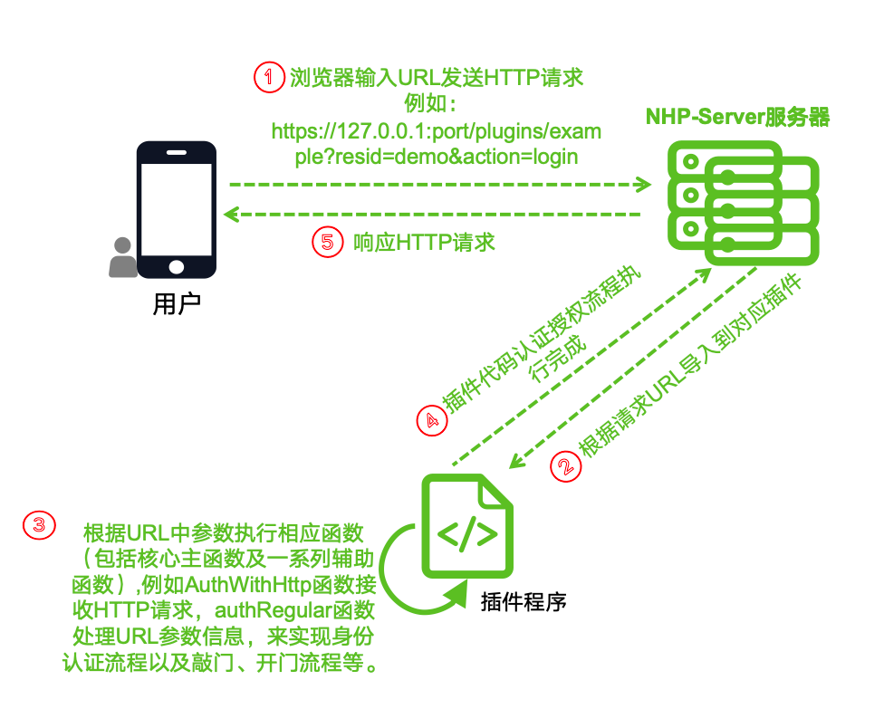
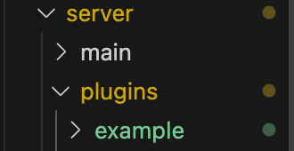
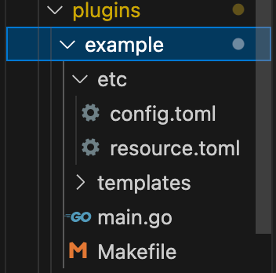
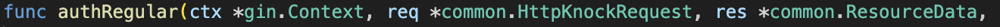
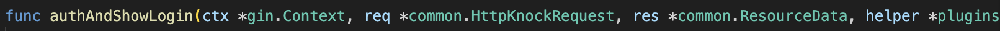
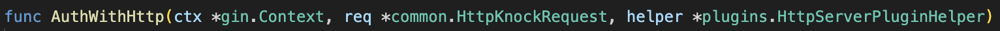
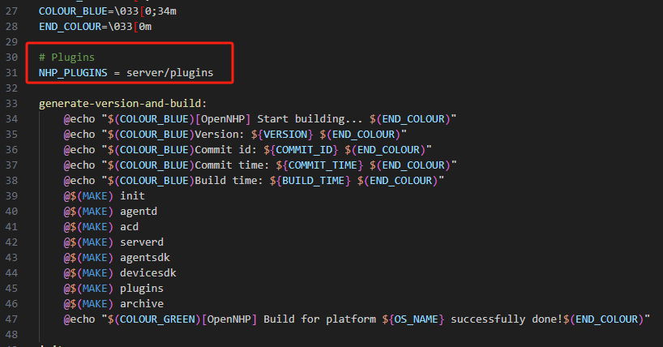
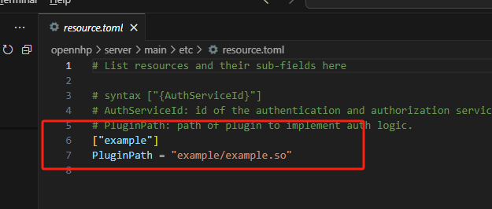
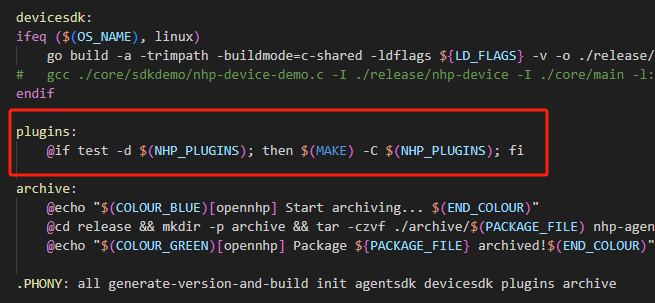

# OpenNHP 플러그인 개발 튜토리얼
{: .fs-9 }

---

- [소개	](#소개 )

- [1. OpenNHP 플러그인 적용의 필요성	](#1-opennhp-플러그인-적용의-필요성 )

    - [1.1 프로토콜 호환성과 기술적 제약	](#11-프로토콜-호환성과-기술적-제약 )

    - [1.2 신원 인증의 맞춤화 요구사항	](#12-신원-인증의-맞춤화-요구사항 )

- [2. 플러그인 동작 원리	](#2-플러그인-동작-원리 )

    - [2.1 사용자가 브라우저를 통해 HTTP 요청을 전송	](#21-사용자가-브라우저를-통해-http-요청을-전송 )

    - [2.2 NHP 서버가 URL을 파싱하여 해당 플러그인을 호출	](#22-nhp-서버가-url을-파싱하여-해당-플러그인을-호출 )

    - [2.3 플러그인 프로그램이 핵심 기능을 실행	](#23-플러그인-프로그램이-핵심-기능을-실행 )

    - [2.4 플러그인이 코드 실행 흐름을 완료	](#24-플러그인이-코드-실행-흐름을-완료 )

    - [2.5 NHP 서버가 사용자에게 HTTP 응답을 반환	](#25-nhp-서버가-사용자에게-http-응답을-반환 )

- [3. 플러그인 개발 원리	](#3-플러그인-개발-원리 )

    - [3.1 환경 준비	](#31-환경-준비 )

    - [3.2 프로젝트 초기화	](#32-프로젝트-초기화 )

    - [3.3 플러그인 기능 설계	](#33-플러그인-기능-설계 )

    - [3.4 핵심 코드 개발	](#34-핵심-코드-개발 )

    - [3.5 플러그인의 컴파일, 테스트 및 배포	](#35-플러그인의-컴파일-테스트-및-배포 )

- [결론	](#결론 )

# 소개
NHP 서버의 플러그인은 특정 기능을 메인 애플리케이션에 추가하는 모듈입니다. 이들은 고도로 모듈화되도록 설계되어 메인 애플리케이션과 느슨하게 결합되며, 개발자가 서버의 핵심 기능에 영향을 주지 않고 플러그인을 추가, 삭제, 업데이트할 수 있도록 합니다.

## 1. OpenNHP 플러그인 적용의 필요성

OpenNHP 플러그인 개발은 한편으로는 UDP 프로토콜과 웹 페이지의 HTTP 요청 간 호환성 문제를 해결하고, 다른 한편으로는 맞춤형 신원 인증 서비스를 통해 정부 플랫폼의 다양한 요구사항을 충족합니다. 플러그인 개발은 NHP 프레임워크가 정부 데이터 유통 애플리케이션에 더욱 확장되고 유연하게 적응하기 위한 핵심 단계입니다. 구체적인 이유는 다음과 같습니다.

### 1.1 프로토콜 호환성과 기술적 제약

NHP 표준 프로토콜은 UDP 프로토콜을 기반으로 통신하며, UDP는 가볍고 빠르다는 특징이 있어 대규모, 고빈도 데이터 전송에 적합합니다. 그러나 일부 애플리케이션 시나리오, 특히 HTML5 웹 페이지와 같은 웹 기반 애플리케이션에서는 브라우저 내 자바스크립트가 HTTP 요청만 시작할 수 있으며 UDP 요청을 직접 보낼 수 없습니다. 이는 프로토콜 비호환 문제를 야기합니다. 많은 현대 정부 애플리케이션이 웹 페이지를 통해 조작과 데이터 상호작용을 수행하기 때문에, 이러한 기술적 격차를 메우기 위해 플러그인 개발이 반드시 필요합니다.

OpenNHP 플러그인을 개발함으로써 NHP 서버는 웹 페이지로부터의 HTTP 요청(일반적으로 웹 페이지 내의 노크 패킷)을 수신하여 이를 UDP 프로토콜로 변환해 내부 통신을 수행할 수 있습니다. 이러한 메커니즘은 HTTP 요청 기반의 웹 애플리케이션과 NHP 서버 간의 원활한 연동을 보장하며, 이를 통해 NHP 프레임워크의 적용 범위를 확장하고, 특히 브라우저와 백엔드 서비스 간 상호작용에 의존하는 시나리오에서 데이터 전송의 유연성과 호환성을 향상시킵니다.

### 1.2 신원 인증의 맞춤화 요구사항

정부 데이터 유통은 고도로 안전한 신원 인증 및 권한 관리를 수반합니다. 그러나 표준 신원 인증 프로토콜은 정부 시나리오의 복잡한 요구사항을 충족할 수 없습니다. 서로 다른 정부 플랫폼은 각자의 인증 메커니즘을 가지고 있으며, 그들의 신원 인증 절차는 높은 맞춤화 요구사항을 가지고 있습니다. 전통적인 표준 프로토콜은 이러한 플랫폼들을 대응하는 데 지나치게 경직되어 있어 각 인증 시스템과 유연하게 연동할 수 없습니다.

OpenNHP 플러그인은 맞춤형 서비스를 통해 서로 다른 정부 플랫폼과 연동할 수 있으며, 구체적인 플랫폼의 요구사항에 따라 신원 인증 절차를 유연하게 맞출 수 있습니다. 플러그인은 맞춤형 개발 능력을 제공하여, 개발자가 서로 다른 정부 플랫폼의 요구사항에 따라 신원 인증 메커니즘을 조정할 수 있도록 함으로써 NHP 프레임워크가 서로 다른 플랫폼과 원활하게 통합될 수 있도록 합니다. 이는 신원 인증의 보안성을 높일 뿐만 아니라 데이터 유통의 규정 준수성과 유연성도 보장합니다.

## 2. 플러그인 동작 원리

플러그인 전체의 실행 흐름은 사용자가 요청을 시작하는 것부터 서버가 플러그인을 파싱하고, 플러그인이 로직을 실행한 뒤 최종적으로 사용자에게 피드백을 반환하는 전체 과정을 포함합니다. 각 단계는 핵심적인 역할을 하며, NHP 서버가 플러그인을 통해 다양한 시나리오의 요청 처리 요구사항, 특히 신원 인증과 노크 패킷 메커니즘을 충족할 수 있도록 보장합니다.

***그림 1 플러그인 동작 원리 아키텍처 다이어그램***

### 2.1 사용자가 브라우저를 통해 HTTP 요청을 전송

사용자가 브라우저에 지정된 URL 주소를 입력하여 NHP 서버로 HTTP 요청을 전송합니다. 예를 들어 사용자가 다음 URL에 접속합니다.
- http://127.0.0.1:port/plugins/example?resid=demo&action=login.

이는 전체 흐름의 출발점으로, 일반적으로 웹 페이지나 애플리케이션에서 발생한 요청이며 플러그인을 통해 처리되어야 합니다.

| URL 구성 요소    | 설명                                                      |
| -------------- | --------------------------------------------------------- |
| 127.0.0.1:port | 앞부분은 NHP-Server 서버의 IP 주소, 뒷부분은 NHP 서비스 포트 번호 |
| plugin         | 플러그인 디렉터리                                          |
| example        | 플러그인 이름                                              |
| resid          | 플러그인 리소스 ID                                          |
| action         | 실행할 동작. 플러그인 프로그램 코드에서 실행할 보조 함수를 판단하는 데 사용됨 |

***표 1 URL 구성 요소 설명***

### 2.2 NHP 서버가 URL을 파싱하여 해당 플러그인을 호출

NHP 서버는 브라우저로부터 HTTP 요청을 수신한 후, 요청의 URL 경로와 파라미터에 따라 호출해야 할 플러그인을 파싱합니다. 이 과정에서 NHP 서버는 plugins/example 부분을 식별하고, 요청을 "example"이라는 이름의 플러그인으로 전달하여 추가 처리를 진행합니다.

### 2.3 플러그인 프로그램이 핵심 기능을 실행

플러그인 프로그램은 URL 내 파라미터(예: resid=demo, action=login)에 따라 해당 기능을 실행합니다. 플러그인의 핵심 기능은 신원 인증과 일련의 "노크(Knock)" 요청 처리 단계를 포함합니다. 구체적인 흐름은 이러한 파라미터에 따라 일련의 함수를 실행하는 것이며, 핵심 함수는 주요 로직을 처리하고 보조 함수는 신원 인증, 리소스 접근 등의 작업을 완료하기 위한 지원을 제공합니다.

### 2.4 플러그인이 코드 실행 흐름을 완료

플러그인은 요청을 처리할 때 신원 인증이나 기타 맞춤형 서비스의 로직을 거친 후 플러그인의 코드 실행 흐름을 완료합니다. 이 단계는 플러그인이 핵심 기능을 구현하는 데 핵심적이며, 모든 인증, 권한 부여 또는 기타 로직이 이 단계에서 완료됩니다.

### 2.5 NHP 서버가 사용자에게 HTTP 응답을 반환

플러그인 처리가 완료되면 결과를 NHP 서버로 피드백하고, NHP 서버는 HTTP 프로토콜을 통해 처리 결과를 사용자에게 응답합니다. 사용자는 최종적으로 브라우저 측에서 반환된 콘텐츠를 수신하게 되며, 이는 작업 성공 확인 정보이거나 관련 데이터, 페이지 업데이트 등의 내용일 수 있습니다.

## 3. 플러그인 개발 원리

### 3.1 환경 준비

OpenNHP 플러그인을 개발하기 전에 다음 개발 환경이 구축되어 있는지 확인하십시오.

**1. 개발 언어**: Golang 언어를 선택하여 개발합니다.

**2. 개발 도구**: IDEA, VS Code 등 통합 개발 환경 사용을 권장합니다.

**3. OpenNHP 소스 코드**: GitHub에서 최신 버전의 opennhp 코드를 다운로드하여 개발 환경에 통합합니다. 다운로드 주소: https://github.com/OpenNHP/opennhp.

### 3.2 프로젝트 초기화

먼저 server/plugins 디렉터리 아래에 새 플러그인 프로젝트를 생성합니다. 예를 들어 지금 "example"이라는 이름의 플러그인 프로젝트를 생성해야 한다고 가정합니다.

***그림 2 example 플러그인 상위 디렉터리***

NHP 서버의 각 플러그인은 일반적으로 하나의 독립된 Go 패키지로 구조화됩니다. 예를 들어 example 플러그인은 NHP/server/plugins/example 디렉터리에 위치하며, 자체 example.go 파일을 가지고 있습니다.

초기화된 프로젝트 구조에는 기본 설정 파일과 플러그인 프레임워크가 포함되며, 주요 구성 요소로는 etc 디렉터리 및 해당 디렉터리 내 설정 파일(config.toml, resource.toml), 메인 프로그램 파일 main.go, 자동 빌드 파일 Makefile 등이 있습니다. 개발할 플러그인이 프런트엔드 페이지 통합이 필요한 경우 templates 디렉터리 및 해당 디렉터리 내 프런트엔드 html 페이지를 추가할 수 있습니다.

example.go와 같은 일반적인 플러그인 파일은 다음 내용을 포함합니다.

- 필요한 패키지의 import 문
- 플러그인 관련 상수 및 변수
- 보조 함수
- 메인 플러그인 함수

***그림 3 example 플러그인 디렉터리 구조 예시***

| ***파일(폴더) 이름*** | ***역할***                                         |
| ------------------------ | ------------------------------------------------------ |
| etc                      | 디렉터리에 플러그인 설정 파일과 리소스 파일이 포함됨                       |
| config.toml              | 플러그인 코드 실행 과정에서의 일부 설정 파일 정보를 정의             |
| resource.toml            | 플러그인 리소스 정보를 정의                                     |
| templates                | 통합된 프런트엔드 페이지 템플릿을 저장. 필요 없으면 생략 가능                 |
| main.go                  | 플러그인 메인 프로그램 파일. 핵심 메인 함수 및 일련의 보조 함수 기능을 정의 |
| Makefile                 | 자동 빌드 파일                                         |

***표 2 플러그인 디렉터리 및 파일 역할***

### 3.3 플러그인 기능 설계

플러그인 기능 설계 단계에서는 다음 핵심 사항을 명확히 해야 합니다.

***데이터 유통 시나리오***: 데이터 유통 과정에서의 참여자, 권한 및 유통 경로를 정의합니다.

***보안 정책***: 제로 트러스트 아키텍처를 통해 엄격한 접근 제어 및 검증 메커니즘을 설정합니다.

***로그 및 감사***: 완비된 로그 기록 기능을 설계하여 이후의 추적 및 감사를 용이하게 합니다.

예를 들어 "example" 플러그인이 구현해야 할 핵심 기능은 다음과 같습니다.

1. H5 페이지에서 사용자명, 비밀번호를 포함한 폼을 제출합니다.

2. NHP-Server 서버가 폼을 수신하여 검증하고, 검증 성공 후 NHP-AC 서버에 노크를 시작합니다.

3. NHP-AC가 개방에 성공하면 애플리케이션 서버 주소를 클라이언트에 반환합니다.

4. 애플리케이션 서버 리소스에 접근합니다.

### 3.4 핵심 코드 개발

다음은 NHP 서버용 플러그인 개발 단계입니다.

1. NHP/server/plugins 아래에 플러그인의 새 디렉터리를 생성합니다. 디렉터리 이름은 플러그인 이름이어야 합니다.

2. 플러그인 디렉터리에 새 Go 파일을 생성합니다. 파일 이름은 디렉터리 이름과 동일해야 합니다. 예를 들어 myplugin이라는 이름의 플러그인이라면 myplugin.go라는 파일을 생성합니다.

3. 플러그인 함수를 정의합니다. 플러그인은 최소한 핵심 기능을 실행하는 메인 함수를 하나 가지고 있어야 합니다. 필요에 따라 보조 함수도 정의할 수 있습니다.

4. 메인 애플리케이션에 플러그인을 import합니다. 메인 애플리케이션 파일(main.go)에서 플러그인 패키지를 import하고 필요에 따라 플러그인 함수를 호출합니다.

플러그인 기능 설계에 따라 코드를 개발하며, "example" 플러그인을 예로 들면 HTTP 요청을 수신하여 처리하는 AuthWithHttp 함수, 사용자명과 비밀번호를 검증하고 노크를 수행하는 authRegular 함수, 로그인 페이지 리소스를 로드하는 authAndShowLogin 함수 등을 설계하며, 기능 구현을 위한 보조 함수도 설계해야 합니다. 구체적인 기능 요구사항에 따라 확장 개발이 가능합니다.

***그림 4, 5, 6 example 플러그인 핵심 코드 및 보조 코드 함수 예시***

### 3.5 플러그인의 컴파일, 테스트 및 배포

플러그인의 테스트와 배포는 플러그인 기능의 완전성과 성능 안정성을 보장하는 핵심 단계입니다. 로컬 환경 테스트와 최적화를 통해 개발자는 플러그인 기능의 정확성을 보장하는 바탕 위에서 실제 배포를 진행할 수 있습니다. 프로덕션 환경에서는 플러그인에 대한 정확한 설정이 필요하며, 보안 및 운영 정책과 결합하여 플러그인이 실제 애플리케이션에서 비즈니스 요구사항을 충족하고 장기간 안정적으로 실행될 수 있도록 보장해야 합니다. 구체적인 단계는 다음과 같습니다.

**1. 플러그인 컴파일**

 컴파일 과정은 플러그인 코드가 메인 프로젝트와 일관성을 유지하도록 보장하며, 동시에 Makefile 내 작업 의존 관계를 통해 플러그인의 빌드 흐름과 메인 시스템의 컴파일이 긴밀하게 결합되어 통합된 빌드 및 배포 흐름을 구현합니다. 구체적인 단계는 다음과 같습니다.

***플러그인 디렉터리 정의***: Makefile 상단에서 플러그인 디렉터리를 정의하는 코드 한 줄을 볼 수 있으며, 아래 그림과 같습니다.

***그림 7 플러그인 디렉터리 정의***

이 코드는 플러그인의 저장 위치, 즉 server/plugins 디렉터리를 지정합니다. 모든 플러그인의 소스 코드와 설정 파일은 이 디렉터리에 위치하게 되며, NHP 서비스를 시작할 때 플러그인이 정상적으로 로드되도록 하려면 NHP-Server의 etc/resource.toml 설정 파일에서 플러그인 파일 경로를 설정해야 합니다.

***그림 8 플러그인 파일 경로 설정***

***버전 정보 생성 및 빌드 시작***: generate-version-and-build 작업에는 버전 번호, 커밋 ID, 빌드 시간 등의 정보를 생성하는 일련의 단계가 포함됩니다. 이 정보들은 플러그인의 버전과 빌드 상태를 추적하는 데 도움이 됩니다.

***플러그인의 컴파일 로직***: Makefile 내 plugins: 작업이 플러그인의 컴파일 실행을 담당하며, 아래 그림과 같습니다.

***그림 9 플러그인 컴파일 작업 plugins***

플러그인 디렉터리 확인: test -d $(NHP_SERVER_PLUGINS)은 정의된 플러그인 디렉터리(server/plugins)가 존재하는지 확인하는 데 사용됩니다.

컴파일 실행: 플러그인 디렉터리가 존재하면 $(MAKE) -C $(NHP_SERVER_PLUGINS)가 해당 디렉터리로 진입하여 그 안의 Makefile을 실행합니다. 즉, 플러그인 디렉터리 내에서 플러그인의 컴파일 작업을 실행합니다.

***전체 컴파일 과정***: 전체 프로젝트 빌드 과정에서(Linux 및 macOS: 코드 루트 디렉터리의 스크립트 make 실행; Windows: 코드 루트 디렉터리의 BAT 파일 build.bat 실행), Makefile 내 plugins 작업이 호출됩니다. 플러그인 디렉터리가 존재하고 유효하면, 플러그인의 Makefile이 실행되어 플러그인 빌드가 완료됩니다. 컴파일 과정에서 플러그인의 바이너리 파일 또는 기타 형태의 출력 파일이 생성되어 NHP 서버에서 사용될 수 있습니다.

**2. 로컬 환경 기능 테스트**

플러그인을 테스트하려면 플러그인 파일과 동일한 디렉터리에 별도의 _test.go 파일을 작성하여 단위 테스트를 작성할 수 있습니다. Go의 내장 테스트 패키지(testing)를 사용하여 테스트를 작성하고 실행할 수 있습니다.

플러그인 개발이 완료되고 컴파일에 성공한 후에는 먼저 로컬 환경에서 기능 테스트를 진행해야 합니다. 이 단계는 주로 플러그인의 핵심 기능이 올바르게 구현되었는지 검증하는 데 사용되며, 플러그인의 모든 기능 모듈이 정상적으로 작동하는지 확인합니다. 실제 애플리케이션 시나리오의 요청을 시뮬레이션하여 플러그인의 응답이 예상과 일치하는지 검증하고, 로그 기록을 관찰하여 발생 가능한 문제를 찾을 수 있습니다. 일반적인 테스트 단계는 다음과 같습니다.

1. HTTP 요청 또는 UDP 요청을 시작하여 플러그인의 응답 상황을 테스트합니다.

2. 플러그인 내 신원 인증, 노크, 개방, 권한 부여 흐름이 예상대로 실행되는지 검증합니다.

3. 플러그인의 오류 처리 및 예외 포착 메커니즘을 테스트합니다.

로컬 테스트 단계에서 개발자는 디버깅 도구, 로그 기록 및 브레이크포인트 디버깅을 통해 코드 내 잠재적 문제를 세밀하게 조사하고 해결하여 플러그인의 로직이 엄밀하고 중대한 결함이 없도록 할 수 있습니다.

**3. 기능 확인 및 최적화**

로컬 환경 테스트를 통과한 후, 개발자는 플러그인의 기능을 확인하고 최적화해야 합니다. 플러그인의 핵심 기능이 요구사항 문서의 설명과 완전히 일치하는지, 예상된 모든 기능이 올바르게 구현되었는지 확인합니다. 테스트 중 플러그인의 일부 기능이 예상에 미치지 못하거나 추가 최적화의 여지가 있는 것으로 발견되면, 이때 테스트 결과에 따라 해당 코드 조정과 기능 최적화를 진행할 수 있습니다.

**4. 실제 애플리케이션 시나리오의 설정 및 배포**

로컬 테스트와 최적화가 완료된 후, 플러그인은 실제 애플리케이션 시나리오의 배포 단계로 진입할 수 있습니다. 플러그인을 배포하려면 메인 애플리케이션을 빌드하고 실행하기만 하면 됩니다. 플러그인은 빌드에 포함되어 서버 실행 시 사용 가능합니다. 플러그인을 배포할 때는 일반적으로 애플리케이션 시나리오의 구체적인 요구사항에 따라 설정을 진행해야 합니다. 구체적인 단계는 다음과 같습니다.

***배포 환경 준비***: 프로덕션 환경의 서버 설정이 로컬 테스트 환경과 일치하거나 유사한지 확인합니다. 여기에는 운영체제, 네트워크 설정, 의존 라이브러리 등이 포함됩니다.

***플러그인 설치 및 설정***: 테스트를 거친 플러그인 코드를 프로덕션 서버에 배포하고, 실제 애플리케이션 시나리오의 요구사항에 따라 해당 설정을 진행합니다. 여기에는 플러그인 경로, 인터페이스 주소, 접근 제어 서버 주소, 신원 인증 메커니즘 등의 설정이 포함됩니다.

***로그 및 모니터링 설정***: 배포 완료 후 로그 레벨 설정을 보완하여 실제 애플리케이션에서 문제를 신속하게 발견하고 해결할 수 있도록 합니다.

***NHP 서비스를 시작하여 플러그인 로드 상황 확인***: NHP 서비스 시작 절차에 따라 NHP 서비스를 시작하고, log 디렉터리 아래의 로그 파일을 통해 플러그인의 로드 상황을 확인하며, 로컬 플러그인 테스트 절차에 따라 플러그인 기능이 정상인지 검증합니다.

**5. 프로덕션 환경 검증 및 운영**

플러그인 배포가 완료된 후에는 실제 애플리케이션 환경에서 기능 검증을 진행하여 프로덕션 환경에서 플러그인이 정상적으로 작동하는지 확인해야 합니다. 플러그인이 출시된 후에도 정기적으로 운영을 진행하여 플러그인의 성능을 지속적으로 모니터링하고, 실행 데이터를 기록하며, 필요한 업데이트와 유지보수를 적시에 진행하여 플러그인이 장기간 사용 시에도 최상의 상태를 유지하도록 해야 합니다.

# 결론
NHP 서버용 플러그인을 개발하면 모듈화되고 유지보수 가능한 방식으로 서버의 기능을 확장할 수 있습니다. 위 단계를 따르면 자신만의 플러그인을 만들고 NHP 서버 프로젝트에 기여할 수 있습니다.
