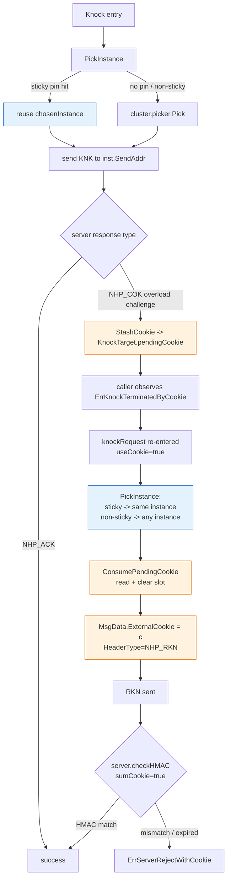
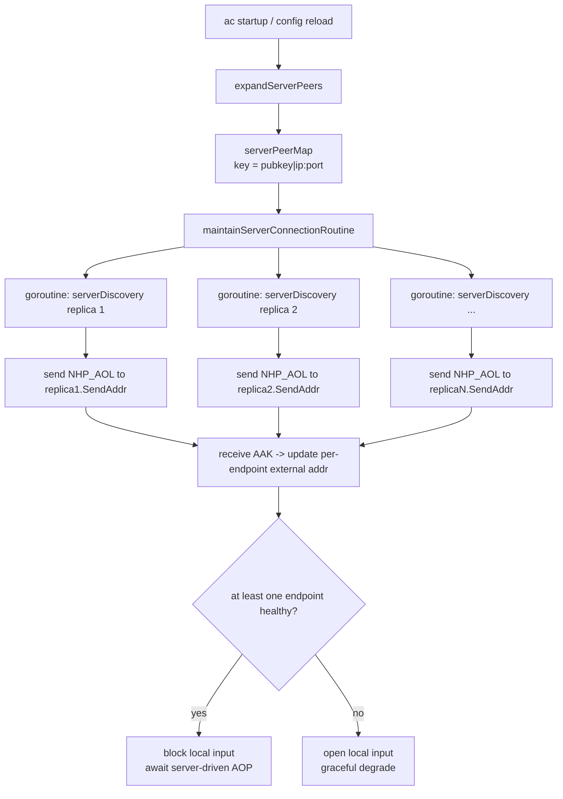
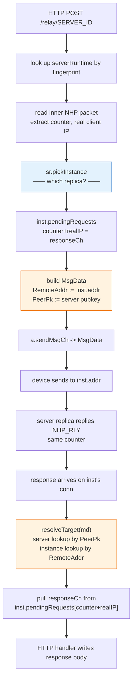

# Multi-Instance nhp-server Clusters: Agent / AC / Relay Implementation

> Branch: `feat/phase2-multi-instance-peers`
> Scope: how NHP-Agent / NHP-AC / NHP-Relay handle "one nhp-server logical identity (one pubkey) backed by N physical instances" — load balancing, sticky routing, and cross-replica interoperability.
> Supporting components: shared picker in [nhp/common/loadbalance](../nhp/common/loadbalance/loadbalance.go), stateless cookies in [nhp/core/responder.go](../nhp/core/responder.go).
> 中文版：[zh-cn/multi-server.zh-cn.md](zh-cn/multi-server.zh-cn.md)

---

## 0. Shared model

### 0.1 What a "cluster" is

Across all three endpoints, a cluster is:

| Concept | Definition |
| --- | --- |
| Logical identity | One nhp-server keypair (`PubKeyBase64`) |
| Physical instance | One `host:port` (each instance listens independently) |
| Cluster | 1 pubkey + N instances; every instance shares the pubkey, each has a distinct address |
| `representativePeer` | The single `UdpPeer` registered into `device.peerMap`; identity is keyed by pubkey, so only one entry per cluster |


### 0.2 Load-balance picker (shared)

[nhp/common/loadbalance/loadbalance.go](../nhp/common/loadbalance/loadbalance.go) provides a generic `Picker[T Weighted]` used by all three endpoints:

- `SchemeRandom` — uniform random
- `SchemeWeightedRandom` (default) — weighted random over `Weight()`; weight=0 is floored to 1
- `SchemeRoundRobin` — atomic counter, lock-free

### 0.3 Stateless cookies (prerequisite)

For any nhp-server replica in a cluster to verify a cookie a sibling minted, three things must hold: **the cookie signing key is shared cluster-wide**, **the cookie is derived from IP (not ip:port)**, and **the cookie is bound to the agent's static public key**:

```text
cookie = HMAC-SHA256(CookieSigningKey, remoteIP || agentStaticPubKey || windowIndex)
```

- Acceptance window: current + previous window (default 60s), so the boundary case still works.
- IP-only, not ip:port: when an agent rotates instances, each UDP conn gets its own ephemeral source port — the port a sibling sees on the RKN is not the port the original instance saw on the KNK. Keying by IP lets the sibling re-derive the same cookie.
- Bound to agent static pubkey: without this, two distinct agents sharing a NAT/CGN egress IP would derive identical cookies in the same window, letting one mint a cookie via its own KNK and have a sibling behind the same NAT replay it. Cross-replica re-derivation still works because the agent's static pubkey is global. The server recovers the pubkey from the IK static field before the cookie check, so the protocol on the wire is unchanged — agents are agnostic to this binding.
- Config: `CookieSigningKeyBase64`, `CookieTimeWindowSeconds` — see [responder.go:23-58](../nhp/core/responder.go#L23-L58), [udpserver.go:235-270](../endpoints/server/udpserver.go#L235-L270).


---

## 1. NHP-Agent

### 1.1 Key types

| Type | File | Purpose |
| --- | --- | --- |
| `ClusterConfig` | [clusterconfig.go](../nhp/common/clusterconfig/clusterconfig.go) | Shared TOML shape — one `[[Servers]]` block in `server.toml`. nhp-agent re-exports as `agent.ClusterConfig` |
| `InstanceConfig` | same | One `[[Servers.Instances]]` |
| `ServerCluster` | [cluster.go:48-90](../endpoints/agent/cluster.go#L48-L90) | Runtime cluster (picker, sticky flag, `representativePeer`) |
| `ServerInstance` | [cluster.go:11-46](../endpoints/agent/cluster.go#L11-L46) | One physical instance; implements `loadbalance.Weighted` |
| `KnockTarget` | [udpagent.go:76-117](../endpoints/agent/udpagent.go#L76-L117) | Resource→cluster binding + sticky state (`chosenInstance`) + cookie stash (`pendingCookie`) |

### 1.2 Resource → cluster binding

[`FindServerClusterFromResource`](../endpoints/agent/udpagent.go) — exactly one reference field must be set on the resource; the function rejects both-set and neither-set:

1. **`Cluster`** (preferred for `resource.toml`): operator-friendly cluster name. Looked up in the by-name index (`serverClusterByName`); stable across pubkey rotation because rotating a key only touches `server.toml`.
2. **`ServerPubKey`** (preferred for SDK callers): base64 pubkey of the target cluster. Used by programmatic callers (`endpoints/agent/main/export.go`, `endpoints/agent/iossdk/export.go`) that don't have a config-file context.

Unknown name → `nil` + error log. There is **no** host:port fallback — the previous `ServerHostname/ServerIp/ServerPort` fields were removed because they were silently ignored whenever `ServerPubKey` was set, which let `resource.toml` display addresses that the agent never dialed.

### 1.3 Instance selection (PickInstance)

[`KnockTarget.PickInstance`](../endpoints/agent/udpagent.go#L162-L188):

```text
PickInstance():
  if Sticky && chosenInstance != nil:
    pin := cluster.FindInstanceByAddr(chosenInstance.HostPort())   // survives reload that replaces instance objects
    if pin != nil:
       chosenInstance = pin                                          // adopt the fresh object
       return chosenInstance
    chosenInstance = nil                                              // pin invalidated, re-pick
  inst := cluster.Pick()                                              // through picker (random / weighted / rr)
  if Sticky: chosenInstance = inst
  return inst
```

### 1.4 Flow: KNK → COK → RKN



Highlights (with code references):

- **Cookie no longer flows through `ConnData.CookieStore`**: [knock.go:144-164](../endpoints/agent/knock.go#L144-L164) — on NHP_COK, `StashCookie` writes onto the `KnockTarget`, not the UDP conn's store. A non-sticky next send picks a different conn whose store would be empty.
- **RKN delivers the cookie via `MsgData.ExternalCookie`**: [knock.go:108-118](../endpoints/agent/knock.go#L108-L118) — `initiator.go:444` short-circuits the default conn-level lookup when this field is set.
- **Exit goes to the same instance**: [knock.go:198-219](../endpoints/agent/knock.go#L198-L219) — `ExitKnockRequest` also calls `PickInstance`, so under stickiness the same replica that approved the knock tears the session down.

### 1.5 Sticky vs non-sticky decision

| Mode | When to use | Shared signing key required? |
| --- | --- | --- |
| `Sticky=true` (default) | Cluster doesn't share `CookieSigningKey`, or you're not sure; KNK/RKN/Exit all land on the same replica | No |
| `Sticky=false` | All replicas share the same `CookieSigningKey` + window; you actually want load to spread | **Yes** — otherwise the RKN lands on a replica that can't re-derive the cookie and fails |

---

## 2. NHP-AC

### 2.1 Why AC is structurally different

For AC, "multi-instance" is an **operational topology**: one AC must serve every replica of one logical nhp-server cluster (each replica may independently emit AOP / KPL toward AC). AC must keep parallel connections to all replicas — there's nothing to "pick from". So AC **does not use the picker**, it **fans out across all endpoints**.


### 2.2 Config: shared `[[Servers.Instances]]` schema

nhp-ac loads the same TOML shape as nhp-agent — see [nhp/common/clusterconfig/clusterconfig.go](../nhp/common/clusterconfig/clusterconfig.go):

```toml
[[Servers]]
PubKeyBase64 = "..."
ExpireTime   = 1924991999

  [[Servers.Instances]]
  Ip   = "10.0.0.9"
  Port = 62206

  [[Servers.Instances]]
  Ip   = "10.0.0.14"
  Port = 62206

# Legacy single-instance form (auto-upgraded with deprecation warning):
# [[Servers]]
# Hostname = ""
# Ip = "10.0.0.9"
# Port = 62206
# PubKeyBase64 = "..."
```

[`normalizeAndExpand`](../endpoints/ac/config.go) runs `clusterconfig.Normalize` (which handles the legacy auto-upgrade) and then fans each cluster's Instances into one `core.UdpPeer` row per instance: same pubkey, distinct addresses. Results go into `serverPeerMap` keyed by [`endpointKey`](../endpoints/ac/config.go) = `pk=<key>|host=<host>|ip=<ip>:<port>`, so instances sharing a pubkey don't overwrite each other.

### 2.3 Flow: AOL fans out to every endpoint



### 2.4 AOP → ART rides the same connection

When some replica sends `NHP_AOP`:

1. The AOP arrives from **a specific replica's UDP source address**; AC routes it to that endpoint's connection.
2. [`HandleUdpACOperations`](../endpoints/ac/msghandler.go#L25-L87) processes it (opens ipset / ebpf rules), then writes `NHP_ART` back via `transaction.NextMsgCh` on **the same connection**.
3. AC does not "broadcast to all replicas" — AOP is a unicast request, the requester gets the reply.

> Cross-replica state sync ("agent X was just opened, please match") **is not AC's job**. Replicas coordinate that themselves (shared allowlist / state broadcast / shared IPSet, etc.). AC's contract is purely "whoever asks, gets answered."

### 2.5 Failure / churn

- Single endpoint fails its heartbeat: only that endpoint is marked down and removed from the active connection map; same-cluster siblings are unaffected.
- A pubkey disappears entirely on reload: [`updateServerPeers`](../endpoints/ac/config.go#L329-L337) calls `RemovePeer` only when the new map has no entry for that pubkey at all. Dropping one or two endpoints from a cluster does not trigger device-level removal.

---

## 3. NHP-Relay

### 3.1 Key types

| Type | File | Purpose |
| --- | --- | --- |
| `Server` | [config.go](../endpoints/relay/config.go) | TOML `[[Servers]]` block (one logical nhp-server identity) |
| `serverRuntime` | [relay.go](../endpoints/relay/relay.go) | Runtime; owns picker + instances |
| `serverInstance` | [relay.go](../endpoints/relay/relay.go) | One physical instance; each holds its own `pendingRequests` correlation map |

### 3.2 Instance selection happens exactly once

Relay bridges HTTP → UDP; the UDP response must come back through the instance that took the forward so the right HTTP handler is unblocked. Hence the **invariant** ([relay.go:640-647](../endpoints/relay/relay.go#L640-L647) comment):

> Handler picks instance once via `pickInstance()` and pins to `md.RemoteAddr`; send path reads the same pin via `resolveTarget()`; response arrives on that instance's connection and is dispatched to that instance's `pendingRequests` map. Picking twice would break response correlation.

### 3.3 Flow: HTTP forward → instance pick → response correlation



### 3.4 Resilience & config validation

- **Duplicate pubkey across servers**: [normalize](../endpoints/relay/config.go) rejects (fingerprint collision would make `resolveTarget` ambiguous).
- **Duplicate host:port across servers**: also rejected (the response wouldn't tell us which server it belongs to).
- **nil picker**: [pickInstance](../endpoints/relay/relay.go) defensively falls back to `instances[0]`; only reachable from tests that bypass `buildServer`.
- **nil md.RemoteAddr**: single-instance server returns the lone instance; multi-instance refuses (don't guess — surface the routing bug).

---

## 4. End-to-end comparison

### 4.1 "Which instance?" decision points

| Endpoint | Decision function | Sticky? | Where the choice is stored |
| --- | --- | --- | --- |
| Agent KNK | [`KnockTarget.PickInstance`](../endpoints/agent/udpagent.go#L162-L188) | `Sticky` on by default | `KnockTarget.chosenInstance` |
| Agent RKN | same | reuses KNK pin (sticky) | same |
| Agent Exit | same | reuses KNK pin | same |
| AC AOL | none (fan-out) | N/A | one goroutine per instance |
| AC AOP→ART | none (reply on arriving conn) | N/A | the UDP connection itself |
| Relay HTTP→UDP | [`serverRuntime.pickInstance`](../endpoints/relay/relay.go) | one pick per request | `md.RemoteAddr` (pin) |
| Relay UDP→HTTP | [`resolveTarget`](../endpoints/relay/relay.go) | reads pin, no re-pick | derived from pin above |

### 4.2 Cookie behavior

| Scenario | Cookie source | Carrier | Cross-instance verifiable? |
| --- | --- | --- | --- |
| Agent sticky cluster | any replica | `KnockTarget.pendingCookie` → `ExternalCookie` | not needed (doesn't cross) |
| Agent non-sticky cluster | any replica | same | required — replicas must share `CookieSigningKey` |
| AC | no cookies involved | — | — |
| Relay | no cookies (relay is not on the KNK signing path) | — | — |

### 4.3 Config quick-reference

| Endpoint | File | Key fields |
| --- | --- | --- |
| Agent | `server.toml` | `PubKeyBase64`, `LoadBalance`, `StickyInstance`, `[[Servers.Instances]]` |
| Agent | `resource.toml` | `Cluster` (cluster name from `server.toml`) — required unless a programmatic caller sets `ServerPubKey` |
| AC | `server.toml` | `PubKeyBase64`, `[[Servers.Instances]]` (same schema as agent) |
| Relay | `config.toml` | `[[Servers]]` + `LoadBalance` + `[[Servers.Instances]]` (same schema as agent) |
| Server (prerequisite) | `config.toml` | `CookieSigningKeyBase64`, `CookieTimeWindowSeconds` |

### 4.4 Operator checklist

Before deploying a cluster, confirm:

1. All nhp-server replicas share **the same pubkey/privkey** — the cluster identity is one keypair.
2. All replicas share **exactly the same** `CookieSigningKeyBase64` — otherwise cross-replica handshake fails (the default random-per-process key will break clusters).
3. AC's `[[Servers]]` lists every replica under `[[Servers.Instances]]`.
4. Relay's `[[Servers.Instances]]` lists every replica; matching the agent's load-balance scheme makes diagnosis simpler.
5. Agent's `StickyInstance` matches what the server side actually supports (shared cookie keys → safe to set false; not shared → must stay true).
6. Resources bind to clusters by name (`Cluster = "<server.toml Name>"`); pubkey rotation only touches `server.toml`, never `resource.toml`.
