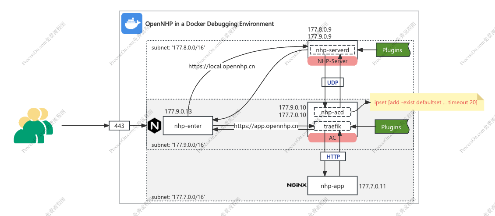

# Quick Start
{: .fs-9 }

A locally built Docker debugging environment that simulates the setup of nhp-server, nhp-ac, traefik, app, etc. This environment can be used for:
- plugins debugging
- basic logic verification
- local performance stress testing

{: .fs-6 .fw-300 }

[中文版](/zh-cn/){: .label .fs-4 }

---

## Workflow



## Build Base Image

```shell
cd ./docker
docker build --no-cache -t opennhp-base:latest -f Dockerfile.base ../..
```

### Configure Local HTTPS

- Generate local HTTPS certificates
Enter to ./docker/certs and execute the following command:
```
openssl req -x509 -newkey rsa:4096 -sha256 -days 365 -nodes \
  -keyout server.key -out server.crt -subj "/CN=opennhp.cn" \
  -addext "subjectAltName=DNS:opennhp.cn,IP:127.0.0.1"
```

- Add /etc/hosts configuration

```
127.0.0.1       local.opennhp.cn
127.0.0.1       app.opennhp.cn
```


## Start
***Note: Enter the docker directory (cd ./docker) first***
```shell
docker compose up -d
```

## Testing
https://local.opennhp.cn/plugins/example?resid=demo&action=login

- The page should display normally
- After clicking login, it should redirect automatically

### Verify ipset Rules
```shell
docker exec -it nhp-ac ipset list
```
If the following results appear, it indicates successful writing, meaning the knock was successful:

***Name: defaultset Rules***

```shell
Name: defaultset
Type: hash:ip,port,ip
Revision: 5
Header: family inet hashsize 1024 maxelem 1000000 timeout 120 counters
Size in memory: 656
References: 7
Number of entries: 2
Members:
177.9.0.13,udp:80,177.9.0.10 timeout 14 packets 0 bytes 0
177.9.0.13,tcp:80,177.9.0.10 timeout 14 packets 138 bytes 28068
192.168.65.1,tcp:80,177.9.0.10 timeout 14 packets 0 bytes 0
192.168.65.1,udp:80,177.9.0.10 timeout 14 packets 0 bytes 0

Name: defaultset_down
Type: hash:ip,port,ip
Revision: 5
Header: family inet hashsize 1024 maxelem 1000000 timeout 121 counters
Size in memory: 208
References: 2
Number of entries: 0
Members:

Name: tempset
Type: hash:net,port
Revision: 7
Header: family inet hashsize 1024 maxelem 1000000 timeout 5 counters
Size in memory: 456
References: 2
Number of entries: 0
Members:
```

## Stress Testing

```shell
ab -k -n 10000 -c 100 'https://local.opennhp.cn/plugins/example?resid=demo&action=valid&passcode=123456'
```