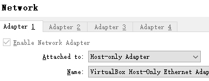
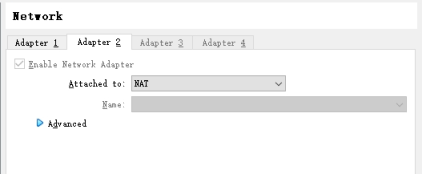
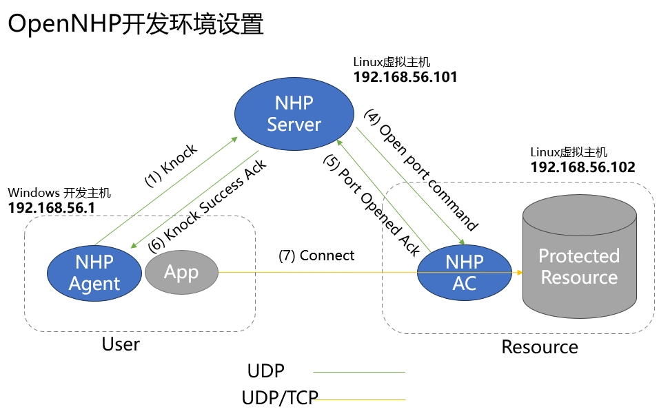

# 部署OpenNHP

## 1. OpenNHP组件说明

根据上一章中的构建步骤，构建结果将输出到 *release* 目录下，该目录下的三个子目录分别包含OpenNHP的三大核心组件：*nhp-agent*、*nhp-server*和*nhp-ac*。

- **nhp-agent代理：** 发起敲门请求的模块，敲门请求中带有数据访问者的身份和设备信息，通常安装在用户终端的设备上。
- **nhp-server服务器:** 处理并验证敲门请求的模块，通常是服务器程序。其功能包括验证敲门请求并与外部授权服务提供商进行交互实现鉴权操作，以及控制NHP门禁进行开门动作。
- **nhp-ac门禁：** 访问控制的执行模块，通常是服务器程序。该模块执行默认“拒绝一切”（deny all）的安全策略并确保被保护资源的网络隐身状态，通常位于被保护资源所在的同一主机上。负责向已授权的NHP代理开放访问权限或向已失去授权的NHP代理关闭访问权限，并根据NHP服务器返回参数执行针对NHP代理的放行动作。

## 2. OpenNHP开发测试环境搭建

### 2.1 开发测试环境：Windows/MacOS开发主机 + Linux虚拟机

假设开发主机为Windows或者macOS，可通过安装虚拟机环境（如VirualBox）并创建两台Linux虚拟机来搭建简单的OpenNHP测试环境。在创建虚拟机时，请将网卡选项设置为`"Host-only Adapter"`（如下图），可使虚拟机的IP与开发主机IP在同一个网段。

 

 **提示：** 如需该虚拟机同时具备访问互联网能力，可以另外增加一个`"NAT"`网卡：
 

至此，NHP三大组件的环境搭建如下：

- 【nhp-server】 运行在Linux虚拟主机上，IP地址为*192.168.56.101*
- 【nhp-ac】 运行在Linux虚拟主机上，IP地址为*192.168.56.102*
- 【nhp-agent】 运行在Windows/macOS开发主机上，IP地址为*192.168.56.1*

### 2.2 开发测试环境的网络拓扑与基础信息

 

| 服务器名称 | IP地址 | 基础配置信息  |
|:--:|:--:|:--:|
| NHP-Server | 192.168.56.101  | **公钥:** WqJxe+Z4+wLen3VRgZx6YnbjvJFmptz99zkONCt/7gc=<br/>**私钥:** eHdyRHKJy/YZJsResCt5XTAZgtcwvLpSXAiZ8DBc0V4= <br/> **Hostname:** localhost <br/> **ListenPort:** 62206 <br/> **aspId:** example |
| NHP-AC | 192.168.56.102  | **公钥:** Fr5jzZDVpNh5m9AcBDMtHGmbCAczHyPegT8IxQ3XAzE=<br/>**私钥:** +B0RLGbe+nknJBZ0Fjt7kCBWfSTUttbUqkGteLfIp30=<br/>**ACId:** testAC-1 <br/> 被保护资源的 **resId:** test |
| NHP-Agent | 192.168.56.1  | **公钥:** WnJAolo88/q0x2VdLQYdmZNtKjwG2ocBd1Ozj41AKlo=<br/>**私钥:** +Jnee2lP6Kn47qzSaqwSmWxORsBkkCV6YHsRqXCegVo= <br/> **UserId:** agent-0 |

**【注意】** 每个组件都有对应的配置文件，需要配置正确才能成功启动。关于配置文件的格式，请见下文中各个组件的“配置文件”相关信息。

**【提示】** 从0.3.3版本起，各组件配置文件中的大多数字段都支持动态更新，详见各配置文件注释说明。

### 2.3 NHP-Server的配置与运行

#### 2.3.1 NHP-Server系统要求

- Linux服务器或者Windows

#### 2.3.2 NHP-Server运行

将*release*目录下*nhp-server*目录复制到目标机器上。配置好*etc*目录下 `toml`文件(详细参数见下一节)，运行`nhp-serverd run`。

- Linux环境：

   ```bash
   nohup ./nhp-serverd run 2>&1 &
   ```

- Windows环境：

   ```bat
   nhp-serverd.exe run
   ```

*【可选项】* 禁止UDP端口暴露：运行`iptables_default.sh`

#### 2.3.3 NHP-Server服务器的配置文件

- 基础配置：[config.toml](https://github.com/OpenNHP/opennhp/tree/main/server/main/etc/config.toml)  
- 门禁peer列表配置：[ac.toml](https://github.com/OpenNHP/opennhp/tree/main/server/main/etc/ac.toml)  
- 客户端peer列表配置：[agent.toml](https://github.com/OpenNHP/opennhp/tree/main/server/main/etc/agent.toml)  
- http服务配置：[http.toml](https://github.com/OpenNHP/opennhp/tree/main/server/main/etc/http.toml)  
- 服务器插件读取配置：[resource.toml](https://github.com/OpenNHP/opennhp/tree/main/server/main/etc/resource.toml)  
- 源地址关联列表：[srcip.toml](https://github.com/OpenNHP/opennhp/tree/main/server/main/etc/srcip.toml)  
- 服务器插件资源配置：[resource.toml](https://github.com/OpenNHP/opennhp/tree/main/server/main/etc/resource.toml)  

### 2.4 NHP-AC的配置与运行

#### 2.4.1 NHP-AC系统要求

- Linux服务器，内核需支持**ipset**。可通过以下命令查看ipset支持情况

   ```bash
   lsmod | grep ip_set 
   ```

#### 2.4.2 NHP-AC运行

将*release*目录下*nhp-ac*目录复制到目标机器上。配置好*etc*目录下 `toml`文件(详细参数见下一章)，运行`iptables_default.sh`，添加防火墙规则，此时外部连接将无法建立。再运行`nhp-acd run`。

**【注意】** `nhp-acd` 以及 `iptables_default.sh` 需要在**root**权限下运行。

- Linux环境：

   ```bash
   su
   ./iptables_default.sh
   nohup ./nhp-acd run 2>&1 &
   ```

如果想恢复`iptables_default.sh`对iptables的改动，可以运行以下命令来清除：

   ```bash
   iptables -F
   ```

#### 2.4.3 NHP-AC门禁配置文件

- 基础配置：[config.toml](https://github.com/OpenNHP/opennhp/tree/main/ac/main/etc/config.toml)  
- 服务器peer列表：[server.toml](https://github.com/OpenNHP/opennhp/tree/main/ac/main/etc/server.toml)  

### 2.5 NHP-Agent的配置与运行

#### 2.5.1 NHP-Agent系统要求

- 所有平台：Windows、Linux、macOS、Android、iOS

#### 2.5.2 NHP-Agent运行

将*release*目录下*nhp-agent*目录复制到目标机器上。配置好*etc*目录下 `toml`文件(详细参数见下一章)，运行`nhp-agentd run`。

- Linux环境：

   ```bash
   nohup ./nhp-agentd run 2>&1 &
   ```

- Windows环境：

   ```bat
   nhp-agentd.exe run
   ```

#### 2.5.3 NHP-Agent的配置文件

- 基础配置：[config.toml](https://github.com/OpenNHP/opennhp/tree/main/agent/main/etc/config.toml)  
- 敲门目标配置：[resource.toml](https://github.com/OpenNHP/opennhp/tree/main/agent/main/etc/resource.toml)  
- 服务器peer列表：[server.toml](https://github.com/OpenNHP/opennhp/tree/main/agent/main/etc/server.toml)  

### 2.6 测试NHP网络隐身效果

验证NHP网络隐身效果，可以通过nhp-agent主机 *（IP：192.168.56.1）*进行`ping` nhp-ac主机 *（IP：192.168.56.102）*来测试。

| 测试用例 | 测试命令 | 测试目的  | 预期结果  |
|:--:|:--:|:--:|:--:|
| nhp-agent未运行 |`ping 192.168.56.102` | 测试AC对Agent隐身 | ping 失败  |
| nhp-agent已运行 |`ping 192.168.56.102` | 测试AC对Agent开放 | ping 成功  |

## 3. 日志说明

### 3.1 日志文件位置

日志文件生成于每个组件各自的*logs*目录下，以日期作为文件名，可通过`tail`命令查看。

- 查看nhp-server的日志

   ```bash
   tail -f release/nhp-server/logs/server-2024-03-10.log
   ```

- 查看nhp-ac的日志

   ```bash
   tail -f release/nhp-ac/logs/ac-2024-03-10.log
   ```

- 查看nhp-agent的日志

   ```bash
   tail -f release/nhp-agent/logs/agent-2024-03-10.log
   ```

### 3.2 日志文件格式

日志的格式如下：

   ```text
   时间戳 代码位置 NHP组件名 [日志权重] 日志消息
   ```

日志权重分成以下几个级别：

- Error
- Critical
- Warning
- Info
- Debug

## 4. 附录A：常见问题FAQ

- **Q：** Windows平台上编译错误：`running gcc failed: exec: "gcc": executable file not found in %PATH%` 
  **A：** 原因是没有安装`gcc`编译工具。请按照上文中3.1.3中步骤安装GCC。

- 日志中显示错误：`NHP-AC [Critical] received stale packet from 192.168.56.101:62206, drop packet` 。 
   【原因】接收方对包的接收时间有要求，数据包发送时间不能早于接收方10分钟以上。
   【修复】两台机器的时间同步

- 怎么调整一次认证后开通的时间？  怎么限制只开放指定的端口？
   【方法】在nhp-server/plugins/下对应的插件模块中，找到etc/resource.toml文件，里面能配置资源的端口、时长、id等信息；如果用的是nhp-agent敲门，则默认是example插件。如果是微信扫码敲门，用的是wxweb插件。

- 如何检查配置是否生效？
   【方法】server和ac的日志里有记录。也可以在ac的系统里输入ipset -L命令查看授权的源ip目的端口和时长。

