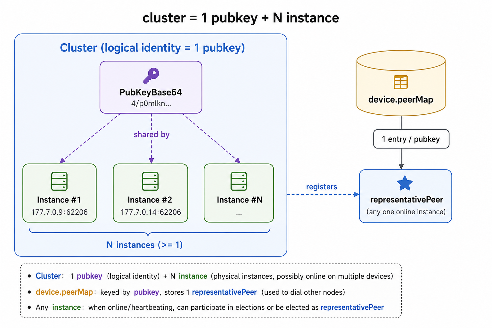
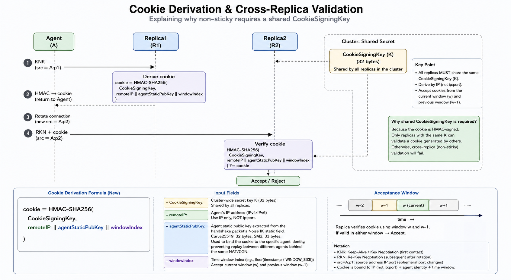
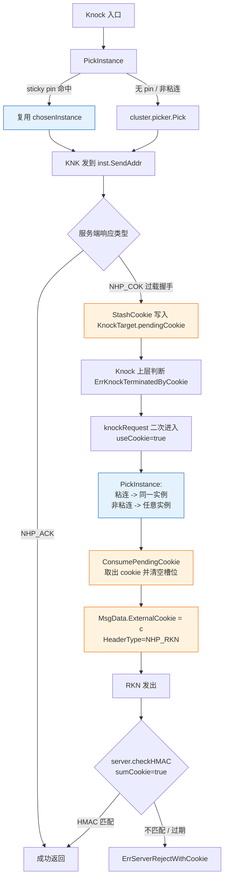
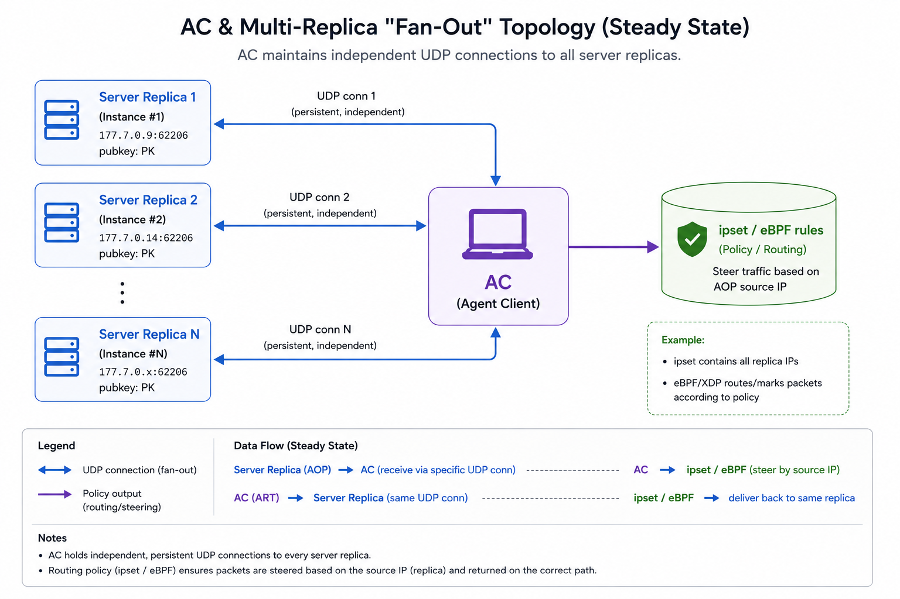
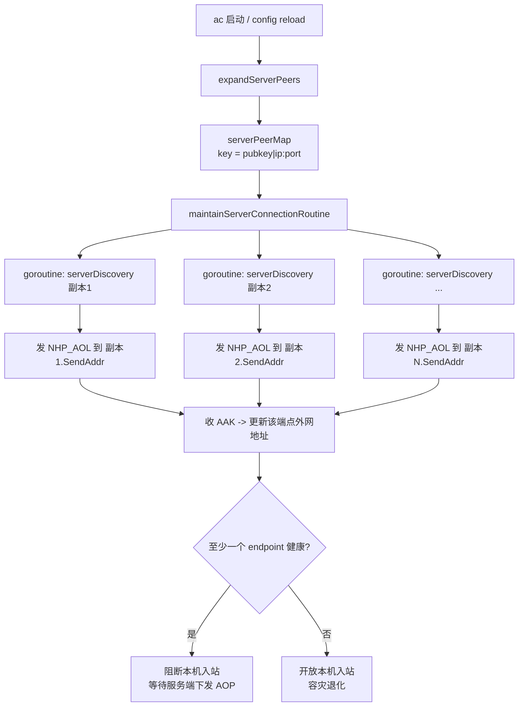
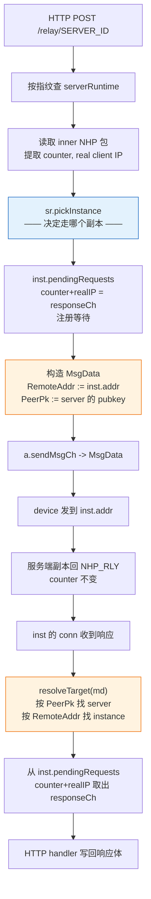

# 多 nhp-server 实例集群：Agent / AC / Relay 实现说明

> 适用分支：`feat/phase2-multi-instance-peers`
> 范围：在 NHP-Agent / NHP-AC / NHP-Relay 中支持「一个 nhp-server 逻辑身份（同一 pubkey）下挂多个物理实例」的负载均衡与故障互通能力。
> 共享支撑：[nhp/common/loadbalance](../../nhp/common/loadbalance/loadbalance.go) 选择器、[nhp/core/responder.go](../../nhp/core/responder.go) 无状态 cookie。
> English version: [../multi-server.en.md](../multi-server.en.md)

---

## 0. 共用模型

### 0.1 集群的形状

无论在哪个端点，"集群"都指：

| 概念 | 定义 |
| --- | --- |
| 逻辑身份 | 一对 nhp-server 公私钥（`PubKeyBase64`）|
| 物理实例 | 一个 `host:port`（每个实例独立监听）|
| 集群 | 1 个 pubkey + N 个 instance；N 个 instance 共享 pubkey、各自地址不同 |
| `representativePeer` | 注册到 device.peerMap 时使用的"代表"`UdpPeer`；身份按 pubkey 索引，因此只能注册一个 |



### 0.2 负载均衡 picker（共享）

[nhp/common/loadbalance/loadbalance.go](../../nhp/common/loadbalance/loadbalance.go) 提供泛型 `Picker[T Weighted]`，三个端点共用：

- `SchemeRandom` — 等概率随机
- `SchemeWeightedRandom`（默认） — 按 `Weight()` 加权随机；weight=0 抬升为 1
- `SchemeRoundRobin` — 原子计数器轮询，无锁

### 0.3 无状态 cookie（前置依赖）

集群内任意 nhp-server 副本要能验证同伴下发的 cookie，前提是三个条件同时成立：**共享 cookie 签名密钥** + **按 IP（去掉 port）派生** + **绑定 agent 静态公钥**：

```text
cookie = HMAC-SHA256(CookieSigningKey, remoteIP || agentStaticPubKey || windowIndex)
```

- 验证窗口：当前 + 上一窗口（默认 60s），跨窗口边界仍可用。
- 只用 IP 不用 port：Agent 跨实例切换时每个 UDP conn 各自一个临时源端口，port 在 KNK 与 RKN 之间会变；用 IP 派生才能让另一副本算出同一 cookie。
- 绑定 agent 静态公钥：若不绑定，共享同一 NAT/CGN 出口 IP 的两个 agent 在同一窗口内会派生相同 cookie——其中一个通过自己的合法 KNK 拿到 cookie 后，同 NAT 后的另一个 agent 即可在无关 RKN 中重放。跨副本派生仍然成立，因为 agent 静态公钥全局唯一。Server 在 cookie 校验前会从 IK static 字段解出 agent 公钥，**线协议保持不变**，agent 完全感知不到这层绑定。
- 配置：`CookieSigningKeyBase64`、`CookieTimeWindowSeconds`，详见 [responder.go:23-58](../../nhp/core/responder.go#L23-L58)、[udpserver.go:235-270](../../endpoints/server/udpserver.go#L235-L270)。



---

## 1. NHP-Agent

### 1.1 关键类型

| 类型 | 文件 | 说明 |
| --- | --- | --- |
| `ClusterConfig` | [clusterconfig.go](../../nhp/common/clusterconfig/clusterconfig.go) | 共享 TOML 结构——一个 `[[Servers]]` 块。nhp-agent 通过 type alias 重新导出为 `agent.ClusterConfig` |
| `InstanceConfig` | 同上 | 一条 `[[Servers.Instances]]` |
| `ServerCluster` | [cluster.go:48-90](../../endpoints/agent/cluster.go#L48-L90) | 运行时集群对象（含 picker、sticky 标志、`representativePeer`） |
| `ServerInstance` | [cluster.go:11-46](../../endpoints/agent/cluster.go#L11-L46) | 一个物理实例；实现 `loadbalance.Weighted` |
| `KnockTarget` | [udpagent.go:76-117](../../endpoints/agent/udpagent.go#L76-L117) | 资源 → 集群绑定 + 粘连状态（`chosenInstance`）+ cookie 暂存（`pendingCookie`） |

### 1.2 资源 → 集群绑定

[`FindServerClusterFromResource`](../../endpoints/agent/udpagent.go)——`resource.toml` 必须二选一设置引用字段（同时设置或都不设置都会被拒）：

1. **`Cluster`**（`resource.toml` 推荐）：人友好的集群名，从 `serverClusterByName` 索引查。公钥 rotate 时只需要改 `server.toml`，`resource.toml` 不动。
2. **`ServerPubKey`**（SDK 推荐）：集群的 base64 公钥，给程序化构造 `KnockResource` 的调用方用（如 `endpoints/agent/main/export.go`、`endpoints/agent/iossdk/export.go`）。

查不到 → 返回 nil 并打错误日志。**不再有** host:port 兜底——原先的 `ServerHostname/ServerIp/ServerPort` 字段已删掉，因为它们在 `ServerPubKey` 设置时被代码无声忽略，会让 `resource.toml` 显示出 agent 实际从不访问的地址。

### 1.3 实例选择（PickInstance）

[`KnockTarget.PickInstance`](../../endpoints/agent/udpagent.go#L162-L188)：

```text
PickInstance():
  if Sticky && chosenInstance != nil:
    pin := cluster.FindInstanceByAddr(chosenInstance.HostPort())   // 处理 reload 后实例对象被替换的情况
    if pin != nil:
       chosenInstance = pin                                          // 收养新对象
       return chosenInstance
    chosenInstance = nil                                              // pin 已失效，重选
  inst := cluster.Pick()                                              // 走 picker（random / weighted / rr）
  if Sticky: chosenInstance = inst
  return inst
```

### 1.4 流程图：KNK → COK → RKN



关键点（代码引用）：

- **cookie 不再走 ConnData.CookieStore**：[knock.go:144-164](../../endpoints/agent/knock.go#L144-L164) 收到 NHP_COK 后 `StashCookie` 写到 `KnockTarget`，而不是写到 UDP conn 的 CookieStore——非粘连模式下下一发 RKN 会换另一条 conn，CookieStore 是空的。
- **RKN 通过 `MsgData.ExternalCookie` 携带**：[knock.go:108-118](../../endpoints/agent/knock.go#L108-L118) 把 cookie 放进 `ExternalCookie` 字段，`initiator.go:444` 在算 HMAC 时优先用这个字段（覆盖默认的 conn-level CookieStore 取值）。
- **退出走同一实例**：[knock.go:198-219](../../endpoints/agent/knock.go#L198-L219) `ExitKnockRequest` 同样调用 `PickInstance`，粘连情况下复用 KNK 选中的实例，保证服务端会话能被同一副本正确清理。

### 1.5 粘连 vs 非粘连决策

| 模式 | 何时使用 | 跨实例 cookie 是否需要共享密钥 |
| --- | --- | --- |
| `Sticky=true`（默认） | 集群内未配置统一 `CookieSigningKey`，或不确定时；KNK/RKN/Exit 全在同一副本 | 不需要 |
| `Sticky=false` | 所有副本已统一 `CookieSigningKey` 与窗口；想真正分摊流量 | **必须**——否则 RKN 会落到没有相同 cookie 状态的副本上失败 |

---

## 2. NHP-AC

### 2.1 与 Agent / Relay 的根本差别

AC 端的"多实例"是 **运维拓扑**：同一台 AC 要同时为同一逻辑 nhp-server 集群下的多个副本服务（每个副本都会单独发 AOP / KPL 给 AC），AC 必须并行维护到所有副本的连接，而不是从中"选一个"。所以 AC **不需要 picker**，而是 **fan-out 到所有 endpoint**。



### 2.2 配置：共享的 `[[Servers.Instances]]` 结构

nhp-ac 与 nhp-agent 共用同一份 TOML schema——见 [nhp/common/clusterconfig/clusterconfig.go](../../nhp/common/clusterconfig/clusterconfig.go)：

```toml
[[Servers]]
PubKeyBase64 = "..."
ExpireTime   = 1924991999

  [[Servers.Instances]]
  Ip   = "10.0.0.9"
  Port = 62206

  [[Servers.Instances]]
  Ip   = "10.0.0.14"
  Port = 62206

# 遗留单实例形式（加载时自动升级，附带一条 deprecation 警告）：
# [[Servers]]
# Hostname = ""
# Ip = "10.0.0.9"
# Port = 62206
# PubKeyBase64 = "..."
```

[`normalizeAndExpand`](../../endpoints/ac/config.go) 先调用 `clusterconfig.Normalize`（包含遗留形态自动升级），再把每个集群的 Instances 展开成 N 个 `core.UdpPeer`：pubkey 都一样，地址各异。结果放进 `serverPeerMap`，key 是 [`endpointKey`](../../endpoints/ac/config.go) = `pk=<key>|host=<host>|ip=<ip>:<port>`，保证同 pubkey 不同地址互不覆盖。

### 2.3 流程图：AOL 同时发往所有 endpoint



### 2.4 AOP → ART 走同一连接

服务端某个副本下发 `NHP_AOP`：

1. 该 AOP 是从 **某个具体副本** 的 UDP 源地址来的；AC 把它解到对应的 endpoint 连接上。
2. [`HandleUdpACOperations`](../../endpoints/ac/msghandler.go#L25-L87) 处理完（开 ipset / ebpf 规则），把 `NHP_ART` 通过 **同一连接** `transaction.NextMsgCh` 回写。
3. AC 不做"发给所有副本"的扩散——AOP 是单播请求，谁请求谁回。

> 副本之间的状态同步（"agent X 已被开放，请你也放行"）**不由 AC 负责**，由服务端集群侧自己解决（共享白名单 / 状态广播 / 共享 IPSet 等）。AC 的语义就是"谁问谁应"。

### 2.5 失败/上线

- 单个 endpoint 心跳失败：仅该 endpoint 标失败，移出活动连接表，不影响同集群其他 endpoint。
- 整个 pubkey 在 reload 后从配置消失：[`updateServerPeers`](../../endpoints/ac/config.go#L329-L337) 在新表里搜不到该 pubkey 时才 `RemovePeer`；只删一两个 endpoint 不触发 device 级别移除。

---

## 3. NHP-Relay

### 3.1 关键类型

| 类型 | 文件 | 说明 |
| --- | --- | --- |
| `Server` | [config.go](../../endpoints/relay/config.go) | TOML `[[Servers]]` 块（一个逻辑 nhp-server 身份） |
| `serverRuntime` | [relay.go](../../endpoints/relay/relay.go) | 运行时；持 picker、instances |
| `serverInstance` | [relay.go](../../endpoints/relay/relay.go) | 单实例；每实例独立 `pendingRequests` 关联表 |

### 3.2 实例选择只发生一次

`relay` 是 HTTP → UDP 桥接，响应要回到正确的实例才能匹配到等待中的 HTTP handler。因此有一条 **不变量**（[relay.go:640-647](../../endpoints/relay/relay.go#L640-L647) 注释）：

> Handler picks instance once via `pickInstance()` and pins to `md.RemoteAddr`; send path reads the same pin via `resolveTarget()`; response arrives on that instance's connection and is dispatched to that instance's `pendingRequests` map. Picking twice would break response correlation.

### 3.3 流程图：HTTP 转发 → 实例选择 → 响应关联



### 3.4 容错与配置校验

- **重复 pubkey** 跨条目：[normalize](../../endpoints/relay/config.go) 拒绝（指纹冲突会导致 `resolveTarget` 无法唯一定位）。
- **重复 host:port** 跨条目：同样拒绝（响应回包没法判定属于哪个 server）。
- **picker 为 nil**：[pickInstance](../../endpoints/relay/relay.go) 防御性返回 `instances[0]`，仅在测试绕过 `buildServer` 时触发。
- **md.RemoteAddr 为空**：单实例时返回该唯一实例；多实例时拒绝（不猜，明确报路由错误）。

---

## 4. 端到端对照表

### 4.1 "哪个实例?" 决策位点

| 端点 | 决策函数 | 是否粘连 | 状态固定在哪里 |
| --- | --- | --- | --- |
| Agent KNK | [`KnockTarget.PickInstance`](../../endpoints/agent/udpagent.go#L162-L188) | `Sticky` 默认开 | `KnockTarget.chosenInstance` |
| Agent RKN | 同上 | 复用 KNK 的 pin（粘连模式） | 同上 |
| Agent Exit | 同上 | 复用 KNK 的 pin | 同上 |
| AC AOL | 无（fan-out） | N/A | 一实例一 goroutine |
| AC AOP→ART | 无（按来源连接回写） | N/A | UDP 连接本身 |
| Relay HTTP→UDP | [`serverRuntime.pickInstance`](../../endpoints/relay/relay.go) | 每请求选一次 | `md.RemoteAddr`（pin） |
| Relay UDP→HTTP | [`resolveTarget`](../../endpoints/relay/relay.go) | 不重选，读 pin | 来自上面 pin |

### 4.2 Cookie 行为对照

| 场景 | Cookie 来源 | 携带方式 | 跨实例可验？ |
| --- | --- | --- | --- |
| Agent 粘连集群 | 任一实例下发 | `KnockTarget.pendingCookie` → `ExternalCookie` | 不需要（不跨）|
| Agent 非粘连集群 | 任一实例下发 | 同上 | 需要 —— 副本必须共享 `CookieSigningKey` |
| AC | 不涉及 cookie | — | — |
| Relay | 不涉及 cookie（Relay 不在 KNK 路径上签名） | — | — |

### 4.3 配置文件速查

| 端点 | 文件 | 关键字段 |
| --- | --- | --- |
| Agent | `server.toml` | `PubKeyBase64`, `LoadBalance`, `StickyInstance`, `[[Servers.Instances]]` |
| Agent | `resource.toml` | `Cluster`（引用 `server.toml` 的 Name）—— 必填；SDK 调用方可改用 `ServerPubKey` |
| AC | `server.toml` | `PubKeyBase64`, `[[Servers.Instances]]`（与 agent 同 schema） |
| Relay | `config.toml` | `[[Servers]]` + `LoadBalance` + `[[Servers.Instances]]`（与 agent 同 schema） |
| Server（前置依赖） | `config.toml` | `CookieSigningKeyBase64`, `CookieTimeWindowSeconds` |

### 4.4 运维 checklist

部署集群前确认：

1. 所有 nhp-server 副本 **同一 pubkey/私钥** —— 集群身份必须一致。
2. 所有副本 `CookieSigningKeyBase64` **完全相同** —— 否则跨副本握手失败（默认随机生成会出问题）。
3. AC 的 `[[Servers]]` 已用 `[[Servers.Instances]]` 列出所有副本。
4. Relay 的 `[[Servers.Instances]]` 已列出所有副本；负载均衡策略与 Agent 一致更便于排查。
5. Agent 端 `StickyInstance` 与服务端的 cookie 共享情况匹配（共享 → 可设 false；不共享 → 必须 true）。
6. Resources 通过名字绑定集群（`Cluster = "<server.toml Name>"`）；公钥 rotate 时只动 `server.toml`，`resource.toml` 不需要修改。
