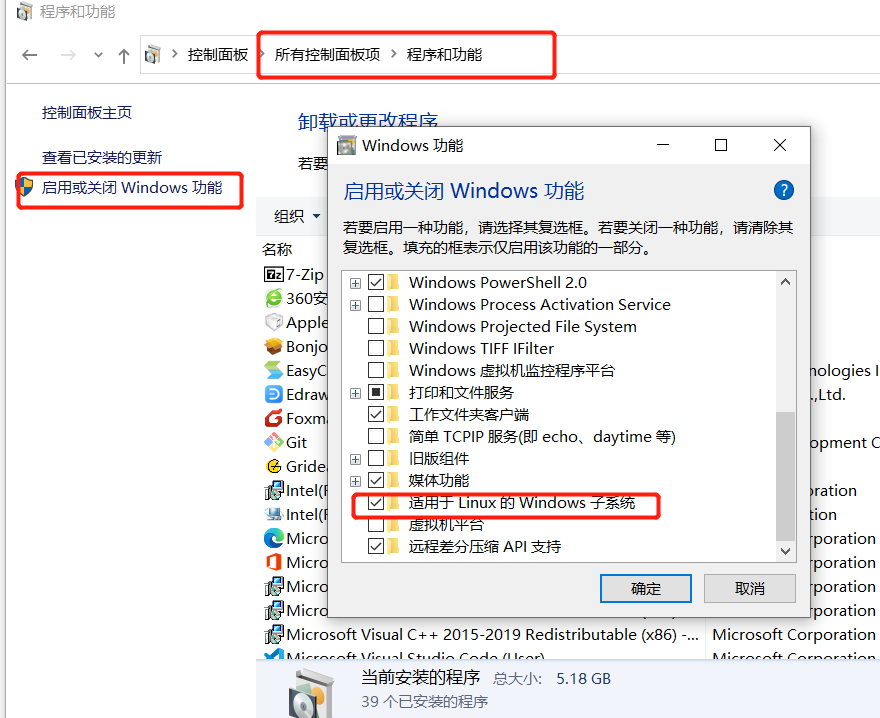
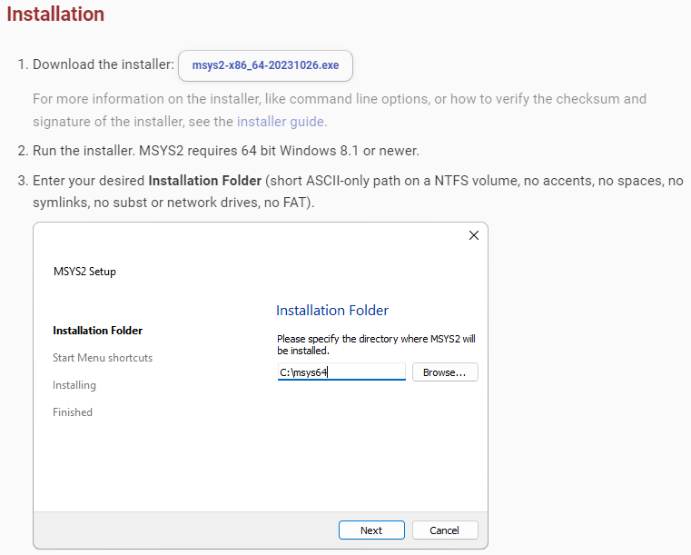

# OpenNHP 零信任网络隐身协议

[toc]

## 第一章：导读

**NHP**是由中国计算机学会CCF发布的零信任网络隐身协议，对比零信任SDP（软件定义边界）中的**单包授权协议SPA**，具有更好的隐身性、更强的性能和可靠性、更灵活的扩展性、以及良好的信创兼容性。

**OpenNHP**是基于NHP标准的开发的开源软件项目。在上手OpenNHP项目前，建议阅读以下文章：

- [《零信任NHP：让安全“降本增效”》](https://github.com/OpenNHP/opennhpdocs/overview)
- [《零信任网络隐身协议NHP标准规范》PDF文档](https://github.com/OpenNHP/opennhpdocs/blob/main/NHPSpec-V0.9.4.pdf)

关于OpenNHP的代码结构与技术详解，请阅读：

- [《OpenNHP设计文档》](./docs/whitepaper.md)

## 第二章：OpenNHP的兼容性

OpenNHP具备良好的兼容性，尤其是对信创生态的支持，以下是OpenNHP兼容的密码算法和软硬件。

### 2.1 密码算法

| 国产密码算法 |  *SM2、SM3、SM4*  |  
|---|---|
| **国际密码算法**   |  ***Curve25519、AES、SHA256***  |

### 2.2 操作系统

| 操作系统 |  兼容性  |
|---|:---:|
| Windows   |  ✅ |
| 苹果MacOS   |  ✅ |
| 统信UOS   |  ✅ |
| 麒麟KylinOS   |  ✅ |
| 中电科普华OS   |  ✅ |  
| 苹果iOS   |  ✅ |
| 安卓Android   |  ✅ |

### 2.3 CPU指令集

| CPU类型 |  兼容性  |
|---|:---:|
| x86   |  ✅ |
| ARM华为鲲鹏   |  ✅ |
|  LoongArch龙芯   |  ✅ |
|  SW申威   |  ✅ |

## 第三章：编译OpenNHP

**提示：** Windows 10/11下可以通过`WSL`子系统来运行Linux，详细请见WSL官方文档：<https://learn.microsoft.com/zh-cn/windows/wsl/install>

- **【开启WSL功能】** 在Win10上，需要首先开启WSL才能使用WSL安装Linux，设置界面请见下图。
   
- **【WSL上安装Linux】** 推荐在WSL上安装Ubuntu Linux，通过PowerShell运行以下命令安装：

   ```bat
   wsl --update
   wsl --install -d Ubuntu
   ```

   如果遇到以下问题，参考：<https://blog.csdn.net/weixin_44293949/article/details/121863559>

   ```text
   无法从 'https://raw.githubusercontent.com/microsoft/WSL/master/distributions/DistributionInfo.json’提取列表分发。无法解析服务器的名称或地址
   Error code: Wsl/WININET_E_NAME_NOT_RESOLVED
   ```

- **【WSL环境的IP地址】** 在WSL的Linux环境中，运行以下命令获取IP地址：
   | 主机 | 查看IP地址的命令  |
   |:--:|:--:|
   | WSL中Linux主机 | `hostname -I \| awk '{print $1}'` |  
   | WSL宿主Windows主机 | `ip route show \| grep -i default \| awk '{ print $3}'` |  

### 3.1 系统需求

- 3.1.1 `Go语言`环境：**Go 1.18** 或以上。安装包下载地址: <https://go.dev/dl/>
  - **Windows与macOS**环境下，通过下载的安装程序来安装Go。
  - **Linux**环境下可以直接通过管理工具安装： ：`sudo apt install golang ` 
  - 安装成功后，运行命令`go version` 来查看Go版本号。
  - **Windows与macOS**环境下，通过下载的安装程序来安装Go。
  - **Linux**环境下可以直接通过管理工具安装：`sudo apt install golang` 或者通过以下命令手动安装：

   ```bash
      1. sudo apt-get update
      2. wget https://go.dev/dl/go1.21.0.linux-amd64.tar.gz
      3. sudo tar -xvf go1.21.0.linux-amd64.tar.gz
      4. sudo mv go /usr/local
      5. export GOROOT=/usr/local/go
      6. export GOPATH=$HOME/go
      7. export PATH=$GOPATH/bin:$GOROOT/bin:$PATH
      8. source ~/.profile
   ```

  - 安装成功后，运行命令`go version` 来查看Go版本号。
- `GCC`环境：
  - **Linux与macOS**：**GCC 8.0**或以上。
    - 查看GCC版本的命令：`gcc -v`
    - 安装GCC： `sudo apt install build-essential`
  - **Windows**:
    1. 第一步：**安装mingw64**。mingw64可以通过msys2的包管理工具进行下载。安装msys2系统要求、下载与安装教程见：<https://www.msys2.org/>。
    

    2. 第二步：**安装GCC**。在msys2的控制台输入命令：

       ```bash
       pacman -S mingw-w64-ucrt-x86_64-gcc
       ```

    3. 第三步：**配置GCC**。将GCC工具路径加入Windows的 *%PATH%* 环境变量。例如：mingw-w64-gcc的安装路径为`C:\Program Files\MSYS2\`， 则需要运行命令

       ```bat
       setx PATH "%PATH%;C:\Program Files\MSYS2\ucrt64\bin
       ```
       执行成功之后，打开新的命令行窗口，检查*gcc*的版本号
       ```bat
       gcc --version
       ```

  - **提示：** Windows下可以通过`WSL`子系统来运行Linux，详细请见WSL官方文档：<https://learn.microsoft.com/zh-cn/windows/wsl/install> 
    - 推荐在WSL上运行Ubuntu最新版v22，在Windows上的PowerShell运行以下命令安装：
      ```bat
      wsl --install --distribution Ubuntu-22.04
      ```
### 3.2 构建

1. 拉取代码仓库

   ```bash
   git clone https://github.com/OpenNHP/opennhp.git
   ```

2. Go环境设置

   ```bash
   go env -w GOPROXY="https://goproxy.cn,direct"
   ```

3. 编译构建
   - **Linux与macOS**：运行代码根目录下脚本
   `make`
   - **Windows**：运行代码根目录下*BAT*文件
   `build.bat`

## 第四章：运行OpenNHP

### 4.1 OpenNHP组件说明

根据上一章中的构建步骤，构建结果将输出到 *release* 目录下，该目录下的三个子目录分别包含OpenNHP的三大核心组件：*nhp-agent*、*nhp-server*和*nhp-ac*。

- **nhp-agent代理：** 发起敲门请求的模块，敲门请求中带有数据访问者的身份和设备信息，通常安装在用户终端的设备上。
- **nhp-server服务器:** 处理并验证敲门请求的模块，通常是服务器程序。其功能包括验证敲门请求并与外部授权服务提供商进行交互实现鉴权操作，以及控制NHP门禁进行开门动作。
- **nhp-ac门禁：** 访问控制的执行模块，通常是服务器程序。该模块执行默认“拒绝一切”（deny all）的安全策略并确保被保护资源的网络隐身状态，通常位于被保护资源所在的同一主机上。负责向已授权的NHP代理开放访问权限或向已失去授权的NHP代理关闭访问权限，并根据NHP服务器返回参数执行针对NHP代理的放行动作。

### 4.2 OpenNHP开发测试环境搭建

#### 4.2.1 开发测试环境：Windows/MacOS开发主机 + Linux虚拟机

假设开发主机为Windows或者macOS，可通过安装虚拟机环境（如VirualBox）并创建两台Linux虚拟机来搭建简单的OpenNHP测试环境。在创建虚拟机时，请将网卡选项设置为`"Host-only Adapter"`（如下图），可使虚拟机的IP与开发主机IP在同一个网段。

 

 **提示：** 如需该虚拟机同时具备访问互联网能力，可以另外增加一个`"NAT"`网卡：
 

至此，NHP三大组件的环境搭建如下：

- 【nhp-server】 运行在Linux虚拟主机上，IP地址为*192.168.56.101*
- 【nhp-ac】 运行在Linux虚拟主机上，IP地址为*192.168.56.102*
- 【nhp-agent】 运行在Windows/macOS开发主机上，IP地址为*192.168.56.1*

#### 4.2.2 开发测试环境的网络拓扑与基础信息

 

| 服务器名称 | IP地址 | 基础配置信息  |
|:--:|:--:|:--:|
| NHP-Server | 192.168.56.101  | **公钥:** WqJxe+Z4+wLen3VRgZx6YnbjvJFmptz99zkONCt/7gc=<br/>**私钥:** eHdyRHKJy/YZJsResCt5XTAZgtcwvLpSXAiZ8DBc0V4= <br/> **Hostname:** localhost <br/> **ListenPort:** 62206 <br/> **aspId:** example |
| NHP-AC | 192.168.56.102  | **公钥:** Fr5jzZDVpNh5m9AcBDMtHGmbCAczHyPegT8IxQ3XAzE=<br/>**私钥:** +B0RLGbe+nknJBZ0Fjt7kCBWfSTUttbUqkGteLfIp30=<br/>**ACId:** testAC-1 <br/> 被保护资源的 **resId:** test |
| NHP-Agent | 192.168.56.1  | **公钥:** WnJAolo88/q0x2VdLQYdmZNtKjwG2ocBd1Ozj41AKlo=<br/>**私钥:** +Jnee2lP6Kn47qzSaqwSmWxORsBkkCV6YHsRqXCegVo= <br/> **UserId:** agent-0 |

**【注意】** 每个组件都有对应的配置文件，需要配置正确才能成功启动。关于配置文件的格式，请见下文中各个组件的“配置文件”相关信息。

**【提示】** 从0.3.3版本起，各组件配置文件中的大多数字段都支持动态更新，详见各配置文件注释说明。

### 4.3 NHP-Server的配置与运行

#### **4.3.1系统要求**

- Linux服务器或者Windows

#### **4.3.2 运行**

将*release*目录下*nhp-server*目录复制到目标机器上。配置好*etc*目录下 `toml`文件(详细参数见下一节)，运行`nhp-serverd run`。

- Linux环境：

   ```bash
   nohup ./nhp-serverd run 2>&1 &
   ```

- Windows环境：

   ```bat
   nhp-serverd.exe run
   ```

*【可选项】* 禁止UDP端口暴露：运行`iptables_default.sh`

#### **4.3.3 NHP-Server服务器的配置文件**

- 基础配置：[config.toml](server/main/etc/config.toml)  
- 门禁peer列表配置：[ac.toml](server/main/etc/ac.toml)  
- 客户端peer列表配置：[agent.toml](server/main/etc/agent.toml)  
- http服务配置：[http.toml](server/main/etc/http.toml)  
- 服务器插件读取配置：[resource.toml](server/main/etc/resource.toml)  
- 源地址关联列表：[srcip.toml](server/main/etc/srcip.toml)  
- 服务器插件资源配置：[resource.toml](server/plugins/example/etc/resource.toml)  

### 4.4 NHP-AC的配置与运行

#### **4.4.1 系统要求**

- Linux服务器，内核需支持**ipset**。可通过以下命令查看ipset支持情况

   ```bash
   lsmod | grep ip_set 
   ```

#### **4.4.2 运行**

将*release*目录下*nhp-ac*目录复制到目标机器上。配置好*etc*目录下 `toml`文件(详细参数见下一章)，运行`iptables_default.sh`，添加防火墙规则，此时外部连接将无法建立。再运行`nhp-acd run`。

**【注意】** `nhp-acd` 以及 `iptables_default.sh` 需要在**root**权限下运行。

- Linux环境：

   ```bash
   su
   ./iptables_default.sh
   nohup ./nhp-acd run 2>&1 &
   ```

如果想恢复`iptables_default.sh`对iptables的改动，可以运行以下命令来清除：

   ```bash
   iptables -F
   ```

#### **4.4.3 NHP-AC门禁配置文件**

- 基础配置：[config.toml](ac/main/etc/config.toml)  
- 服务器peer列表：[server.toml](ac/main/etc/server.toml)  

### 4.5 NHP-Agent的配置与运行

#### **4.5.1 系统要求**

- 所有平台：Windows、Linux、macOS、Android、iOS

#### **4.5.2 运行**

将*release*目录下*nhp-agent*目录复制到目标机器上。配置好*etc*目录下 `toml`文件(详细参数见下一章)，运行`nhp-agentd run`。

- Linux环境：

   ```bash
   nohup ./nhp-agentd run 2>&1 &
   ```

- Windows环境：

   ```bat
   nhp-agentd.exe run
   ```

#### **4.5.3 NHP-Agent的配置文件**

- 基础配置：[config.toml](agent/main/etc/config.toml)  
- 敲门目标配置：[resource.toml](agent/main/etc/resource.toml)  
- 服务器peer列表：[server.toml](agent/main/etc/server.toml)  

### 4.6 测试NHP网络隐身效果

验证NHP网络隐身效果，可以通过nhp-agent主机 *（IP：192.168.56.1）*进行`ping` nhp-ac主机 *（IP：192.168.56.102）*来测试。

| 测试用例 | 测试命令 | 测试目的  | 预期结果  |
|:--:|:--:|:--:|:--:|
| nhp-agent未运行 |`ping 192.168.56.102` | 测试AC对Agent隐身 | ping 失败  |
| nhp-agent已运行 |`ping 192.168.56.102` | 测试AC对Agent开放 | ping 成功  |

## 第五章：日志说明

### 5.1 日志文件位置

日志文件生成于每个组件各自的*logs*目录下，以日期作为文件名，可通过`tail`命令查看。

- 查看nhp-server的日志

   ```bash
   tail -f release/nhp-server/logs/server-2024-03-10.log
   ```

- 查看nhp-ac的日志

   ```bash
   tail -f release/nhp-ac/logs/ac-2024-03-10.log
   ```

- 查看nhp-agent的日志

   ```bash
   tail -f release/nhp-agent/logs/agent-2024-03-10.log
   ```

### 5.2 日志文件格式

日志的格式如下：

   ```text
   时间戳 代码位置 NHP组件名 [日志权重] 日志消息
   ```

日志权重分成以下几个级别：

- Error
- Critical
- Warning
- Info
- Debug

## 附录A：常见问题FAQ

- **Q：** Windows平台上编译错误：`running gcc failed: exec: "gcc": executable file not found in %PATH%` 
  **A：** 原因是没有安装`gcc`编译工具。请按照上文中3.1.3中步骤安装GCC。

- 日志中显示错误：`NHP-AC [Critical] received stale packet from 192.168.56.101:62206, drop packet` 。 
   【原因】接收方对包的接收时间有要求，数据包发送时间不能早于接收方10分钟以上。
   【修复】两台机器的时间同步

- 怎么调整一次认证后开通的时间？  怎么限制只开放指定的端口？
   【方法】在nhp-server/plugins/下对应的插件模块中，找到etc/resource.toml文件，里面能配置资源的端口、时长、id等信息；如果用的是nhp-agent敲门，则默认是example插件。如果是微信扫码敲门，用的是wxweb插件。

- 如何检查配置是否生效？
   【方法】server和ac的日志里有记录。也可以在ac的系统里输入ipset -L命令查看授权的源ip目的端口和时长。